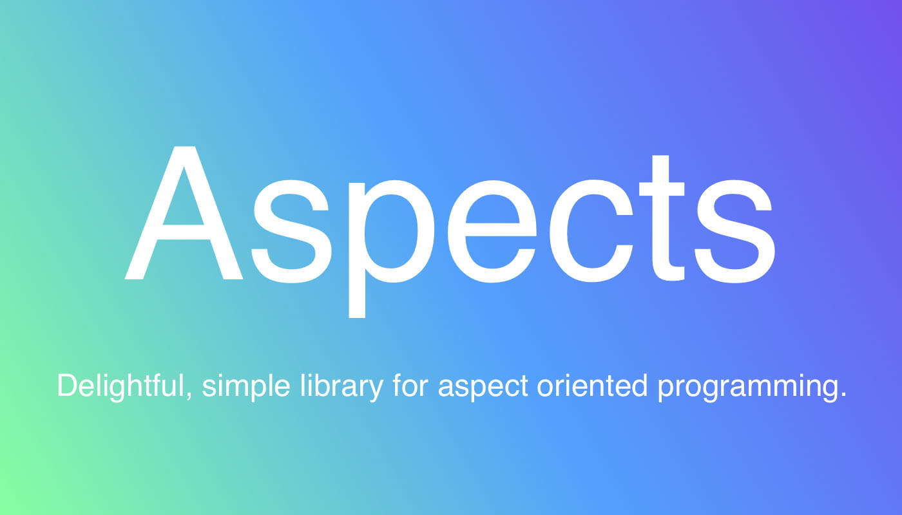
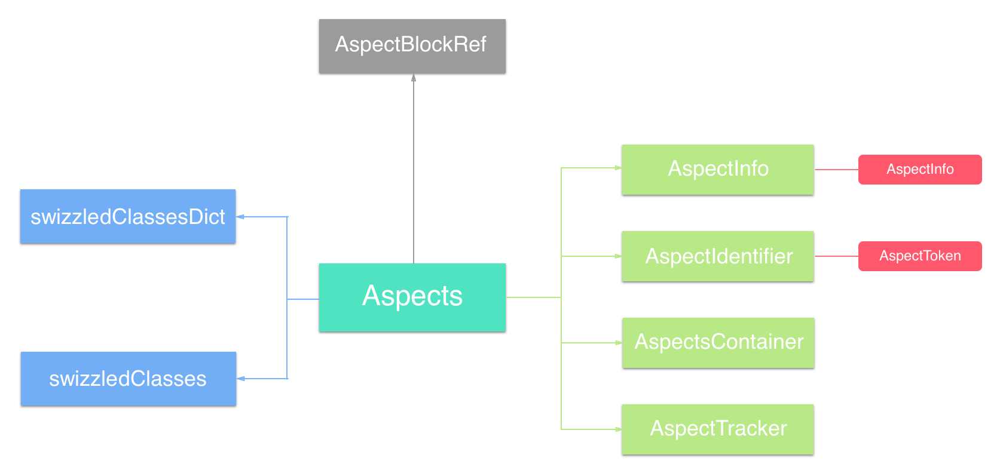
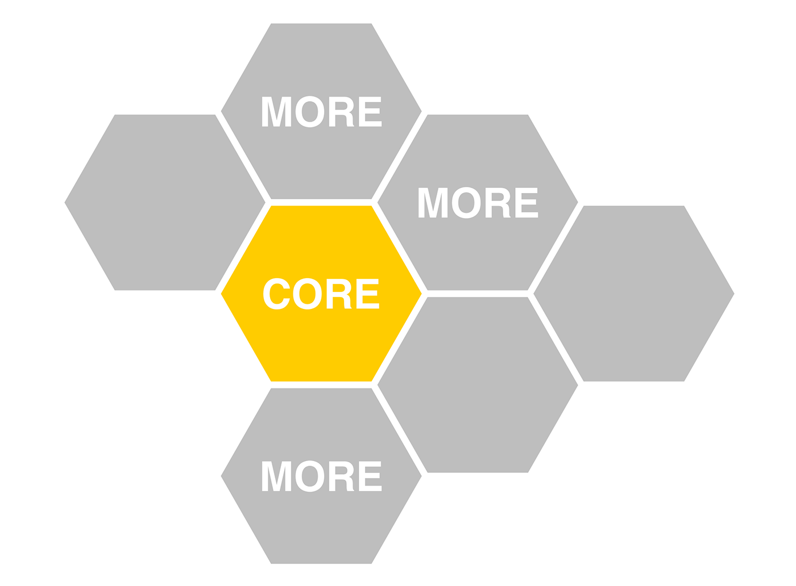

# 从 Aspects 源码中我学到了什么？


## 前言

[AOP (Aspect-oriented programming)](https://en.wikipedia.org/wiki/Aspect-oriented_programming) 译为 “面向切面编程”，是通过预编译方式和运行期动态代理实现程序功能统一维护的一种技术。利用 AOP 可以对业务逻辑的各个部分进行隔离，从而使得业务逻辑各部分之间的耦合度降低，提高程序的可重用性，同时提高了开发的效率。

Emmmmm...AOP 目前是较为热门的一个话题，尽管你也许没有听说过它，但是你的项目中可能已经渗入了它，例如：用户统计（不添加一行代码即实现对所有 ViewController 的跟踪日志）。

对于 iOS 开发者而言，无外乎 Swift 和 Objective-C 两种主流开发语言：

- Swift 受限于 ABI 尚未稳定，动态性依赖 `dynamic` 修饰符，在 Runtime 没有留给我们太多的发挥空间（前几日新增了 `swift-5.0-branch` 分支，写这篇文章时看了一眼 `181 commits behind master` 😂）。
- Objective-C 在动态性上相对 Swift 具有无限大的优势，这几年 Objective-C Runtime 相关文章多如牛毛，相信现在的 iOSer 都具备一定的 Runtime 相关知识。

[Aspects](https://github.com/steipete/Aspects) 作为 Objective-C 语言编写的 AOP 库，适用于 iOS 和 Mac OS X，使用体验简单愉快，已经在 GitHub 摘得 5k+ Star。Aspects 内部实现比较健全，考虑到了 Hook 安全方面可能发生的种种问题，非常值得我们学习。

> Note: 本文内引用 Aspects 源码版本为 v1.4.2，要求读者具备一定的 Runtime 知识。

## 索引

- AOP 简介
- Aspects 简介
- Aspects 结构剖析
- Aspects 核心代码剖析
- 优秀 AOP 库应该具备的特质
- 总结

## AOP 简介


> 在**运行时，动态地**将代码切入到类的指定方法、指定位置上的编程思想就是面向切面的编程。

[AOP (Aspect-oriented programming)](https://en.wikipedia.org/wiki/Aspect-oriented_programming)，即 “面向切面编程” 是一种编程范式，或者说是一种编程思想，它解决了 [OOP (Object-oriented programming)](https://en.wikipedia.org/wiki/Object-oriented_programming) 的延伸问题。

### 什么时候需要使用 AOP

光是给个概念可能初次接触 AOP 的人还是无法 Get 到其中微秒，拿我们前言中举的例子🌰，假设随着我们所在的公司逐步发展，之前第三方的用户页面统计已经不能满足需求了，公司要求实现一个我们自己的用户页面统计。

嘛~ 我们来理一下 OOP 思想下该怎么办？

- 一个熟悉 OOP 思想的程序猿会理所应当的想到要把用户页面统计这一任务放到 ViewController 中；
- 考虑到一个个的手动添加统计代码要死人（而且还会漏，以后新增 ViewController 也要手动加），于是想到了 OOP 思想中的继承；
- 不巧由于项目久远，所有的 ViewController 都是直接继承自系统类 UIViewController（笑），此时选择抽一个项目 RootViewController，替换所有 ViewController 继承 RootViewController；
- 然后在 RootViewController 的 `viewWillAppear:` 和 `viewWillDisappear:` 方法加入时间统计代码，记录 ViewController 以及 Router 传参。

你会想，明明 OOP 也能解决问题是不是？不要急，再假设你们公司有多个 App，你被抽调至基础技术组专门给这些 App 写**通用**组件，要把之前实现过的用户页面统计重新以**通用**的形式实现，提供给你们公司所有的 App 使用。

MMP，使用标准 OOP 思想貌似无解啊...这个时候就是 AOP 的用武之地了。

这里简单给个思路：Hook UIViewController 的 `viewWillAppear:` 和 `viewWillDisappear:` 方法，在原方法执行之后记录需要统计的信息上报即可。

> Note: 简单通过 Method Swizzling 来 Hook 不是不可以，但是有很多安全隐患！

## Aspects 简介



[Aspects](https://github.com/steipete/Aspects) 是一个使用起来简单愉快的 AOP 库，使用 Objective-C 编写，适用于 iOS 与 Mac OS X。

> Aspects 内部实现考虑到了很多 Hook 可能引发的问题，笔者在看源码的过程中抠的比较细，真的是受益匪浅。

Aspects 简单易用，作者通过在 `NSObject (Aspects)` 分类中暴露出的两个接口分别提供了对实例和 Class 的 Hook 实现：

``` obj-c
@interface NSObject (Aspects)

+ (id<AspectToken>)aspect_hookSelector:(SEL)selector
                      withOptions:(AspectOptions)options
                       usingBlock:(id)block
                            error:(NSError **)error;

- (id<AspectToken>)aspect_hookSelector:(SEL)selector
                      withOptions:(AspectOptions)options
                       usingBlock:(id)block
                            error:(NSError **)error;

@end
```

Aspects 支持实例 Hook，相较其他 Objective-C AOP 库而言可操作粒度更小，适合的场景更加多样化。作为使用者无需进行更多的操作即可 Hook 指定实例或者 Class 的指定 SEL，AspectOptions 参数可以指定 Hook 的点，以及是否执行一次之后就撤销 Hook。

## Aspects 结构剖析



Emmmmm...尽管 Aspects 只有不到千行的源码，但是其内部实现考虑到了很多 Hook 相关的安全问题和其他细节，对比其他 Objective-C AOP 开源项目来说 Aspects 更为健全，所以我自己在扒 Aspects 源码时也看的比较仔细。

### Aspects 内部结构

Aspects 内部定义了两个协议：

- AspectToken - 用于注销 Hook
- AspectInfo - 嵌入 Hook 中的 Block 首位参数

此外 Aspects 内部还定义了 4 个类：

- AspectInfo - 切面信息，遵循 AspectInfo 协议
- AspectIdentifier - 切面 ID，**应该**遵循 AspectToken 协议（作者漏掉了，已提 PR）
- AspectsContainer - 切面容器
- AspectTracker - 切面跟踪器

以及一个结构体：

- AspectBlockRef - 即 `_AspectBlock`，充当内部 Block

如果你扒一遍源码，还会发现两个内部静态全局变量：

- `static NSMutableDictionary *swizzledClassesDict;`
- `static NSMutableSet *swizzledClasses;`

现在你也许还不能理解为什么要定义这么多东西，别急~ 我们后面都会分析到。

### Aspects 协议

按照上面列出的顺序，先来介绍一些 Aspects 声明的协议。

#### AspectToken

AspectToken 协议旨在让使用者可以灵活的注销之前添加过的 Hook，内部规定遵守此协议的对象须实现 `remove` 方法。

``` obj-c
/// 不透明的 Aspect Token，用于注销 Hook
@protocol AspectToken <NSObject>

/// 注销一个 aspect.
/// 返回 YES 表示注销成功，否则返回 NO
- (BOOL)remove;

@end
```

#### AspectInfo

AspectInfo 协议旨在规范对一个切面，即 aspect 的 Hook 内部信息的纰漏，我们在 Hook 时添加切面的 Block 第一个参数就遵守此协议。

``` obj-c
/// AspectInfo 协议是我们块语法的第一个参数。
@protocol AspectInfo <NSObject>

/// 当前被 Hook 的实例
- (id)instance;

/// 被 Hook 方法的原始 invocation
- (NSInvocation *)originalInvocation;

/// 所有方法参数（装箱之后的）惰性执行
- (NSArray *)arguments;

@end
```

> Note: 装箱是一个开销昂贵操作，所以用到再去执行。

### Aspects 内部类

接着协议，我们下面详细介绍一下 Aspects 的内部类。

#### AspectInfo

> Note: AspectInfo 在这里是一个 Class，其遵守上文中讲到的 AspectInfo 协议，不要混淆。

AspectInfo 类定义：

``` obj-c
@interface AspectInfo : NSObject <AspectInfo>

- (id)initWithInstance:(__unsafe_unretained id)instance invocation:(NSInvocation *)invocation;

@property (nonatomic, unsafe_unretained, readonly) id instance;
@property (nonatomic, strong, readonly) NSArray *arguments;
@property (nonatomic, strong, readonly) NSInvocation *originalInvocation;

@end
```

> Note: 关于装箱，对于提供一个 NSInvocation 就可以拿到其 `arguments` 这一点上，ReactiveCocoa 团队提供了很大贡献（细节见 Aspects 内部 NSInvocation 分类）。

AspectInfo 比较简单，参考 ReactiveCocoa 团队提供的 NSInvocation 参数通用方法可将参数装箱为 NSValue，简单来说 AspectInfo 扮演了一个提供 Hook 信息的角色。

#### AspectIdentifier

AspectIdentifier 类定义：

``` obj-c
@interface AspectIdentifier : NSObject

+ (instancetype)identifierWithSelector:(SEL)selector object:(id)object options:(AspectOptions)options block:(id)block error:(NSError **)error;

- (BOOL)invokeWithInfo:(id<AspectInfo>)info;

@property (nonatomic, assign) SEL selector;
@property (nonatomic, strong) id block;
@property (nonatomic, strong) NSMethodSignature *blockSignature;
@property (nonatomic, weak) id object;
@property (nonatomic, assign) AspectOptions options;

@end
```

> Note: AspectIdentifier 实际上是添加切面的 Block 的第一个参数，其应该遵循 AspectToken 协议，事实上也的确如此，其提供了 `remove` 方法的实现。

AspectIdentifier 内部需要注意的是由于使用 Block 来写 Hook 中我们加的料，这里生成了 `blockSignature`，在 AspectIdentifier 初始化的过程中会去判断 `blockSignature` 与入参 `object` 的 `selector` 得到的 `methodSignature` 的兼容性，兼容性判断成功才会顺利初始化。

#### AspectsContainer

AspectsContainer 类定义：

``` obj-c
@interface AspectsContainer : NSObject

- (void)addAspect:(AspectIdentifier *)aspect withOptions:(AspectOptions)injectPosition;
- (BOOL)removeAspect:(id)aspect;
- (BOOL)hasAspects;

@property (atomic, copy) NSArray *beforeAspects;
@property (atomic, copy) NSArray *insteadAspects;
@property (atomic, copy) NSArray *afterAspects;

@end
```

AspectsContainer 作为切面的容器类，**关联**指定对象的指定方法，内部有三个切面队列，分别容纳关联指定对象的指定方法中相对应 AspectOption 的 Hook：

- `NSArray *beforeAspects;` - AspectPositionBefore
- `NSArray *insteadAspects;` - AspectPositionInstead
- `NSArray *afterAspects;` - AspectPositionAfter

为什么要说关联呢？因为 AspectsContainer 是在 NSObject 分类中通过 AssociatedObject 方法与当前要 Hook 的目标关联在一起的。

> Note: 关联目标是 Hook 之后的 Selector，即 `aliasSelector`（原始 SEL 名称加 `aspects_` 前缀对应的 SEL）。

#### AspectTracker

AspectTracker 类定义：

``` obj-c
@interface AspectTracker : NSObject

- (id)initWithTrackedClass:(Class)trackedClass parent:(AspectTracker *)parent;

@property (nonatomic, strong) Class trackedClass;
@property (nonatomic, strong) NSMutableSet *selectorNames;
@property (nonatomic, weak) AspectTracker *parentEntry;

@end
```

AspectTracker 作为切面追踪器，原理大致如下：

``` obj-c
// Add the selector as being modified.
currentClass = klass;
AspectTracker *parentTracker = nil;
do {
    AspectTracker *tracker = swizzledClassesDict[currentClass];
    if (!tracker) {
        tracker = [[AspectTracker alloc] initWithTrackedClass:currentClass parent:parentTracker];
        swizzledClassesDict[(id<NSCopying>)currentClass] = tracker;
    }
    [tracker.selectorNames addObject:selectorName];
    // All superclasses get marked as having a subclass that is modified.
    parentTracker = tracker;
}while ((currentClass = class_getSuperclass(currentClass)));
```

> Note: 聪明的你应该已经注意到了全局变量 `swizzledClassesDict` 中的 `value` 对应着 AspectTracker 指针。

嘛~ 就是说 AspectTracker 是从下而上追踪，最底层的 `parentEntry` 为 `nil`，父类的 `parentEntry` 为子类的 `tracker`。

### Aspects 内部结构体

#### AspectBlockRef

AspectBlockRef，即 `struct _AspectBlock`，其定义如下：

``` obj-c
typedef struct _AspectBlock {
	__unused Class isa;
	AspectBlockFlags flags;
	__unused int reserved;
	void (__unused *invoke)(struct _AspectBlock *block, ...);
	struct {
		unsigned long int reserved;
		unsigned long int size;
		// requires AspectBlockFlagsHasCopyDisposeHelpers
		void (*copy)(void *dst, const void *src);
		void (*dispose)(const void *);
		// requires AspectBlockFlagsHasSignature
		const char *signature;
		const char *layout;
	} *descriptor;
	// imported variables
} *AspectBlockRef;
```

Emmmmm...没什么特别的，大家应该比较眼熟吧。

> Note: `__unused` 宏定义实际上是 `__attribute__((unused))` GCC 定语，旨在告诉编译器“如果我没有在后面使用到这个变量也别警告我”。

嘛~ 想起之前自己挖的坑还没有填，事实上自己也不知道什么时候填（笑）：

- 之前挖坑说要写一篇文章记录一些阅读源码时发现的代码书写技巧
- 之前挖坑说要封装一个 WKWebView 给群里的兄弟参考

不要急~ 你瞧伦家不是都记得嘛（至于什么时候填坑嘛就...咳咳）

### Aspects 静态全局变量

#### `static NSMutableDictionary *swizzledClassesDict;`

`static NSMutableDictionary *swizzledClassesDict;` 在 Aspects 中扮演着已混写类字典的角色，其内部结构应该是这样的：

``` obj-c
<Class : AspectTracker *>
```

Aspects 内部提供了专门访问这个全局字典的方法：

``` obj-c
static NSMutableDictionary *aspect_getSwizzledClassesDict() {
    static NSMutableDictionary *swizzledClassesDict;
    static dispatch_once_t pred;
    dispatch_once(&pred, ^{
        swizzledClassesDict = [NSMutableDictionary new];
    });
    return swizzledClassesDict;
}
```

这个全局变量可以简单理解为记录整个 Hook 影响的 Class 包含其 SuperClass 的追踪记录的全局字典。

#### `static NSMutableSet *swizzledClasses;`

`static NSMutableSet *swizzledClasses;` 在 Aspects 中担当记录已混写类的角色，其内部结构如下：

``` obj-c
<NSStringFromClass(Class)>
```

Aspects 内部提供一个用于修改这个全局变量内容的方法：

``` obj-c
static void _aspect_modifySwizzledClasses(void (^block)(NSMutableSet *swizzledClasses)) {
    static NSMutableSet *swizzledClasses;
    static dispatch_once_t pred;
    dispatch_once(&pred, ^{
        swizzledClasses = [NSMutableSet new];
    });
    @synchronized(swizzledClasses) {
        block(swizzledClasses);
    }
}
```

> Note: 注意 `@synchronized(swizzledClasses)`。

这个全局变量记录了 `forwardInvocation:` 被混写的的类名称。

> Note: 注意在用途上与 `static NSMutableDictionary *swizzledClassesDict;` 区分理解。

## Aspects 核心代码剖析



嘛~ Aspects 的整体实现代码不超过一千行，而且考虑的情况也比较全面，非常值得大家花时间去读一下，这里我只准备给出自己对其核心代码的理解。

### Hook Class && Hook Instance

Aspects 不光支持 Hook Class 还支持 Hook Instance，这提供了更小粒度的控制，配合 Hook 的撤销功能可以更加灵活精准的做我们想做的事~

Aspects 为了能区别 Class 和 Instance 的逻辑，实现了名为 `aspect_hookClass` 的方法，我认为其中的实现值得我用一部分篇幅来单独讲解，也觉得读者们有必要花点时间理解这里的实现逻辑。

``` obj-c
static Class aspect_hookClass(NSObject *self, NSError **error) {
    // 断言 self
    NSCParameterAssert(self);
    // class
    Class statedClass = self.class;
    // isa
    Class baseClass = object_getClass(self);
    NSString *className = NSStringFromClass(baseClass);
    
    // 已经子类化过了
    if ([className hasSuffix:AspectsSubclassSuffix]) {
        return baseClass;
        // 我们混写了一个 class 对象，而非一个单独的 object
    }else if (class_isMetaClass(baseClass)) {
        // baseClass 是元类，则 self 是 Class 或 MetaClass，混写 self
        return aspect_swizzleClassInPlace((Class)self);
        // 可能是一个 KVO'ed class。混写就位。也要混写 meta classes。
    }else if (statedClass != baseClass) {
        // 当 .class 和 isa 指向不同的情况，混写 baseClass
        return aspect_swizzleClassInPlace(baseClass);
    }
    
    // 默认情况下，动态创建子类
    // 拼接子类后缀 AspectsSubclassSuffix
    const char *subclassName = [className stringByAppendingString:AspectsSubclassSuffix].UTF8String;
    // 尝试用拼接后缀的名称获取 isa
    Class subclass = objc_getClass(subclassName);
    
    // 找不到 isa，代表还没有动态创建过这个子类
    if (subclass == nil) {
        // 创建一个 class pair，baseClass 作为新类的 superClass，类名为 subclassName
        subclass = objc_allocateClassPair(baseClass, subclassName, 0);
        if (subclass == nil) { // 返回 nil，即创建失败
            NSString *errrorDesc = [NSString stringWithFormat:@"objc_allocateClassPair failed to allocate class %s.", subclassName];
            AspectError(AspectErrorFailedToAllocateClassPair, errrorDesc);
            return nil;
        }
        
        // 混写 forwardInvocation:
        aspect_swizzleForwardInvocation(subclass);
        // subClass.class = statedClass
        aspect_hookedGetClass(subclass, statedClass);
        // subClass.isa.class = statedClass
        aspect_hookedGetClass(object_getClass(subclass), statedClass);
        // 注册新类
        objc_registerClassPair(subclass);
    }
    
    // 覆盖 isa
    object_setClass(self, subclass);
    return subclass;
}
```

> Note: 其实这里的难点就在于对 `.class` 和 `object_getClass` 的区分。

- `.class` 当 target 是 Instance 则返回 Class，当 target 是 Class 则返回自身
- `object_getClass` 返回 `isa` 指针的指向

> Note: 动态创建一个 Class 的完整步骤也是我们应该注意的。

- objc_allocateClassPair
- class_addMethod
- class_addIvar
- objc_registerClassPair

嘛~ 难点和重点都讲完了，大家结合注释理解其中的逻辑应该没什么困难了，有什么问题可以找我一起交流~

### Hook 的实现

在上面 `aspect_hookClass` 方法中，不仅仅是返回一个要 Hook 的 Class，期间还做了一些细节操作，不论是 Class 还是 Instance，都会调用 `aspect_swizzleForwardInvocation` 方法，这个方法没什么难点，简单贴一下代码让大家有个印象：

``` obj-c
static void aspect_swizzleForwardInvocation(Class klass) {
    // 断言 klass
    NSCParameterAssert(klass);
    // 如果没有 method，replace 实际上会像是 class_addMethod 一样
    IMP originalImplementation = class_replaceMethod(klass, @selector(forwardInvocation:), (IMP)__ASPECTS_ARE_BEING_CALLED__, "v@:@");
    // 拿到 originalImplementation 证明是 replace 而不是 add，情况少见
    if (originalImplementation) {
        // 添加 AspectsForwardInvocationSelectorName 的方法，IMP 为原生 forwardInvocation:
        class_addMethod(klass, NSSelectorFromString(AspectsForwardInvocationSelectorName), originalImplementation, "v@:@");
    }
    AspectLog(@"Aspects: %@ is now aspect aware.", NSStringFromClass(klass));
}
```

上面的方法就是把要 Hook 的目标 Class 的 `forwardInvocation:` 混写了，混写之后 `forwardInvocation:` 的具体实现在 `__ASPECTS_ARE_BEING_CALLED__` 中，里面能看到 invoke 标识位的不同是如何实现的，还有一些其他的实现细节：

``` obj-c
// 宏定义，以便于我们有一个更明晰的 stack trace
#define aspect_invoke(aspects, info) \
for (AspectIdentifier *aspect in aspects) {\
    [aspect invokeWithInfo:info];\
    if (aspect.options & AspectOptionAutomaticRemoval) { \
        aspectsToRemove = [aspectsToRemove?:@[] arrayByAddingObject:aspect]; \
    } \
}

static void __ASPECTS_ARE_BEING_CALLED__(__unsafe_unretained NSObject *self, SEL selector, NSInvocation *invocation) {
    // __unsafe_unretained NSObject *self 不解释了
    // 断言 self, invocation
    NSCParameterAssert(self);
    NSCParameterAssert(invocation);
    // 从 invocation 可以拿到很多东西，比如 originalSelector
    SEL originalSelector = invocation.selector;
    // originalSelector 加前缀得到 aliasSelector
    SEL aliasSelector = aspect_aliasForSelector(invocation.selector);
    // 用 aliasSelector 替换 invocation.selector
    invocation.selector = aliasSelector;
    
    // Instance 的容器
    AspectsContainer *objectContainer = objc_getAssociatedObject(self, aliasSelector);
    // Class 的容器
    AspectsContainer *classContainer = aspect_getContainerForClass(object_getClass(self), aliasSelector);
    AspectInfo *info = [[AspectInfo alloc] initWithInstance:self invocation:invocation];
    NSArray *aspectsToRemove = nil;

    // Before hooks.
    aspect_invoke(classContainer.beforeAspects, info);
    aspect_invoke(objectContainer.beforeAspects, info);

    // Instead hooks.
    BOOL respondsToAlias = YES;
    if (objectContainer.insteadAspects.count || classContainer.insteadAspects.count) {
        // 如果有任何 insteadAspects 就直接替换了
        aspect_invoke(classContainer.insteadAspects, info);
        aspect_invoke(objectContainer.insteadAspects, info);
    }else { // 否则正常执行
        // 遍历 invocation.target 及其 superClass 找到实例可以响应 aliasSelector 的点 invoke
        Class klass = object_getClass(invocation.target);
        do {
            if ((respondsToAlias = [klass instancesRespondToSelector:aliasSelector])) {
                [invocation invoke];
                break;
            }
        }while (!respondsToAlias && (klass = class_getSuperclass(klass)));
    }

    // After hooks.
    aspect_invoke(classContainer.afterAspects, info);
    aspect_invoke(objectContainer.afterAspects, info);

    // 如果没有 hook，则执行原始实现（通常会抛出异常）
    if (!respondsToAlias) {
        invocation.selector = originalSelector;
        SEL originalForwardInvocationSEL = NSSelectorFromString(AspectsForwardInvocationSelectorName);
        // 如果可以响应 originalForwardInvocationSEL，表示之前是 replace method 而非 add method
        if ([self respondsToSelector:originalForwardInvocationSEL]) {
            ((void( *)(id, SEL, NSInvocation *))objc_msgSend)(self, originalForwardInvocationSEL, invocation);
        }else {
            [self doesNotRecognizeSelector:invocation.selector];
        }
    }

    // 移除 aspectsToRemove 队列中的 AspectIdentifier，执行 remove
    [aspectsToRemove makeObjectsPerformSelector:@selector(remove)];
}
#undef aspect_invoke
```

> Note: `aspect_invoke` 宏定义的作用域。

- 代码实现对应了 Hook 的 AspectOptions 参数的 Before，Instead 和 After。
- `aspect_invoke` 中 `aspectsToRemove` 是一个 NSArray，里面容纳着需要被销户的 Hook，即 AspectIdentifier（之后会调用 `remove` 移除）。
- 遍历 invocation.target 及其 superClass 找到实例可以响应 aliasSelector 的点 invoke 实现代码。

### Block Hook

Aspects 让我们在指定 Class 或 Instance 的特定 Selector 执行时，根据 AspectOptions 插入我们自己的 Block 做 Hook，而这个 Block 内部有我们想要的有关于当前 Target 和 Selector 的信息，我们来看一下 Aspects 是怎么办到的：

``` obj-c
- (BOOL)invokeWithInfo:(id<AspectInfo>)info {
    NSInvocation *blockInvocation = [NSInvocation invocationWithMethodSignature:self.blockSignature];
    NSInvocation *originalInvocation = info.originalInvocation;
    NSUInteger numberOfArguments = self.blockSignature.numberOfArguments;

    // 偏执。我们已经在 hook 注册的时候检查过了，（不过这里我们还要检查）。
    if (numberOfArguments > originalInvocation.methodSignature.numberOfArguments) {
        AspectLogError(@"Block has too many arguments. Not calling %@", info);
        return NO;
    }

    // block 的 `self` 将会是 AspectInfo。可选的。
    if (numberOfArguments > 1) {
        [blockInvocation setArgument:&info atIndex:1];
    }
    
    // 简历参数分配内存 argBuf 然后从 originalInvocation 取 argument 赋值给 blockInvocation
    void *argBuf = NULL;
    for (NSUInteger idx = 2; idx < numberOfArguments; idx++) {
        const char *type = [originalInvocation.methodSignature getArgumentTypeAtIndex:idx];
		NSUInteger argSize;
		NSGetSizeAndAlignment(type, &argSize, NULL);
		
		// reallocf 优点，如果创建内存失败会自动释放之前的内存，讲究
		if (!(argBuf = reallocf(argBuf, argSize))) {
            AspectLogError(@"Failed to allocate memory for block invocation.");
			return NO;
		}
        
		[originalInvocation getArgument:argBuf atIndex:idx];
		[blockInvocation setArgument:argBuf atIndex:idx];
    }
    
    // 执行
    [blockInvocation invokeWithTarget:self.block];
    
    // 释放 argBuf
    if (argBuf != NULL) {
        free(argBuf);
    }
    return YES;
}
```

考虑两个问题：

- `[blockInvocation setArgument:&info atIndex:1];` 为什么要在索引 1 处插入呢？
- `for (NSUInteger idx = 2; idx < numberOfArguments; idx++)` 为什么要从索引 2 开始遍历参数呢？

嘛~ 如果你对 Block 的 Runtime 结构以及执行过程下断点研究一下就全都明白了，感兴趣的同学有疑问可以联系我（与真正勤奋好学的人交流又有谁会不乐意呢？笑~）

## 优秀 AOP 库应该具备的特质


- 良好的使用体验
- 可控粒度小
- 使用 Block 做 Hook
- 支持撤销 Hook
- 安全性

### 良好的使用体验

Aspects 使用 NSObject + Categroy 的方式提供接口，非常巧妙的涵盖了 Instance 和 Class。

Aspects 提供的接口保持高度一致（本着**易用，简单，方便**的原则设计接口和整个框架的实现会让你的开源项目更容易被人们接纳和使用）：

``` obj-c
+ (id<AspectToken>)aspect_hookSelector:(SEL)selector
                      withOptions:(AspectOptions)options
                       usingBlock:(id)block
                            error:(NSError **)error;

- (id<AspectToken>)aspect_hookSelector:(SEL)selector
                      withOptions:(AspectOptions)options
                       usingBlock:(id)block
                            error:(NSError **)error;
```

> Note: 其实接口这里对于 `block` 的参数自动补全可以更进一步，不过 Aspects 当初是没有办法做到的，单从接口设计这块已经很优秀了。

### 可控粒度小

Aspects 不仅支持大部分 AOP 框架应该做到的对于 Class 的 Hook，还支持粒度更小的 Instance Hook，而其在内部实现中为了支持 Instance Hook 所做的代码也非常值得我们参考和学习（已在上文 **Aspects 核心代码剖析** 处单独分析）。

为使用者提供更为自由的 Hook 方式以达到更加精准的控制是每个使用者乐于见到的事。

### 使用 Block 做 Hook

Aspects 使用 Block 来做 Hook 应该考虑到了很多东西，支持使用者通过在 Block 中获取到相关的信息，书写自己额外的操作就可以实现 Hook 需求。

### 支持撤销 Hook

Aspects 还支持撤销之前做的 Hook 以及已混写的 Method，为了实现这个功能 Aspects 设计了全局容器，把 Hook 和混写用全局容器做记录，让一切都可以复原，这不正是我们想要的吗？

### 安全性

嘛~ 我们在学习 Runtime 的时候，就应该看到过不少文章讲解 Method Swizzling 要注意的安全性问题，由于用到了大量 Runtime 方法，加上 AOP 是面向整个切面的，所以一单发现问题就会比较严重，涉及的面会比较广，而且难以调试。

> Note: 我们不能因为容易造成问题就可以回避 Method Swizzling，就好比大学老师讲到递归时强调容易引起循环调用，很多人就在内心回避使用递归，甚至于非常适合使用递归来写的算法题（这里指递归来写会易读写、易维护）只会用复杂的方式来思考。

## 总结

- 文章简单介绍了 AOP 的概念，希望能给各位读者对 AOP 思想的理解提供微薄的帮助。
- 文章系统的剖析了 Aspects 开源库的内部结构，希望能让大家在浏览 Aspects 源码时快速定位代码位置，找到核心内容。
- 文章重点分析了 Aspects 的核心代码，提炼了一些笔者认为值得注意的点，但愿可以在大家扒源码时提供一些指引。
- 文章结尾总结了 Aspects 作为一个比较优秀

文章写得比较用心（是我个人的原创文章，转载请注明 [https://lision.me/](https://lision.me/)），如果发现错误会优先在我的 [个人博客](https://lision.me/) 中更新。如果有任何问题欢迎在我的微博 [@Lision](https://weibo.com/lisioncode) 联系我~

希望我的文章可以为你带来价值~