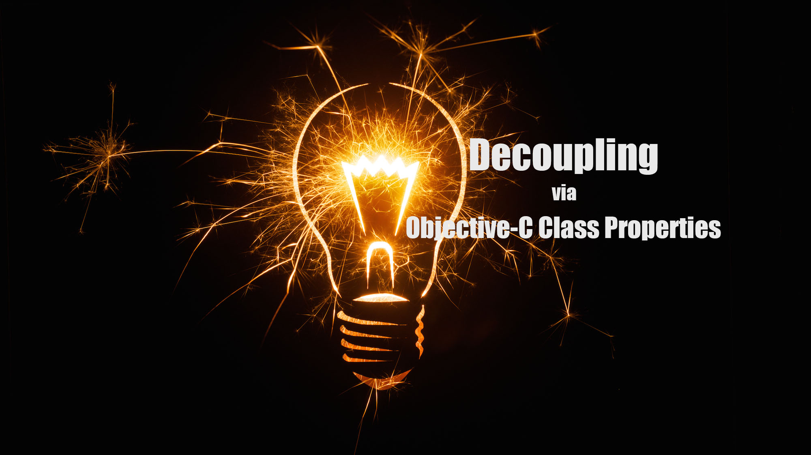
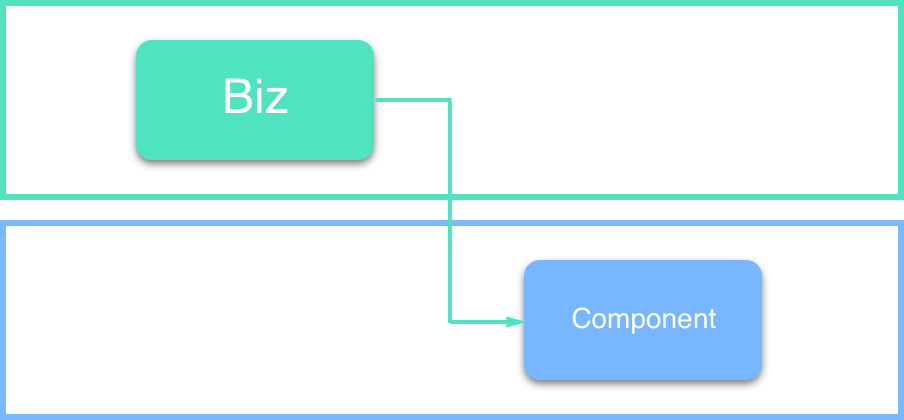
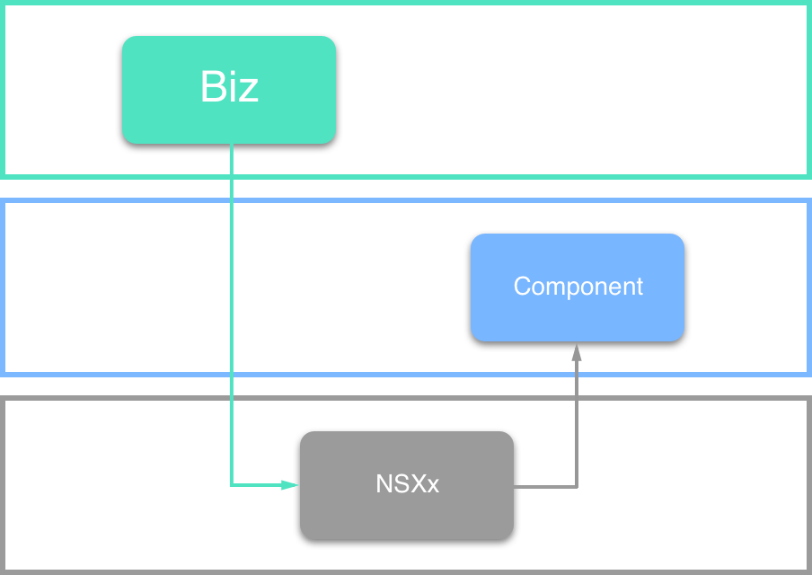

# 巧用 LLVM 特性: Objective-C Class Properties 解耦



## 前言

Emmmmm... Objective-C Class Properties 早在 WWDC 2016 中就已经公示，给 Objective-C 加入这个特性主要是为了与 Swift 类型属性相互操作。

官方是这么说明的：

> Interoperate with Swift type properties.

嘛~ 虽然是为了配合 Swift 加入的新特性，不过聊胜于无哈！

> Note: 值得一提的是 Objective-C Class Properties 语法特性虽然是 WWDC 2016 加入的，不过由于是 Xcode 8 中 LLVM Compiler 的特性，因此也适用于 iOS 10 之前的部署版本哟~

## 索引

- LLVM
- Objective-C Class Properties
- 解耦
- 总结

## LLVM


[LLVM 官网](https://llvm.org/) 对于 LLVM 的定义：

> Note: The LLVM Project is a collection of modular and reusable compiler and toolchain technologies. 

Emmmmm... 有趣的是，有的文章把 LLVM 强行展开为 "low level virtual machine" 译为 “低级别虚拟机”，不过在 [LLVM 官网](https://llvm.org/) 可以看到官方明示 LLVM 与传统的虚拟机**没有一毛钱关系**，名称 "LLVM" 本身**不是缩写**，它仅仅是项目的名称而已~

嘛~ 可能有的同学不能理解为何 LLVM 是一个编译器工具链集合？这就要从 Apple 的编译器历史讲起咯~ 

很久很久以前... 算了，我感觉要跑题了（囧），这里简单列一下 Apple 采用过的编译方案吧：

- GCC
- LLVM & GCC
- LLVM Compiler

### GCC

[GCC, the GNU Compiler Collection](https://gcc.gnu.org/) 是一套由 GNU 开发的编程语言编译器，最初作为 [GNU 操作系统](http://www.gnu.org/gnu/thegnuproject.html) 的编译器使用，后面发展成为类 Unix 操作系统以及 Apple Mac OS X 操作系统的标准编译器。

原本 GCC 仅能处理 C 语言的编译，不过 GCC 很快扩展以支持 C++，之后的 GCC 越发全面，支持 Objective-C，Fortran，Ada，以及 Go 语言。

值得一提的是 GCC 是一套以 GPL 以及 LGPL 许可证锁发行的 100% 自由软件，这意味着**用户可以自由地运行，拷贝，分发，学习，修改并改进该软件**。

### LLVM & GCC

LLVM 我们前面介绍过了，是模块化 & 可重用性编译器以及工具链技术集合。

LLVM 能够进行程序语言的 **编译期优化、链接优化、在线编译优化、代码生成**。

### LLVM Compiler

前面介绍过 GCC 支持很多语言，系统架构庞大而笨重，而 Apple 大量使用的 Objective-C 在 GCC 中顺位（优先级）较低。此外，GCC 作为一个纯粹的编译系统，在与 IDE 配合方面的表现也很差。

So，Apple 决定从零开始写 C，C++，Objective-C 的编译器 Clang。

至此，Apple 彻底与 GCC 了断。

## Objective-C Class Properties


Objective-C Class Properties 作为 Objective-C 新语法特性在 [WWDC2016 What's New in LLVM](https://developer.apple.com/videos/play/wwdc2016/405/) 中公示，表示 Xcode 8 之后可以使用这一新语法特性。

使用方式很简单：

- Declared with `class` flag 
- Accessed with dot syntax
- Never synthesized
- Use `@dynamic` to defer to runtime

### Declared with `class` flag

``` objc
@interface MyType : NSObject
@property (class) NSString *someString;
@end
```

### Accessed with dot syntax

``` objc
NSLog(@"format string: %@", MyType.someString);
```

### Never synthesized

``` objc
@implementation MyType
static NSString *_someString = nil;
+ (NSString *)someString { return _someString; }
+ (void)setSomeString:(NSString *)newString { _someString = newString; }
@end
```

### Use `@dynamic` to defer to runtime

``` objc
@implementation MyType
@dynamic (class) someString;
+ (BOOL)resolveClassMethod:(SEL) name {
...
}
@end
```

## 解耦

笔者在做项目组件下沉时，遇到一个问题，正好适用于 Objective-C Class Properties 发挥：将要下沉的组件库中某系统类 Categroy 引用了业务层某方法。



业务层应该依赖于将要下沉的组件，而组件既然要下沉就不应该再反过来依赖上层业务实现！

按照常规思路，想要把上层业务中被依赖的部分一起随组件下沉，但是发现被依赖的部分虽然也属于一个较为基础的模块，不过此模块现阶段不做下沉...

后来经过组内大佬指点，使用 Objective-C Class Properties 解决了这个问题，即将上层业务被依赖的部分化作将要下沉组件依赖方系统类 Categroy 的 Class Properties。

> Note: 在 Categroy 中写 Objective-C Class Properties 需要使用 Runtime 关联方法。



## 总结

- 介绍了 LLVM 顺便提到了 Apple 的编译系统发展简史。
- 使用官方 Demo 简单介绍了 Objective-C Class Properties 语法特性的书写方式。
- 提供了一种巧妙使用 Objective-C Class Properties 解耦的思路。

文章写得比较用心（是我个人的原创文章，转载请注明 [https://lision.me/](https://lision.me/)），如果发现错误会优先在我的 [个人博客](https://lision.me/) 中更新。如果有任何问题欢迎在我的微博 [@Lision](https://weibo.com/lisioncode) 联系我~

希望我的文章可以为你带来价值~