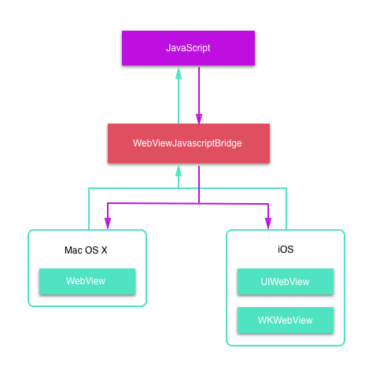
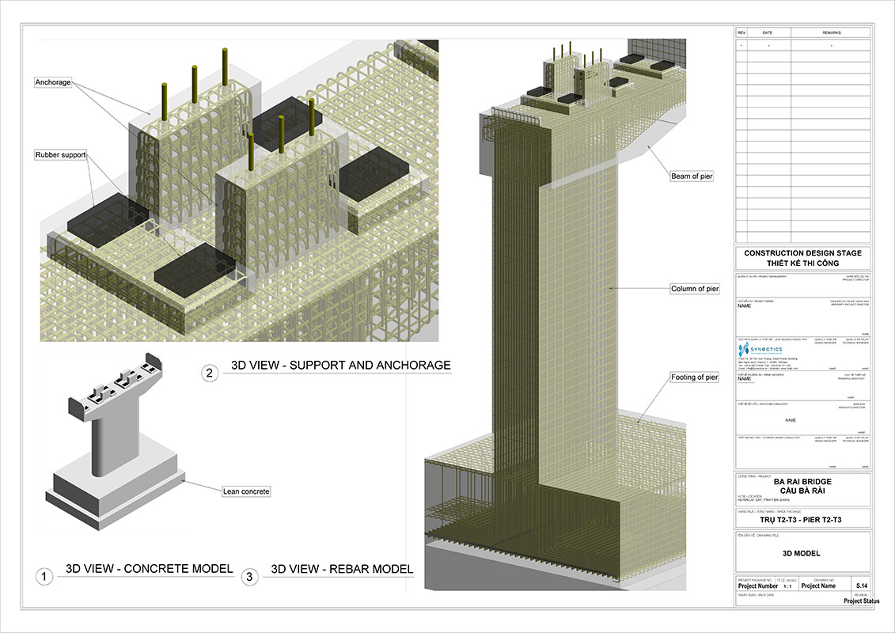

# WebViewJavascriptBridge 源码中 Get 到的“桥梁美学”


## 前言

Emmmmm...这篇文章发布出来可能正逢圣诞节🎄，Merry Christmas!


Web 页面中的 JS 与 iOS Native 如何交互是每个 iOS 猿必须掌握的技能。而 JS 和 iOS Native 就好比两块没有交集的大陆，如果想要使它们相互通信就必须要建立一座“桥梁”。

**思考一下，如果项目组让你去造这座“桥”，如何才能做到既优雅又实用？**

本文将结合 WebViewJavascriptBridge 源码逐步带大家找到答案。

[WebViewJavascriptBridge](https://github.com/marcuswestin/WebViewJavascriptBridge) 是盛名已久的 JSBridge 库，早在 2011 年就被作者 [Marcus Westin](https://github.com/marcuswestin) 发布到 GitHub，直到现在作者还在积极维护中，目前该项目已收获近 1w star 咯，其源码非常值得我们学习。

WebViewJavascriptBridge 的代码逻辑清晰，风格良好，加上自身代码量比较小使得其源码阅读非常轻松（可能需要一些 JS 基础）。更加难能可贵的是它仅使用了少量代码就实现了对于 Mac OS X 的 WebView 以及 iOS 平台的 UIWebView 和 WKWebView 三种组件的完美支持。

我对 WebViewJavascriptBridge 的评价是**小而美**，这类小而美的源码非常利于我们对其实现思想的学习（本文分析 WebViewJavascriptBridge 源码版本为 v6.0.3）。

关于 iOS 与 JS 的原生交互知识，之前我有写过一篇文章[《iOS 与 JS 交互开发知识总结》](https://lision.me/ios-native-js/)，文章除了介绍 JavaScriptCore 库以及 UIWebView 和 WKWebView 与 JS 原生交互的方法之外还捎带提到了 [Hybrid](https://en.wikipedia.org/wiki/Hybrid) 的发展简史，文末还提供了一个 [JS 通过 Native 调用 iOS 设备摄像头的 Demo](https://github.com/Lision/HybridCameraDemo)。

所以这篇文章不会再把重点放在 iOS 与 JS 的原生交互了，本文旨在介绍 [WebViewJavascriptBridge](https://github.com/marcuswestin/WebViewJavascriptBridge) 的设计思路和实现原理，对 iOS 与 JS 原生交互知识感兴趣的同学推荐去阅读上面提到的文章，应该会有点儿帮助（笑）。

## 索引

- WebViewJavascriptBridge 简介
- WebViewJavascriptBridge && WKWebViewJavascriptBridge 探究
- WebViewJavascriptBridgeBase - JS 调用 Native 实现原理剖析
- WebViewJavascriptBridge_JS - Native 调用 JS 实现解读
- WebViewJavascriptBridge 的“桥梁美学”
- 文章总结

## WebViewJavascriptBridge 简介



WebViewJavascriptBridge 是用于在 WKWebView，UIWebView 和 WebView 中的 Obj-C 和 JavaScript 之间发送消息的 iOS / OSX 桥接器。

有许多不错的项目都有使用 WebViewJavascriptBridge，这里简单列一部分（笑）：

- [Facebook Messenger](https://www.messenger.com/)
- [Facebook Paper](https://www.facebook.com/paper)
- [ELSEWHERE](http://www.stayelsewhere.com/)
- ... & many more!

关于 WebViewJavascriptBridge 的具体使用方法详见其 [GitHub 页面](https://github.com/marcuswestin/WebViewJavascriptBridge)。

在读完 WebViewJavascriptBridge 的源码之后我将其划分为三个层级：

| 层级 | 源文件 |
| :---: | :---: |
| 接口层 | WebViewJavascriptBridge && WKWebViewJavascriptBridge |
| 实现层 | WebViewJavascriptBridgeBase |
| JS 层 | WebViewJavascriptBridge_JS |

其中 WebViewJavascriptBridge && WKWebViewJavascriptBridge 作为接口层主要负责提供方便的接口，隐藏实现细节，其实现细节都是通过实现层 WebViewJavascriptBridgeBase 去做的，而 WebViewJavascriptBridge_JS 作为 JS 层其实存储了一段 JS 代码，在需要的时候注入到当前 WebView 组件中，最终实现 Native 与 JS 的交互。

## WebViewJavascriptBridge && WKWebViewJavascriptBridge 探究


WebViewJavascriptBridge 和 WKWebViewJavascriptBridge 作为接口层分别对应于 UIWebView 和 WKWebView 组件，我们来简单看一下这两个文件暴露出的信息：

WebViewJavascriptBridge 暴露信息：

``` obj-c
@interface WebViewJavascriptBridge : WVJB_WEBVIEW_DELEGATE_INTERFACE

+ (instancetype)bridgeForWebView:(id)webView; // 初始化
+ (instancetype)bridge:(id)webView; // 初始化

+ (void)enableLogging; // 开启日志
+ (void)setLogMaxLength:(int)length; // 设置日志最大长度

- (void)registerHandler:(NSString*)handlerName handler:(WVJBHandler)handler; // 注册 handler (Native)
- (void)removeHandler:(NSString*)handlerName; // 删除 handler (Native)
- (void)callHandler:(NSString*)handlerName data:(id)data responseCallback:(WVJBResponseCallback)responseCallback; // 调用 handler (JS)
- (void)setWebViewDelegate:(id)webViewDelegate; // 设置 webViewDelegate
- (void)disableJavscriptAlertBoxSafetyTimeout; // 禁用 JS AlertBox 的安全时长来加速消息传递，不推荐使用

@end
```

WKWebViewJavascriptBridge 暴露信息：

``` obj-c
// Emmmmm...这里应该不需要我注释了吧
@interface WKWebViewJavascriptBridge : NSObject<WKNavigationDelegate, WebViewJavascriptBridgeBaseDelegate>

+ (instancetype)bridgeForWebView:(WKWebView*)webView;
+ (void)enableLogging;

- (void)registerHandler:(NSString*)handlerName handler:(WVJBHandler)handler;
- (void)removeHandler:(NSString*)handlerName;
- (void)callHandler:(NSString*)handlerName data:(id)data responseCallback:(WVJBResponseCallback)responseCallback;
- (void)reset;
- (void)setWebViewDelegate:(id)webViewDelegate;
- (void)disableJavscriptAlertBoxSafetyTimeout;

@end
```

> Note: `disableJavscriptAlertBoxSafetyTimeout` 方法是通过禁用 JS 端 AlertBox 的安全时长来加速网桥消息传递的。如果想使用那么需要和前端约定好，如果禁用之后前端 JS 代码仍有调用 AlertBox 相关代码（alert, confirm, 或 prompt）则程序将被挂起，所以这个方法是不安全的，如无特殊需求笔者不推荐使用。

可以看得出来这两个文件暴露出的接口几乎一致，其中 WebViewJavascriptBridge 中使用了宏定义 `WVJB_WEBVIEW_DELEGATE_INTERFACE` 来分别适配 iOS 和 Mac OS X 平台的 UIWebView 和 WebView 组件需要实现的代理方法。

### WebViewJavascriptBridge 中的宏定义

其实 WebViewJavascriptBridge 中为了适配 iOS 和 Mac OS X 平台的 UIWebView 和 WebView 组件使用了一系列的宏定义，其源码比较简单：

``` obj-c
#if defined __MAC_OS_X_VERSION_MAX_ALLOWED
    #define WVJB_PLATFORM_OSX
    #define WVJB_WEBVIEW_TYPE WebView
    #define WVJB_WEBVIEW_DELEGATE_TYPE NSObject<WebViewJavascriptBridgeBaseDelegate>
    #define WVJB_WEBVIEW_DELEGATE_INTERFACE NSObject<WebViewJavascriptBridgeBaseDelegate, WebPolicyDelegate>
#elif defined __IPHONE_OS_VERSION_MAX_ALLOWED
    #import <UIKit/UIWebView.h>
    #define WVJB_PLATFORM_IOS
    #define WVJB_WEBVIEW_TYPE UIWebView
    #define WVJB_WEBVIEW_DELEGATE_TYPE NSObject<UIWebViewDelegate>
    #define WVJB_WEBVIEW_DELEGATE_INTERFACE NSObject<UIWebViewDelegate, WebViewJavascriptBridgeBaseDelegate>
#endif
```

分别根据所在平台不同定义了 `WVJB_WEBVIEW_TYPE`，`WVJB_WEBVIEW_DELEGATE_TYPE` 以及刚才提到的 `WVJB_WEBVIEW_DELEGATE_INTERFACE` 宏定义，并且分别定义了 `WVJB_PLATFORM_OSX` 和 `WVJB_PLATFORM_IOS` 便于之后的实现源码区分当前平台时使用，下面的 `supportsWKWebView` 宏定义也是同样的道理：

``` obj-c
#if (__MAC_OS_X_VERSION_MAX_ALLOWED > __MAC_10_9 || __IPHONE_OS_VERSION_MAX_ALLOWED >= __IPHONE_7_1)
#define supportsWKWebView
#endif
```

在引入头文件的时候可以通过这个 `supportsWKWebView` 宏灵活引入所需的头文件：

``` obj-c
// WebViewJavascriptBridge.h
#if defined supportsWKWebView
#import <WebKit/WebKit.h>
#endif

// WebViewJavascriptBridge.m
#if defined(supportsWKWebView)
#import "WKWebViewJavascriptBridge.h"
#endif
```

### WebViewJavascriptBridge 的实现分析

我们接着看一下 WebViewJavascriptBridge 的实现部分，首先从内部变量信息看起：

``` obj-c
#if __has_feature(objc_arc_weak)
    #define WVJB_WEAK __weak
#else
    #define WVJB_WEAK __unsafe_unretained
#endif

@implementation WebViewJavascriptBridge {
    WVJB_WEAK WVJB_WEBVIEW_TYPE* _webView; // bridge 对应的 WebView 组件
    WVJB_WEAK id _webViewDelegate; // 给 WebView 组件设置的代理（需要的话）
    long _uniqueId; // 唯一标识，Emmmmm...但是我发现没卵用，只有 _base 中的 _uniqueId 才有用
    WebViewJavascriptBridgeBase *_base; // 上文说过，底层实现其实都是 WebViewJavascriptBridgeBase 在做
}
```

上文提到 WebViewJavascriptBridge 和 WKWebViewJavascriptBridge 的 .h 文件暴露接口信息非常相似，那么我们要不要看看 WKWebViewJavascriptBridge 的内部变量信息呢？

``` obj-c
// 注释参见 WebViewJavascriptBridge 就好
@implementation WKWebViewJavascriptBridge {
    __weak WKWebView* _webView;
    __weak id<WKNavigationDelegate> _webViewDelegate;
    long _uniqueId;
    WebViewJavascriptBridgeBase *_base;
}
```

嘛~ 这俩货简直是一个妈生的。其实这是作者故意为之，因为作者想对外提供一套接口，即 WebViewJavascriptBridge，我们只需要使用 WebViewJavascriptBridge 就可以自动根据绑定的 WebView 组件的不同生成与之对应的 JSBridge 实例。

``` obj-c
+ (instancetype)bridge:(id)webView {
// 如果支持 WKWebView
#if defined supportsWKWebView
    // 需要先判断当前入参 webView 是否从属于 WKWebView
    if ([webView isKindOfClass:[WKWebView class]]) {
        // 返回 WKWebViewJavascriptBridge 实例
        return (WebViewJavascriptBridge*) [WKWebViewJavascriptBridge bridgeForWebView:webView];
    }
#endif
    // 判断当前入参 webView 是否从属于 WebView（Mac OS X）或者 UIWebView（iOS）
    if ([webView isKindOfClass:[WVJB_WEBVIEW_TYPE class]]) {
        // 返回 WebViewJavascriptBridge 实例
        WebViewJavascriptBridge* bridge = [[self alloc] init];
        [bridge _platformSpecificSetup:webView];
        return bridge;
    }
    
    // 抛出 BadWebViewType 异常并返回 nil
    [NSException raise:@"BadWebViewType" format:@"Unknown web view type."];
    return nil;
}
```

我们可以看到上面的代码，实现并不复杂。如果支持 WKWebView 的话（`#if defined supportsWKWebView`）则去判断当前绑定的 WebView 组件是否从属于 WKWebView，这样可以返回 WKWebViewJavascriptBridge 实例，否则返回 WebViewJavascriptBridge 实例，最后如果入参 `webView` 的类型不满足判断条件则抛出 `BadWebViewType` 异常。

还有一个关于 `_webViewDelegate` 的小细节，本来不打算讲的，但是还是提一下吧（囧）。其实在 WebViewJavascriptBridge 以及 WKWebViewJavascriptBridge 的初始化实现过程中，会把当前 WebView 组件的代理绑定为自己：

``` obj-c
// WebViewJavascriptBridge
- (void) _platformSpecificSetup:(WVJB_WEBVIEW_TYPE*)webView {
    _webView = webView;
    _webView.delegate = self;
    _base = [[WebViewJavascriptBridgeBase alloc] init];
    _base.delegate = self;
}

// WKWebViewJavascriptBridge
- (void) _setupInstance:(WKWebView*)webView {
    _webView = webView;
    _webView.navigationDelegate = self;
    _base = [[WebViewJavascriptBridgeBase alloc] init];
    _base.delegate = self;
}
```

> Note: 替换组件的代理将其代理绑定为 bridge 自己是因为 WebViewJavascriptBridge 的实现原理上是利用我之前的文章[《iOS 与 JS 交互开发知识总结》](https://lision.me/ios-native-js/)中讲过的假 Request 方法实现的，所以需要监听 WebView 组件的代理方法获取加载之前的 Request.URL 并做处理。这也是为什么 WebViewJavascriptBridge 提供了一个接口 `setWebViewDelegate:` 存储了一个逻辑上的 `_webViewDelegate`，这个 `_webViewDelegate` 也需要遵循 WebView 组件的代理协议，这样在 WebViewJavascriptBridge 内部不同的代理方法中做完 bridge 要做的事情只有就会再去调用 `_webViewDelegate` 对应的代理方法，其实可以理解为 WebViewJavascriptBridge 对当前 WebView 组件的代理做了 hook。

对于 WebViewJavascriptBridge 中暴露的初始化以外的所有接口，其内部实现都是通过 WebViewJavascriptBridgeBase 来实现的。这样做的好处就是**即使 WebViewJavascriptBridge 因为绑定了 WKWebView 返回了 WKWebViewJavascriptBridge 实例，只要接口一致，对 JSBridge 发送相同的消息，就会有相同的实现（都是由 WebViewJavascriptBridgeBase 类实现的）**。

## WebViewJavascriptBridgeBase - JS 调用 Native 实现原理剖析



作为 WebViewJavascriptBridge 的实现层，WebViewJavascriptBridgeBase 的命名也可以体现出其是作为整座“桥梁”桥墩一般的存在，我们还是按照老规矩先看一下 WebViewJavascriptBridgeBase.h 暴露的信息，好对其有一个整体的印象：

``` obj-c
typedef void (^WVJBResponseCallback)(id responseData); // 回调 block
typedef void (^WVJBHandler)(id data, WVJBResponseCallback responseCallback); // 注册的 Handler block
typedef NSDictionary WVJBMessage; // 消息类型 - 字典

@protocol WebViewJavascriptBridgeBaseDelegate <NSObject>
- (NSString*) _evaluateJavascript:(NSString*)javascriptCommand;
@end

@interface WebViewJavascriptBridgeBase : NSObject

@property (weak, nonatomic) id <WebViewJavascriptBridgeBaseDelegate> delegate; // 代理，指向接口层类，用以给对应接口绑定的 WebView 组件发送执行 JS 消息
@property (strong, nonatomic) NSMutableArray* startupMessageQueue; // 启动消息队列，可以理解为存放 WVJBMessage
@property (strong, nonatomic) NSMutableDictionary* responseCallbacks; // 回调 blocks 字典，存放 WVJBResponseCallback 类型的 block
@property (strong, nonatomic) NSMutableDictionary* messageHandlers; // 已注册的 handlers 字典，存放 WVJBHandler 类型的 block
@property (strong, nonatomic) WVJBHandler messageHandler; // 没卵用

+ (void)enableLogging; // 开启日志
+ (void)setLogMaxLength:(int)length; // 设置日志最大长度
- (void)reset; // 对应 WKJSBridge 的 reset 接口
- (void)sendData:(id)data responseCallback:(WVJBResponseCallback)responseCallback handlerName:(NSString*)handlerName; // 发送消息，入参依次是参数，回调 block，对应 JS 端注册的 HandlerName
- (void)flushMessageQueue:(NSString *)messageQueueString; // 刷新消息队列，核心代码
- (void)injectJavascriptFile; // 注入 JS
- (BOOL)isWebViewJavascriptBridgeURL:(NSURL*)url; // 判定是否为 WebViewJavascriptBridgeURL
- (BOOL)isQueueMessageURL:(NSURL*)urll; // 判定是否为队列消息 URL
- (BOOL)isBridgeLoadedURL:(NSURL*)urll; // 判定是否为 bridge 载入 URL
- (void)logUnkownMessage:(NSURL*)url; // 打印收到未知消息信息
- (NSString *)webViewJavascriptCheckCommand; // JS bridge 检测命令
- (NSString *)webViewJavascriptFetchQueyCommand; // JS bridge 获取查询命令
- (void)disableJavscriptAlertBoxSafetyTimeout; // 禁用 JS AlertBox 安全时长以获取发送消息速度提升，不建议使用，理由见上文

@end
```

嘛~ 从 .h 文件中我们可以看到整个 WebViewJavascriptBridgeBase 所暴露出来的信息，属性层面上需要对以下 4 个属性加深印象，之后分析实现的过程中会带入这些属性：

- `id <WebViewJavascriptBridgeBaseDelegate> delegate ` 代理，可以通过代理让当前 bridge 绑定的 WebView 组件执行 JS 代码
- `NSMutableArray* startupMessageQueue;` 启动消息队列，存放 Obj-C 发送给 JS 的消息（可以理解为存放 `WVJBMessage` 类型）
- `NSMutableDictionary* responseCallbacks;` 回调 blocks 字典，存放 `WVJBResponseCallback` 类型的 block
- `NSMutableDictionary* messageHandlers;` Obj-C 端已注册的 handlers 字典，存放 `WVJBHandler` 类型的 block

Emmmmm...接口层面看一下注释就好了，后面分析实现的时候会捎带讲解一些接口，剩下一些跟实现无关的接口内容感兴趣的同学推荐自己扒源码哈。

我们在对 WebViewJavascriptBridgeBase 整体有了一个初始印象之后就可以自己写一个页面，简单的嵌入一些 JS 跑一遍流程，在中间下断点扒源码，这样我们对于 Native 与 JS 的交互流程就可以一清二楚了。

**下面模拟一遍 JS 通过 WebViewJavascriptBridge 调用 Native 功能的流程分析 WebViewJavascriptBridgeBase 的相关实现**（考虑现在的时间点决定以 WKWebView 为例讲解，即针对 WKWebViewJavascriptBridge 源码讲解）：

### 1.监听假 Request 并注入 WebViewJavascriptBridge_JS 内的 JS 代码

上文说到 WebViewJavascriptBridge 的实现其实本质上是利用了我之前的文章[《iOS 与 JS 交互开发知识总结》](https://lision.me/ios-native-js/)中讲过的假 Request 方法实现的，那么我们就从监听假 Request 开始讲起吧。

``` obj-c
// WKNavigationDelegate 协议方法，用于监听 Request 并决定是否允许导航
- (void)webView:(WKWebView *)webView decidePolicyForNavigationAction:(WKNavigationAction *)navigationAction decisionHandler:(void (^)(WKNavigationActionPolicy))decisionHandler {
    // webView 校验
    if (webView != _webView) { return; }
    NSURL *url = navigationAction.request.URL;
    __strong typeof(_webViewDelegate) strongDelegate = _webViewDelegate;

    // 核心代码
    if ([_base isWebViewJavascriptBridgeURL:url]) { // 判定 WebViewJavascriptBridgeURL
        if ([_base isBridgeLoadedURL:url]) { // 判定 BridgeLoadedURL
            // 注入 JS 代码
            [_base injectJavascriptFile];
        } else if ([_base isQueueMessageURL:url]) { // 判定 QueueMessageURL
            // 刷新消息队列
            [self WKFlushMessageQueue];
        } else {
            // 记录未知 bridge msg 日志
            [_base logUnkownMessage:url];
        }
        decisionHandler(WKNavigationActionPolicyCancel);
        return;
    }
    
    // 调用 _webViewDelegate 对应的代理方法
    if (strongDelegate && [strongDelegate respondsToSelector:@selector(webView:decidePolicyForNavigationAction:decisionHandler:)]) {
        [_webViewDelegate webView:webView decidePolicyForNavigationAction:navigationAction decisionHandler:decisionHandler];
    } else {
        decisionHandler(WKNavigationActionPolicyAllow);
    }
}
```

> Note: 之前说过 WebViewJavascriptBridge 会 hook 绑定的 WebView 的代理方法，这一点 WKWebViewJavascriptBridge 也一样，在加入自己的代码之后会判断是否有 `_webViewDelegate` 响应这个代理方法，如果有则调用。

我们还是把注意力放到注释中核心代码的位置，里面会先判断当前 url 是否为 bridge url：

``` obj-c
// 相关宏定义
#define kOldProtocolScheme @"wvjbscheme"
#define kNewProtocolScheme @"https"
#define kQueueHasMessage   @"__wvjb_queue_message__"
#define kBridgeLoaded      @"__bridge_loaded__"
```

[WebViewJavascriptBridge GitHub 页面](https://github.com/marcuswestin/WebViewJavascriptBridge) 的使用方法中第 4 步明确指出要复制粘贴 `setupWebViewJavascriptBridge` 方法到前段 JS 中，我们先来看一下这段 JS 方法源码：

``` js
function setupWebViewJavascriptBridge(callback) {
	if (window.WebViewJavascriptBridge) { return callback(WebViewJavascriptBridge); }
	if (window.WVJBCallbacks) { return window.WVJBCallbacks.push(callback); }
	window.WVJBCallbacks = [callback];
	// 创建一个 iframe
	var WVJBIframe = document.createElement('iframe');
	// 设置 iframe 为不显示
	WVJBIframe.style.display = 'none';
	// 将 iframe 的 src 置为 'https://__bridge_loaded__'
	WVJBIframe.src = 'https://__bridge_loaded__';
	// 将 iframe 加入到 document.documentElement
	document.documentElement.appendChild(WVJBIframe);
	setTimeout(function() { document.documentElement.removeChild(WVJBIframe) }, 0)
}
```

上面的代码创建了一个不显示的 iframe 并将其 src 置为 `https://__bridge_loaded__`，与上文中 `kBridgeLoaded` 宏定义一致，即用于 `isBridgeLoadedURL:` 方法中判定当前 url 是否为 BridgeLoadedURL。

> Note: 假 Request 的发起有两种方式，-1:`location.href` -2:`iframe`。通过 `location.href` 有个问题，就是如果 JS 多次调用原生的方法也就是 `location.href` 的值多次变化，Native 端只能接受到最后一次请求，前面的请求会被忽略掉，所以这里 WebViewJavascriptBridge 选择使用 iframe，后面不再解释。

因为加入了 src 为 `https://__bridge_loaded__` 的 iframe 元素，我们上面截获 url 的代理方法就会拿到一个 `https://__bridge_loaded__` 的 url，由于 https 满足判定 WebViewJavascriptBridgeURL，将会进入核心代码区域接着会被判定为 BridgeLoadedURL 执行注入 JS 代码的方法，即 `[_base injectJavascriptFile];`。

``` obj-c
- (void)injectJavascriptFile {
    // 获取到 WebViewJavascriptBridge_JS 的代码
    NSString *js = WebViewJavascriptBridge_js();
    // 将获取到的 js 通过代理方法注入到当前绑定的 WebView 组件
    [self _evaluateJavascript:js];
    // 如果当前已有消息队列则遍历并分发消息，之后清空消息队列
    if (self.startupMessageQueue) {
        NSArray* queue = self.startupMessageQueue;
        self.startupMessageQueue = nil;
        for (id queuedMessage in queue) {
            [self _dispatchMessage:queuedMessage];
        }
    }
}
```

至此，第一步交互已完成。关于 WebViewJavascriptBridge_JS 内部的 JS 代码我们放到后面的章节解读，现在可以简单理解为 WebViewJavascriptBridge 在 JS 端的具体实现代码。

### 2.JS 端调用 `callHandler` 方法之后 Native 端究竟是如何响应的？

[WebViewJavascriptBridge GitHub 页面](https://github.com/marcuswestin/WebViewJavascriptBridge) 中指出 JS 端的操作方式：

``` js
setupWebViewJavascriptBridge(function(bridge) {
	
	/* Initialize your app here */

	bridge.registerHandler('JS Echo', function(data, responseCallback) {
		console.log("JS Echo called with:", data)
		responseCallback(data)
	})
	bridge.callHandler('ObjC Echo', {'key':'value'}, function responseCallback(responseData) {
		console.log("JS received response:", responseData)
	})
})
```

我们知道 JS 端调用 `setupWebViewJavascriptBridge` 方法会走我们刚才分析过的第一步，即监听假 Request 并注入 WebViewJavascriptBridge_JS 内的 JS 代码。那么当 JS 端调用 `bridge.callHandler` 时，Native 端究竟是如何做出响应的呢？这里我们需要先稍微解读一下之前注入的 WebViewJavascriptBridge_JS 中的 JS 代码：

``` js
// 调用 iOS handler，参数校验之后调用 _doSend 函数
function callHandler(handlerName, data, responseCallback) {
	if (arguments.length == 2 && typeof data == 'function') {
		responseCallback = data;
		data = null;
	}
	_doSend({ handlerName:handlerName, data:data }, responseCallback);
}

// 如有回调，则设置 message['callbackId'] 与 responseCallbacks[callbackId]
// 将 msg 加入 sendMessageQueue 数组，设置 messagingIframe.src
function _doSend(message, responseCallback) {
	if (responseCallback) {
		var callbackId = 'cb_'+(uniqueId++)+'_'+new Date().getTime();
		responseCallbacks[callbackId] = responseCallback;
		message['callbackId'] = callbackId;
	}
	sendMessageQueue.push(message);
	messagingIframe.src = CUSTOM_PROTOCOL_SCHEME + '://' + QUEUE_HAS_MESSAGE;
}
	
// scheme 使用 https 之后通过 host 做匹配
var CUSTOM_PROTOCOL_SCHEME = 'https';
var QUEUE_HAS_MESSAGE = '__wvjb_queue_message__';
```

可以看到 JS 端的代码中有 `callHandler` 函数的实现，其内部将入参 `handlerName` 以及 `data` 以字典形式作为参数调用 `_doSend` 方法，我们看一下 `_doSend` 方法的实现：

- `_doSend` 方法内部会先判断入参中是否有回调
- 如果有回调则根据规则生成 `callbackId` 并且将回调 block 保存到 `responseCallbacks` 字典（囧~ JS 不叫字典的，我是为了 iOS 读者看着方便），之后给消息也加入一个键值对保存刚才生成的 `callbackId`
- 之后给 `sendMessageQueue` 队列加入 `message`
- 将 `messagingIframe.src` 设置为 `https://__wvjb_queue_message__`

好，点到为止，对于 WebViewJavascriptBridge_JS 内的 JS 端其他源码我们放着后面看。注意这里加入了一个 src 为 `https://__wvjb_queue_message__` 的 `messagingIframe`，它也是一个不可见的 iframe。这样 Native 端会收到一个 url 为 `https://__wvjb_queue_message__` 的 request，回到第 1 步中获取到假的 request 之后会进行各项判定，这次会满足 `[_base isQueueMessageURL:url]` 的判定调用 Native 的 `WKFlushMessageQueue` 方法。

``` obj-c
- (void)WKFlushMessageQueue {
    // 执行 WebViewJavascriptBridge._fetchQueue(); 方法
    [_webView evaluateJavaScript:[_base webViewJavascriptFetchQueyCommand] completionHandler:^(NSString* result, NSError* error) {
        if (error != nil) {
            NSLog(@"WebViewJavascriptBridge: WARNING: Error when trying to fetch data from WKWebView: %@", error);
        }
        // 刷新消息列表
        [_base flushMessageQueue:result];
    }];
}

- (NSString *)webViewJavascriptFetchQueyCommand {
    return @"WebViewJavascriptBridge._fetchQueue();";
}
```

可见 Native 端会在刷新队列中调用 JS 端的 `WebViewJavascriptBridge._fetchQueue();` 方法，我们来看一下 JS 端此方法的具体实现：

``` js
// 获取队列，在 iOS 端刷新消息队列时会调用此函数
function _fetchQueue() {
   // 将 sendMessageQueue 转为 JSON 格式
	var messageQueueString = JSON.stringify(sendMessageQueue);
	// 重置 sendMessageQueue
	sendMessageQueue = [];
	// 返回 JSON 格式的 
	return messageQueueString;
}
```

这个方法会把当前 JS 端 `sendMessageQueue` 消息队列以 JSON 的形式返回，而 Native 端会调用 `[_base flushMessageQueue:result];` 将拿到的 JSON 形式消息队列作为参数调用 `flushMessageQueue:` 方法，这个方法是整个框架 Native 端的精华所在，就是稍微有点长（笑）。

``` obj-c
- (void)flushMessageQueue:(NSString *)messageQueueString {
    // 校验 messageQueueString
    if (messageQueueString == nil || messageQueueString.length == 0) {
        NSLog(@"WebViewJavascriptBridge: WARNING: ObjC got nil while fetching the message queue JSON from webview. This can happen if the WebViewJavascriptBridge JS is not currently present in the webview, e.g if the webview just loaded a new page.");
        return;
    }

    // 将 messageQueueString 通过 NSJSONSerialization 解为 messages 并遍历
    id messages = [self _deserializeMessageJSON:messageQueueString];
    for (WVJBMessage* message in messages) {
        // 类型校验
        if (![message isKindOfClass:[WVJBMessage class]]) {
            NSLog(@"WebViewJavascriptBridge: WARNING: Invalid %@ received: %@", [message class], message);
            continue;
        }
        [self _log:@"RCVD" json:message];
        
        // 尝试取 responseId，如取到则表明是回调，从 _responseCallbacks 取匹配的回调 block 执行
        NSString* responseId = message[@"responseId"];
        if (responseId) { // 取到 responseId
            WVJBResponseCallback responseCallback = _responseCallbacks[responseId];
            responseCallback(message[@"responseData"]);
            [self.responseCallbacks removeObjectForKey:responseId];
        } else { // 未取到 responseId，则表明是正常的 JS callHandler 调用 iOS
            WVJBResponseCallback responseCallback = NULL;
            // 尝试取 callbackId，示例 cb_1_1512035076293
            // 对应 JS 代码 var callbackId = 'cb_'+(uniqueId++)+'_'+new Date().getTime();
            NSString* callbackId = message[@"callbackId"];
            if (callbackId) { // 取到 callbackId，表示 js 端希望在调用 iOS native 代码后有回调
                responseCallback = ^(id responseData) {
                    if (responseData == nil) {
                        responseData = [NSNull null];
                    }
                    
                    // 将 callbackId 作为 msg 的 responseId 并设置 responseData，执行 _queueMessage
                    WVJBMessage* msg = @{ @"responseId":callbackId, @"responseData":responseData };
                    // _queueMessage 函数主要是把 msg 转为 JSON 格式，内含 responseId = callbackId
                    // JS 端调用 WebViewJavascriptBridge._handleMessageFromObjC('msg_JSON'); 其中 'msg_JSON' 就是 JSON 格式的 msg
                    [self _queueMessage:msg];
                };
            } else { // 未取到 callbackId
                responseCallback = ^(id ignoreResponseData) {
                    // Do nothing
                };
            }
            
            // 尝试以 handlerName 获取 iOS 端之前注册过的 handler
            WVJBHandler handler = self.messageHandlers[message[@"handlerName"]];
            if (!handler) { // 没注册过，则跳过此 msg
                NSLog(@"WVJBNoHandlerException, No handler for message from JS: %@", message);
                continue;
            }
            // 调用对应的 handler，以 message[@"data"] 为入参，以 responseCallback 为回调
            handler(message[@"data"], responseCallback);
        }
    }
}
```

嘛~ `flushMessageQueue:` 方法作为整个 Native 端的核心，有点长是可以理解的。我们简单理一下它的实现思路：

- 入参校验
- 将 JSON 形式的入参转换为 Native 对象，即消息队列，这里面消息类型是之前定义过的 WVJBMessage，即字典
- 如果消息中含有 “responseId” 则表明是之前 Native 调用的 JS 方法回调过来的消息（因为 JS 端和 Native 端实现逻辑是对等的，所以这个地方不明白的可以参考下面的分析）
- 如果消息中不含 “responseId” 则表明是 JS 端通过 `callHandler` 函数正常调用 Native 端过来的消息
- 尝试获取消息中的 “callbackId”，如果 JS 本次消息需要 Native 响应之后回调才会有这个键值，具体参见上文中 JS 端 `_doSend` 部分源码分析。如取到 “callbackId” 则需生成一个回调 block，回调 block 内部将 “callbackId” 作为 msg 的 “responseId” 执行 `_queueMessage` 将消息发送给 JS 端（JS 端处理消息逻辑与 Native 端一致，所以上面使用 “responseId” 判断当前消息是否为回调方法传递过来的消息是很容易理解的）
- 尝试以消息中的 “handlerName” 从 `messageHandlers`（上文提到过，是保存 Native 端注册过的 handler 的字典）取到对应的 handler block，如果取到则执行代码块，否则打印错误日志

> Note: 这个消息处理的方法虽然长，但是逻辑清晰，而且有效的解决了 JS 与 Native 相互调用的过程中参数传递的问题（包括回调），此外 JS 端的消息处理逻辑与 Native 端保持一致，实现了逻辑对称，非常值得我们学习。

## WebViewJavascriptBridge_JS - Native 调用 JS 实现解读


Emmmmm...这一章节主要讲 JS 端注入的代码，即 WebViewJavascriptBridge_JS 中的 JS 源码。由于我没做过前段，能力不足，水平有限，可能有谬误希望各位读者发现的话及时指正，感激不尽。预警，由于 JS 端和上文分析过的 Native 端逻辑对称且上文已经分析过部分 JS 端的函数，所以下面的 JS 源码没有另做拆分，为避免被大段 JS 代码糊脸不感兴趣的同学可以直接看代码后面的总结。

``` js
;(function() {
    // window.WebViewJavascriptBridge 校验，避免重复
	if (window.WebViewJavascriptBridge) {
		return;
	}

    // 懒加载 window.onerror，用于打印 error 日志
	if (!window.onerror) {
		window.onerror = function(msg, url, line) {
			console.log("WebViewJavascriptBridge: ERROR:" + msg + "@" + url + ":" + line);
		}
	}
	
	// window.WebViewJavascriptBridge 声明
	window.WebViewJavascriptBridge = {
		registerHandler: registerHandler,
		callHandler: callHandler,
		disableJavscriptAlertBoxSafetyTimeout: disableJavscriptAlertBoxSafetyTimeout,
		_fetchQueue: _fetchQueue,
		_handleMessageFromObjC: _handleMessageFromObjC
	};

    // 变量声明
	var messagingIframe; // 消息 iframe
	var sendMessageQueue = []; // 发送消息队列
	var messageHandlers = {}; // JS 端注册的消息处理 handlers 字典（囧，JS 其实叫对象）
	
	// scheme 使用 https 之后通过 host 做匹配
	var CUSTOM_PROTOCOL_SCHEME = 'https';
	var QUEUE_HAS_MESSAGE = '__wvjb_queue_message__';
	
	var responseCallbacks = {}; // JS 端存放回调的字典
	var uniqueId = 1; // 唯一标示，用于回调时生成 callbackId
	var dispatchMessagesWithTimeoutSafety = true; // 默认启用安全时长

    // 通过禁用 AlertBoxSafetyTimeout 来提速网桥消息传递
    function disableJavscriptAlertBoxSafetyTimeout() {
		dispatchMessagesWithTimeoutSafety = false;
	}

    // 同 iOS 逻辑，注册 handler 其实是往 messageHandlers 字典中插入对应 name 的 block
	function registerHandler(handlerName, handler) {
		messageHandlers[handlerName] = handler;
	}
	
	// 调用 iOS handler，参数校验之后调用 _doSend 函数
	function callHandler(handlerName, data, responseCallback) {
	    // 如果参数只有两个且第二个参数类型为 function，则表示没有参数传递，即 data 为空
		if (arguments.length == 2 && typeof data == 'function') {
			responseCallback = data;
			data = null;
		}
		// 将 handlerName 和 data 作为 msg 对象参数调用 _doSend 函数
		_doSend({ handlerName:handlerName, data:data }, responseCallback);
	}
	
	// _doSend 向 Native 端发送消息
	function _doSend(message, responseCallback) {
	    // 如有回调，则设置 message['callbackId'] 与 responseCallbacks[callbackId]
		if (responseCallback) {
			var callbackId = 'cb_'+(uniqueId++)+'_'+new Date().getTime();
			responseCallbacks[callbackId] = responseCallback;
			message['callbackId'] = callbackId;
		}
		// 将 msg 加入 sendMessageQueue 数组，设置 messagingIframe.src
		sendMessageQueue.push(message);
		messagingIframe.src = CUSTOM_PROTOCOL_SCHEME + '://' + QUEUE_HAS_MESSAGE;
	}

    // 获取队列，在 iOS 端刷新消息队列时会调用此函数
	function _fetchQueue() {
	    // 内部将发送消息队列 sendMessageQueue 转为 JSON 格式并返回
		var messageQueueString = JSON.stringify(sendMessageQueue);
		sendMessageQueue = [];
		return messageQueueString;
	}

	// iOS 端 _dispatchMessage 函数会调用此函数
	function _handleMessageFromObjC(messageJSON) {
	    // 调度从 Native 端获取到的消息
        _dispatchMessageFromObjC(messageJSON);
	}
    
    // 核心代码，调度从 Native 端获取到的消息，逻辑与 Native 端一致
	function _dispatchMessageFromObjC(messageJSON) {
		// 判断有没有禁用 AlertBoxSafetyTimeout，最终会调用 _doDispatchMessageFromObjC 函数
		if (dispatchMessagesWithTimeoutSafety) {
			setTimeout(_doDispatchMessageFromObjC);
		} else {
			 _doDispatchMessageFromObjC();
		}
		
		// 解析 msgJSON 得到 msg
		function _doDispatchMessageFromObjC() {
			var message = JSON.parse(messageJSON);
			var messageHandler;
			var responseCallback;

			// 如果有 responseId，则说明是回调，取对应的 responseCallback 执行，之后释放
			if (message.responseId) {
				responseCallback = responseCallbacks[message.responseId];
				if (!responseCallback) {
					return;
				}
				responseCallback(message.responseData);
				delete responseCallbacks[message.responseId];
			} else { // 没有 responseId，则表示正常的 iOS call handler 调用 js
				// 如 msg 包含 callbackId，说明 iOS 端需要回调，初始化对应的 responseCallback
				if (message.callbackId) {
					var callbackResponseId = message.callbackId;
					responseCallback = function(responseData) {
						_doSend({ handlerName:message.handlerName, responseId:callbackResponseId, responseData:responseData });
					};
				}
				
				// 从 messageHandlers 拿到对应的 handler 执行
				var handler = messageHandlers[message.handlerName];
				if (!handler) {
				    // 如未取到对应的 handler 则打印错误日志
					console.log("WebViewJavascriptBridge: WARNING: no handler for message from ObjC:", message);
				} else {
					handler(message.data, responseCallback);
				}
			}
		}
	}

    // messagingIframe 的声明，类型 iframe，样式不可见，src 设置
	messagingIframe = document.createElement('iframe');
	messagingIframe.style.display = 'none';
	messagingIframe.src = CUSTOM_PROTOCOL_SCHEME + '://' + QUEUE_HAS_MESSAGE;
	// messagingIframe 加入 document.documentElement 中
	document.documentElement.appendChild(messagingIframe);

    // 注册 disableJavscriptAlertBoxSafetyTimeout handler，Native 可以通过禁用 AlertBox 的安全时长来加速桥接消息
	registerHandler("_disableJavascriptAlertBoxSafetyTimeout", disableJavscriptAlertBoxSafetyTimeout);
	
	setTimeout(_callWVJBCallbacks, 0);
	function _callWVJBCallbacks() {
		var callbacks = window.WVJBCallbacks;
		delete window.WVJBCallbacks;
		for (var i=0; i<callbacks.length; i++) {
			callbacks[i](WebViewJavascriptBridge);
		}
	}
}
```

JS 端和 Native 端逻辑一致，上面的代码已经加入了详细的中文注释，上文在对于“WebViewJavascriptBridgeBase - JS 调用 Native 实现原理剖析”章节的分析过程中为了走通整个调用的逻辑已经对部分 JS 端代码进行了分析，这里我们简单的梳理一下 JS 端核心代码 `_doDispatchMessageFromObjC` 函数的逻辑：

- 将 messageJSON 使用 JSON 解析出来
- 尝试取解析到的消息中的 responseId，如果有取到则说明是 Native 端响应 JS 端之后通过回调向 JS 端发出的消息，用 responseId 取 responseCallbacks 中对应的回调响应 block，找到后执行该 block 之后删除
- 如果没取到 responseId 则表示这条消息是 Native 端通过 `callHandler:data:responseCallback:` 正常调用 JS 注册的 handler 发送过来的消息（这里的正常是针对回调而言）
- 如果当前的消息有 callbackId 则表明 Native 端需要 JS 端响应本次消息之后回调反馈，生成一个 responseCallback 作为回调 block (JS 端是 function) ，其内部使用 `_doSend` 方法传递一个带有 responseId 的消息给 Native 端，表明此条消息是之前的回调消息
- 最后按照解析到的消息中 handlerName 从 messageHandlers，即 JS 端注册过的 handlers 中找到与名称对应的处理函数执行，如果没找到则打印附带相关信息的错误日志

嘛~ 对比一下 Native 端的核心代码 `flushMessageQueue:` 看一下，很容易发现两端的处理实现是逻辑对称的。

## WebViewJavascriptBridge 的“桥梁美学”


在总结 WebViewJavascriptBridge 的“桥梁美学”之前请再回顾一下 WebViewJavascriptBridge 的工作流：

- JS 端加入 src 为 `https://__bridge_loaded__` 的 iframe
- Native 端检测到 Request，检测如果是 `__bridge_loaded__` 则通过当前的 WebView 组件注入 WebViewJavascriptBridge_JS 代码
- 注入代码成功之后会加入一个 messagingIframe，其 src 为 `https://__wvjb_queue_message__`
- 之后不论是 Native 端还是 JS 端都可以通过 `registerHandler` 方法注册一个两端约定好的 HandlerName 的处理，也都可以通过 `callHandler` 方法通过约定好的 HandlerName 调用另一端的处理（两端处理消息的实现逻辑对称）

嘛~ 所以我们很容易列举出 WebViewJavascriptBridge 所具有的“美学”：

- 隐性适配
- 接口对等
- 逻辑对称

我们结合本文展开来说一下上面的“美学”的具体实现。

### 隐性适配

WebViewJavascriptBridge 主要是作为 Mac OS X 和 iOS 端（Native 端）与 JS 端相互通信，互相调用的桥梁。对于 Mac OS X 和 iOS 两种平台包含的三种 WebView 功能组件而言，WebViewJavascriptBridge 做了隐性适配，即仅用一套代码即可绑定不同平台的 WebView 组件实现同样功能的 JS 通信功能，这一点非常方便。

### 接口对等

WebViewJavascriptBridge 对于 JS 端和 Native 端设计了对等的接口，不论是 JS 端还是 Native 端，注册本端的响应处理都是用 `registerHandler` 接口，调用另一端（给另一端发消息）都是用 `callHandler` 接口。

这样做是非常合理的，因为不论是 JS 端还是 Native 端，作为通信的双方就通信本身而言是处于对等的地位的。这就好比一座大桥连接两块陆地，两地用大桥相互运输货物并接收资源，两块陆地在大桥的运输使用过程中逻辑上也是地位对等的。

### 逻辑对称

WebViewJavascriptBridge 在 JS 端和 Native 端对发送过来的消息有着相同逻辑的处理实现，如果考虑到收发双方的身份则可以把逻辑相同看做逻辑对称。

这种实现方式依旧非常合理，被桥连接的两块大陆在装货上桥和下桥卸货这两处逻辑上就应该是对称的。

嘛~ 说到这里就不得不祭出一个词来形容 WebViewJavascriptBridge 了，这个词就是**优雅**（笑）。当大家结合 WebViewJavascriptBridge 源码阅读本文之后不难发现其整个架构和设计思想跟现实桥梁设计中很多设计思想不谋而合，比如桥一般会分为左右桥幅，而左右幅桥一般只有一条线路中心线，即一个前进方向，用于桥上单一方向的资源传输，左右桥幅在功能上对等。

## 文章总结

- 文章系统分析了 WebViewJavascriptBridge 源码，希望各位读者能够在阅读本文之后对 WebViewJavascriptBridge 的架构有一个整体认识。
- 文章对 WebViewJavascriptBridge 在 JS 端和 Native 端的消息处理实现做了深入剖析，希望可以对各位读者这部分源码的理解提供一些微薄的帮助。
- 总结了 WebViewJavascriptBridge 作为一个 JSBridge 框架所具有的优势，即文中所指的“桥梁美学”，期望可以对大家以后自己封装一个 JSBridge 提供思路，抛砖引玉。

Emmmmm...不过需要注意的是 WebViewJavascriptBridge 仅仅是作为 JSBridge 层用于提供 JS 和 Native 之间相互传递消息的基础支持的。如果想要封装自己项目中的 WebView 组件还需要另外实现 HTTP cookie 注入，自定义 User-Agent，白名单或者权限校验等功能，更进一步还需要对 WebView 组件进行初始化速度，页面渲染速度以及页面缓存策略的优化。我之后**也许可能大概应该**会写一篇文章分享一下自己封装 WebView 组件时踩到的一些坑以及经验，因为自己水平有限...所以也可能不会写（笑）。

文章写得比较用心（是我个人的原创文章，转载请注明 [https://lision.me/](https://lision.me/)），如果发现错误会优先在我的 [个人博客](https://lision.me/) 中更新。如果有任何问题欢迎在我的微博 [@Lision](https://weibo.com/lisioncode) 联系我~

希望我的文章可以为你带来价值~