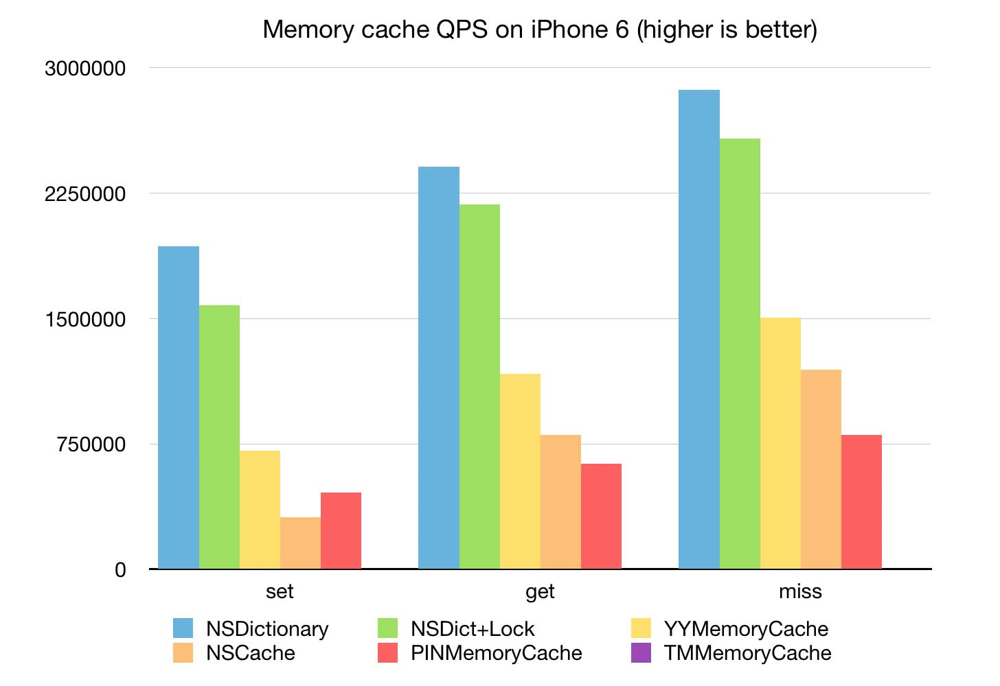
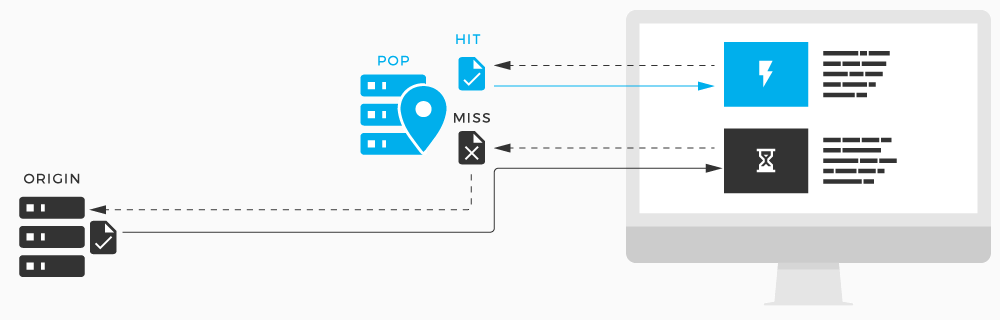

# 从 YYCache 源码 Get 到如何设计一个优秀的缓存


## 前言

iOS 开发中总会用到各种缓存，但是各位有没有考虑过什么样的缓存才能被叫做优秀的缓存，或者说优秀的缓存应该具备哪些特质？

**闭上眼睛，想一想如果面试官让你设计一个缓存你会怎么回答？**

本文将结合 YYCache 的源码逐步带大家找到答案。

[YYCache](https://github.com/ibireme/YYCache) 是一个线程安全的高性能键值缓存（该项目是 [YYKit](https://github.com/ibireme/YYKit) 组件之一）。YYKit 是在 2015 年发布到 Github 的，由于其代码质量很高，在短时间内就收获了大量的 Star（目前已经 1w+ Star 了），而且在 iOS 各大社区反响广泛，Google 一下也是漫天赞叹。

YYKit 作者是 [@ibireme](https://github.com/ibireme)，原名郭曜源（猜测 YY 前缀来源于曜源？），是我个人非常喜欢的国人开发者（何止喜欢，简直是迷弟😘）。

YYCache 的代码逻辑清晰，注释详尽，加上自身不算太大的代码量使得其阅读非常简单，更加难能可贵的是它的性能还非常高。




我对它的评价是**小而美**，这种小而美的缓存源码对于我们今天的主题太合适不过了（本文中 YYCache 源码版本为 v1.0.4）。

## 索引

- YYCache 简介
- YYMemoryCache 细节剖析
- YYDiskCache 细节剖析
- 优秀的缓存应该具备哪些特质
- 总结

## YYCache 简介


简单把 YYCache 从头到尾撸了一遍，最大的感触就是代码风格干净整洁，代码思路清晰明了。

由于代码整体阅读难度不是非常大，本文不会去逐字逐句的解读源码，而是提炼 YYCache 作为一个小而美的缓存实现了哪些缓存该具备的特质，并且分析实现细节。

我们先来简单看一下 YYCache 的代码结构，YYCache 是由 YYMemoryCache 与 YYDiskCache 两部分组成的，其中 YYMemoryCache 作为高速内存缓存，而 YYDiskCache 则作为低速磁盘缓存。

> 通常一个缓存是由内存缓存和磁盘缓存组成，内存缓存提供容量小但高速的存取功能，磁盘缓存提供大容量但低速的持久化存储。

``` obj-c
@interface YYCache : NSObject

@property (copy, readonly) NSString *name;
@property (strong, readonly) YYMemoryCache *memoryCache;
@property (strong, readonly) YYDiskCache *diskCache;

- (BOOL)containsObjectForKey:(NSString *)key;
- (nullable id<NSCoding>)objectForKey:(NSString *)key;
- (void)setObject:(nullable id<NSCoding>)object forKey:(NSString *)key;
- (void)removeObjectForKey:(NSString *)key;

@end
```

上面的代码我做了简化，只保留了最基本的代码（我认为作者在最初设计 YYCache 雏形时很可能也只是提供了这些基本的接口），其他的接口只是通过调用基本的接口再附加对应处理代码而成。

> Note: 其实源码中作者用了一些技巧性的宏，例如 `NS_ASSUME_NONNULL_BEGIN` 与 `NS_ASSUME_NONNULL_END` 来通过编译器层检测入参是否为空并给予警告，参见 [Nullability and Objective-C](https://developer.apple.com/swift/blog/?id=25)。
> 
> 类似上述的编码技巧还有很多，我并非不想与大家分享我 get 到的这些编码技巧，只是觉得它与本文的主题似乎不太相符。我准备在之后专门写一篇文章来与大家分享我在阅读各大源码库过程中 get 到的编码技巧（感兴趣的话可以 [关注我](https://weibo.com/5071795354/profile)）。

从代码中我们可以看到 YYCache 中持有 YYMemoryCache 与 YYDiskCache，并且对外提供了一些接口。这些接口基本都是基于 Key 和 Value 设计的，类似于 iOS 原生的字典类接口（增删改查）。

## YYMemoryCache 细节剖析


YYMemoryCache 是一个高速的内存缓存，用于存储键值对。它与 NSDictionary 相反，Key 被保留并且不复制。API 和性能类似于 NSCache，所有方法都是线程安全的。

YYMemoryCache 对象与 NSCache 的不同之处在于：

- YYMemoryCache 使用 LRU(least-recently-used) 算法来驱逐对象；NSCache 的驱逐方式是非确定性的。
- YYMemoryCache 提供 age、cost、count 三种方式控制缓存；NSCache 的控制方式是不精确的。
- YYMemoryCache 可以配置为在收到内存警告或者 App 进入后台时自动逐出对象。

> Note: YYMemoryCache 中的 `Access Methods` 消耗时长通常是稳定的 `(O(1))`。

``` obj-c
@interface YYMemoryCache : NSObject

#pragma mark - Attribute
@property (nullable, copy) NSString *name; // 缓存名称，默认为 nil
@property (readonly) NSUInteger totalCount; // 缓存对象总数
@property (readonly) NSUInteger totalCost; // 缓存对象总开销


#pragma mark - Limit
@property NSUInteger countLimit; // 缓存对象数量限制，默认无限制，超过限制则会在后台逐出一些对象以满足限制
@property NSUInteger costLimit; // 缓存开销数量限制，默认无限制，超过限制则会在后台逐出一些对象以满足限制
@property NSTimeInterval ageLimit; // 缓存时间限制，默认无限制，超过限制则会在后台逐出一些对象以满足限制

@property NSTimeInterval autoTrimInterval; // 缓存自动清理时间间隔，默认 5s

@property BOOL shouldRemoveAllObjectsOnMemoryWarning; // 是否应该在收到内存警告时删除所有缓存内对象
@property BOOL shouldRemoveAllObjectsWhenEnteringBackground; // 是否应该在 App 进入后台时删除所有缓存内对象

@property (nullable, copy) void(^didReceiveMemoryWarningBlock)(YYMemoryCache *cache); // 我认为这是一个 hook，便于我们在收到内存警告时自定义处理缓存
@property (nullable, copy) void(^didEnterBackgroundBlock)(YYMemoryCache *cache); // 我认为这是一个 hook，便于我们在收到 App 进入后台时自定义处理缓存

@property BOOL releaseOnMainThread; // 是否在主线程释放对象，默认 NO，有些对象（例如 UIView/CALayer）应该在主线程释放
@property BOOL releaseAsynchronously; // 是否异步释放对象，默认 YES

- (BOOL)containsObjectForKey:(id)key;

- (nullable id)objectForKey:(id)key;

- (void)setObject:(nullable id)object forKey:(id)key;
- (void)setObject:(nullable id)object forKey:(id)key withCost:(NSUInteger)cost;
- (void)removeObjectForKey:(id)key;
- (void)removeAllObjects;


#pragma mark - Trim
- (void)trimToCount:(NSUInteger)count; // 用 LRU 算法删除对象，直到 totalCount <= count
- (void)trimToCost:(NSUInteger)cost; // 用 LRU 算法删除对象，直到 totalCost <= cost
- (void)trimToAge:(NSTimeInterval)age; // 用 LRU 算法删除对象，直到所有到期对象全部被删除

@end
```

YYMemoryCache 的定义代码比较简单~ 该有的注释我已经加到了上面，这里 LRU 算法的实现我准备单独拎出来放到后面和（`_YYLinkedMapNode` 与 `_YYLinkedMap`）一起讲。我们这里只需要再关注一下 YYMemoryCache 是如何做到线程安全的。

### YYMemoryCache 是如何做到线程安全的

``` obj-c
@implementation YYMemoryCache {
    pthread_mutex_t _lock; // 线程锁，旨在保证 YYMemoryCache 线程安全
    _YYLinkedMap *_lru; // _YYLinkedMap，YYMemoryCache 通过它间接操作缓存对象
    dispatch_queue_t _queue; // 串行队列，用于 YYMemoryCache 的 trim 操作
}
```

没错，这里 ibireme 选择使用 `pthread_mutex` 线程锁来确保 YYMemoryCache 的线程安全。

> 有趣的是，这里 ibireme 使用 `pthread_mutex` 是有一段小故事的。在最初 YYMemoryCache 这里使用的锁是 `OSSpinLock` 自旋锁（详见 [YYCache 设计思路](https://blog.ibireme.com/2015/10/26/yycache/) 备注-关于锁），后面有人在 Github 向作者提 [issue](https://github.com/ibireme/YYModel/issues/43) 反馈 `OSSpinLock` 不安全，经过作者的确认（详见 [不再安全的 OSSpinLock](https://blog.ibireme.com/2016/01/16/spinlock_is_unsafe_in_ios/)）最后选择用 `pthread_mutex` 替代 `OSSpinLock`。


上面是 ibireme 在确认 `OSSpinLock` 不再安全之后为了寻找替代方案做的简单性能测试，对比了一下几种能够替代 `OSSpinLock` 锁的性能。在 [不再安全的 OSSpinLock](https://blog.ibireme.com/2016/01/16/spinlock_is_unsafe_in_ios/) 文末的评论中，我找到了作者使用 `pthread_mutex` 的原因。

> ibireme: 苹果员工说 libobjc 里 `spinlock` 是用了一些私有方法 (`mach_thread_switch`)，贡献出了高线程的优先来避免优先级反转的问题，但是我翻了下 libdispatch 的源码倒是没发现相关逻辑，也可能是我忽略了什么。在我的一些测试中，`OSSpinLock` 和 `dispatch_semaphore` 都不会产生特别明显的死锁，所以我也无法确定用 `dispatch_semaphore` 代替 `OSSpinLock` 是否正确。能够肯定的是，用 `pthread_mutex` 是安全的。

### `_YYLinkedMapNode` 与 `_YYLinkedMap`

上文介绍了 YYMemoryCache，其实 YYMemoryCache 并不直接操作缓存对象，而是通过内部的 `_YYLinkedMapNode` 与 `_YYLinkedMap` 来间接的操作缓存对象。这两个类对于上文中提到的 LRU 缓存算法的理解至关重要，所以我把他们俩单独拎出来放在这里详细解读一下。

``` obj-c

/**
 _YYLinkedMap 中的一个节点。
 通常情况下我们不应该使用这个类。
 */
@interface _YYLinkedMapNode : NSObject {
    @package
    __unsafe_unretained _YYLinkedMapNode *_prev; // __unsafe_unretained 是为了性能优化，节点被 _YYLinkedMap 的 _dic 强引用
    __unsafe_unretained _YYLinkedMapNode *_next; // __unsafe_unretained 是为了性能优化，节点被 _YYLinkedMap 的 _dic 强引用
    id _key;
    id _value;
    NSUInteger _cost; // 记录开销，对应 YYMemoryCache 提供的 cost 控制
    NSTimeInterval _time; // 记录时间，对应 YYMemoryCache 提供的 age 控制
}
@end


/**
 YYMemoryCache 内的一个链表。
 _YYLinkedMap 不是一个线程安全的类，而且它也不对参数做校验。
 通常情况下我们不应该使用这个类。
 */
@interface _YYLinkedMap : NSObject {
    @package
    CFMutableDictionaryRef _dic; // 不要直接设置该对象
    NSUInteger _totalCost;
    NSUInteger _totalCount;
    _YYLinkedMapNode *_head; // MRU, 最常用节点，不要直接修改它
    _YYLinkedMapNode *_tail; // LRU, 最少用节点，不要直接修改它
    BOOL _releaseOnMainThread; // 对应 YYMemoryCache 的 releaseOnMainThread
    BOOL _releaseAsynchronously; // 对应 YYMemoryCache 的 releaseAsynchronously
}

// 链表操作，看接口名称应该不需要注释吧~
- (void)insertNodeAtHead:(_YYLinkedMapNode *)node;
- (void)bringNodeToHead:(_YYLinkedMapNode *)node;
- (void)removeNode:(_YYLinkedMapNode *)node;
- (_YYLinkedMapNode *)removeTailNode;
- (void)removeAll;

@end

```

为了方便大家阅读，我标注了必要的中文注释。其实对数据结构与算法不陌生的同学应该一眼就看的出来 `_YYLinkedMapNode` 与 `_YYLinkedMap` 这俩货的本质。没错，丫就是双向链表节点和双向链表。

`_YYLinkedMapNode` 作为双向链表节点，除了基本的 `_prev`、`_next`，还有键值缓存基本的 `_key` 与 `_value`，**我们可以把 `_YYLinkedMapNode` 理解为 YYMemoryCache 中的一个缓存对象**。

`_YYLinkedMap` 作为由 `_YYLinkedMapNode` 节点组成的双向链表，使用 `CFMutableDictionaryRef _dic` 字典存储 `_YYLinkedMapNode`。这样在确保 `_YYLinkedMapNode` 被强引用的同时，能够利用字典的 Hash 快速定位用户要访问的缓存对象，这样既符合了键值缓存的概念又省去了自己实现的麻烦（笑）。

嘛~ 总得来说 YYMemoryCache 是通过使用 `_YYLinkedMap` 双向链表来操作 `_YYLinkedMapNode` 缓存对象节点的。

### LRU(least-recently-used) 算法的实现

上文我们认清了 `_YYLinkedMap` 与 `_YYLinkedMapNode` 本质上就是双向链表和链表节点，这里我们简单讲一下 YYMemoryCache 是如何利用双向链表实现 LRU(least-recently-used) 算法的。

#### 缓存替换策略

首先 LRU 是缓存替换策略（[Cache replacement policies](https://en.wikipedia.org/wiki/Cache_replacement_policies)）的一种，还有很多缓存替换策略诸如：

- First In First Out (FIFO)
- Last In First Out (LIFO)
- Time aware Least Recently Used (TLRU)
- Most Recently Used (MRU)
- Pseudo-LRU (PLRU)
- Random Replacement (RR)
- Segmented LRU (SLRU)
- Least-Frequently Used (LFU)
- Least Frequent Recently Used (LFRU)
- LFU with Dynamic Aging (LFUDA)
- Low Inter-reference Recency Set (LIRS)
- Adaptive Replacement Cache (ARC)
- Clock with Adaptive Replacement (CAR)
- Multi Queue (MQ) caching algorithm|Multi Queue (MQ)
- Pannier: Container-based caching algorithm for compound objects

是不是被唬到了？不要担心，我这里会表述的尽量易懂。

#### 缓存命中率



为什么有这么多缓存替换策略，或者说搞这么多名堂究竟是为了什么呢？

答案是提高缓存命中率，那么何谓缓存命中率呢？

Google 一下自然是有不少解释，不过很多都是 web 相关的，而且不说人话（很难理解），我个人非常讨厌各种不说人话的“高深”抽象概念。

这里抖了好几抖胆才敢谈一下我对于缓存命中率的理解（限于 YYCache 和 iOS 开发）。

- 缓存命中 = 用户要访问的缓存对象在高速缓存中，我们直接在高速缓存中通过 Hash 将其找到并返回给用户。
- 缓存命中率 = 用户要访问的缓存对象在高速缓存中被我们访问到的概率。

既然谈到了自己的理解，我索性说个够。

- 缓存丢失 = 由于高速缓存数量有限（占据内存等原因），所以用户要访问的缓存对象很有可能被我们从有限的高速缓存中淘汰掉了，我们可能会将其存储于低速的磁盘缓存中（如果磁盘缓存还有资源的话），那么就要从磁盘缓存中获取该缓存对象以返回给用户，这种情况我理解为（高速）缓存未命中，即缓存丢失（并不是真的被我们丢掉了，但肯定是被我们从高速缓存淘汰掉了）。

缓存命中是 cache-hit，那么如果你玩游戏，可以理解为这次 hit miss 了（笑，有人找我开黑吗）。

#### LRU

首先来讲一下 LRU 的概念让大家有一个基本的认识。LRU(least-recently-used) 翻译过来是“最近最少使用”，顾名思义这种缓存替换策略是基于用户最近最少访问过的缓存对象而建立。

我认为 LRU 缓存替换策略的核心思想在于：LRU 认为用户最新使用（访问）过的缓存对象为高频缓存对象，即用户很可能还会再次使用（访问）该缓存对象；而反之，用户很久之前使用（访问）过的缓存对象（期间一直没有再次访问）为低频缓存对象，即用户很可能不会再去使用（访问）该缓存对象，通常在资源不足时会先去释放低频缓存对象。

#### `_YYLinkedMapNode` 与 `_YYLinkedMap` 实现 LRU

YYCache 作者通过 `_YYLinkedMapNode` 与 `_YYLinkedMap` 双向链表实现 LRU 缓存替换策略的思路其实很简捷清晰，我们一步一步来看。

双向链表中有头结点和尾节点：

- 头结点 = 链表中用户最近一次使用（访问）的缓存对象节点，MRU。
- 尾节点 = 链表中用户已经很久没有再次使用（访问）的缓存对象节点，LRU。

如何让头结点和尾节点指向我们想指向的缓存对象节点？我们结合代码来看：

- 在用户使用（访问）时更新缓存节点信息，并将其移动至双向链表头结点。

``` obj-c
- (id)objectForKey:(id)key {
    // 判断入参
    if (!key) return nil;
    pthread_mutex_lock(&_lock);
    // 找到对应缓存节点
    _YYLinkedMapNode *node = CFDictionaryGetValue(_lru->_dic, (__bridge const void *)(key));
    if (node) {
        // 更新缓存节点时间，并将其移动至双向链表头结点
        node->_time = CACurrentMediaTime();
        [_lru bringNodeToHead:node];
    }
    pthread_mutex_unlock(&_lock);
    // 返回找到的缓存节点 value
    return node ? node->_value : nil;
}
```

- 在用户设置缓存对象时，判断入参 key 对应的缓存对象节点是否存在？存在则更新缓存对象节点并将节点移动至链表头结点；不存在则根据入参生成新的缓存对象节点并插入链表表头。

``` obj-c
- (void)setObject:(id)object forKey:(id)key withCost:(NSUInteger)cost {
    // 判断入参，省略
    ...
    pthread_mutex_lock(&_lock);
    // 判断入参 key 对应的缓存对象节点是否存在
    _YYLinkedMapNode *node = CFDictionaryGetValue(_lru->_dic, (__bridge const void *)(key));
    NSTimeInterval now = CACurrentMediaTime();
    if (node) {
        // 存在则更新缓存对象节点并将节点移动至链表头结点
        _lru->_totalCost -= node->_cost;
        _lru->_totalCost += cost;
        node->_cost = cost;
        node->_time = now;
        node->_value = object;
        [_lru bringNodeToHead:node];
    } else {
        // 不存在则根据入参生成新的缓存对象节点并插入链表表头
        node = [_YYLinkedMapNode new];
        node->_cost = cost;
        node->_time = now;
        node->_key = key;
        node->_value = object;
        [_lru insertNodeAtHead:node];
    }
    // 判断插入、更新节点之后是否超过了限制 cost、count，如果超过则 trim，省略
    ...
    pthread_mutex_unlock(&_lock);
}
```

- 在资源不足时，从双线链表的尾节点（LRU）开始清理缓存，释放资源。

``` obj-c
// 这里拿 count 资源举例，cost、age 自己举一反三
- (void)_trimToCount:(NSUInteger)countLimit {
    // 判断 countLimit 为 0，则全部清空缓存，省略
    // 判断 _lru->_totalCount <= countLimit，没有超出资源限制则不作处理，省略
    ...
    
    NSMutableArray *holder = [NSMutableArray new];
    while (!finish) {
        if (pthread_mutex_trylock(&_lock) == 0) {
            if (_lru->_totalCount > countLimit) {
                // 从双线链表的尾节点（LRU）开始清理缓存，释放资源
                _YYLinkedMapNode *node = [_lru removeTailNode];
                if (node) [holder addObject:node];
            } else {
                finish = YES;
            }
            pthread_mutex_unlock(&_lock);
        } else {
            // 使用 usleep 以微秒为单位挂起线程，在短时间间隔挂起线程
            // 对比 sleep 用 usleep 能更好的利用 CPU 时间
            usleep(10 * 1000); //10 ms
        }
    }
    
    // 判断是否需要在主线程释放，采取释放缓存对象操作
    if (holder.count) {
        dispatch_queue_t queue = _lru->_releaseOnMainThread ? dispatch_get_main_queue() : YYMemoryCacheGetReleaseQueue();
        dispatch_async(queue, ^{
            // 异步释放，我们单独拎出来讲
            [holder count]; // release in queue
        });
    }
}
```

嘛~ 是不是感觉敲简单？上面代码去掉了可能会分散大家注意力的代码，我们这里仅仅讨论 LRU 的实现，其余部分的具体实现源码也非常简单，我觉得没必要贴出来单独讲解，感兴趣的同学可以自己去 [YYCache](https://github.com/ibireme/YYCache) 下载源码查阅。

#### 异步释放技巧

关于上面的异步释放缓存对象的代码，我觉得还是有必要单独拎出来讲一下的：

``` obj-c
dispatch_queue_t queue = _lru->_releaseOnMainThread ? dispatch_get_main_queue() : YYMemoryCacheGetReleaseQueue();
dispatch_async(queue, ^{
    // 异步释放，我们单独拎出来讲
    [holder count]; // release in queue
});
```

这个技巧 ibireme 在他的另一篇文章 [iOS 保持界面流畅的技巧](https://blog.ibireme.com/2015/11/12/smooth_user_interfaces_for_ios/) 中有提及：

> Note: 对象的销毁虽然消耗资源不多，但累积起来也是不容忽视的。通常当容器类持有大量对象时，其销毁时的资源消耗就非常明显。同样的，如果对象可以放到后台线程去释放，那就挪到后台线程去。这里有个小 Tip：把对象捕获到 block 中，然后扔到后台队列去随便发送个消息以避免编译器警告，就可以让对象在后台线程销毁了。

而上面代码中的 YYMemoryCacheGetReleaseQueue 这个队列源码为：

``` obj-c
// 静态内联 dispatch_queue_t
static inline dispatch_queue_t YYMemoryCacheGetReleaseQueue() {
    return dispatch_get_global_queue(DISPATCH_QUEUE_PRIORITY_LOW, 0);
}
```

在源码中可以看到 YYMemoryCacheGetReleaseQueue 是一个低优先级 `DISPATCH_QUEUE_PRIORITY_LOW` 队列，猜测这样设计的原因是可以让 iOS 在系统相对空闲时再来异步释放缓存对象。

## YYDiskCache 细节剖析


YYDiskCache 是一个线程安全的磁盘缓存，用于存储由 SQLite 和文件系统支持的键值对（类似于 NSURLCache 的磁盘缓存）。

YYDiskCache 具有以下功能：

- 它使用 LRU(least-recently-used) 来删除对象。
- 支持按 cost，count 和 age 进行控制。
- 它可以被配置为当没有可用的磁盘空间时自动驱逐缓存对象。
- 它可以自动抉择每个缓存对象的存储类型（sqlite/file）以便提供更好的性能表现。

> Note: 您可以编译最新版本的 sqlite 并忽略 iOS 系统中的 libsqlite3.dylib 来获得 2x〜4x 的速度提升。

``` obj-c
@interface YYDiskCache : NSObject

#pragma mark - Attribute
@property (nullable, copy) NSString *name; // 缓存名称，默认为 nil
@property (readonly) NSString *path; // 缓存路径

@property (readonly) NSUInteger inlineThreshold; // 阈值，大于阈值则存储类型为 file；否则存储类型为 sqlite

@property (nullable, copy) NSData *(^customArchiveBlock)(id object); // 用来替换 NSKeyedArchiver，你可以使用该代码块以支持没有 conform `NSCoding` 协议的对象
@property (nullable, copy) id (^customUnarchiveBlock)(NSData *data); // 用来替换 NSKeyedUnarchiver，你可以使用该代码块以支持没有 conform `NSCoding` 协议的对象

@property (nullable, copy) NSString *(^customFileNameBlock)(NSString *key); // 当一个对象将以 file 的形式保存时，该代码块用来生成指定文件名。如果为 nil，则默认使用 md5(key) 作为文件名

#pragma mark - Limit
@property NSUInteger countLimit; // 缓存对象数量限制，默认无限制，超过限制则会在后台逐出一些对象以满足限制
@property NSUInteger costLimit; // 缓存开销数量限制，默认无限制，超过限制则会在后台逐出一些对象以满足限制
@property NSTimeInterval ageLimit; // 缓存时间限制，默认无限制，超过限制则会在后台逐出一些对象以满足限制
@property NSUInteger freeDiskSpaceLimit; // 缓存应该保留的最小可用磁盘空间（以字节为单位），默认无限制，超过限制则会在后台逐出一些对象以满足限制

@property NSTimeInterval autoTrimInterval; // 缓存自动清理时间间隔，默认 60s
@property BOOL errorLogsEnabled; // 是否开启错误日志

#pragma mark - Initializer
- (nullable instancetype)initWithPath:(NSString *)path
                      inlineThreshold:(NSUInteger)threshold NS_DESIGNATED_INITIALIZER;

- (BOOL)containsObjectForKey:(NSString *)key;

- (nullable id<NSCoding>)objectForKey:(NSString *)key;

- (void)setObject:(nullable id<NSCoding>)object forKey:(NSString *)key;

- (void)removeObjectForKey:(NSString *)key;
- (void)removeAllObjects;
                                 
- (NSInteger)totalCount;
- (NSInteger)totalCost;

#pragma mark - Trim
- (void)trimToCount:(NSUInteger)count;
- (void)trimToCost:(NSUInteger)cost;
- (void)trimToAge:(NSTimeInterval)age;

#pragma mark - Extended Data
+ (nullable NSData *)getExtendedDataFromObject:(id)object;
+ (void)setExtendedData:(nullable NSData *)extendedData toObject:(id)object;

@end
```
YYDiskCache 结构与 YYMemoryCache 类似，由于很多接口都是基于基本的接口做了扩展所得，这里贴的代码省略了一些接口。代码还是一如既往的干净简洁，相信各位都能看懂。

YYDiskCache 是基于 sqlite 和 file 来做的磁盘缓存，我们的缓存对象可以自由的选择存储类型，下面简单对比一下：

- sqlite: 对于小数据（例如 NSNumber）的存取效率明显高于 file。
- file: 对于较大数据（例如高质量图片）的存取效率优于 sqlite。

所以 YYDiskCache 使用两者配合，灵活的存储以提高性能。

### NSMapTable

NSMapTable 是类似于字典的集合，但具有更广泛的可用内存语义。NSMapTable 是 iOS6 之后引入的类，它基于 NSDictionary 建模，但是具有以下差异：

- 键/值可以选择 “weakly” 持有，以便于在回收其中一个对象时删除对应条目。
- 它可以包含任意指针（其内容不被约束为对象）。
- 您可以将 NSMapTable 实例配置为对任意指针进行操作，而不仅仅是对象。

> Note: 配置映射表时，请注意，只有 NSMapTableOptions 中列出的选项才能保证其余的 API 能够正常工作，包括复制，归档和快速枚举。 虽然其他 NSPointerFunctions 选项用于某些配置，例如持有任意指针，但并不是所有选项的组合都有效。使用某些组合，NSMapTableOptions 可能无法正常工作，甚至可能无法正确初始化。

更多信息详见 [NSMapTable 官方文档](https://developer.apple.com/documentation/foundation/nsmaptable?language=objc)。

需要特殊说明的是，YYDiskCache 内部是基于一个单例 NSMapTable 管理的，这点有别于 YYMemoryCache。

``` obj-c
static NSMapTable *_globalInstances; // 引用管理所有的 YYDiskCache 实例
static dispatch_semaphore_t _globalInstancesLock; // YYDiskCache 使用 dispatch_semaphore 保障 NSMapTable 线程安全

static void _YYDiskCacheInitGlobal() {
    static dispatch_once_t onceToken;
    dispatch_once(&onceToken, ^{
        _globalInstancesLock = dispatch_semaphore_create(1);
        _globalInstances = [[NSMapTable alloc] initWithKeyOptions:NSPointerFunctionsStrongMemory valueOptions:NSPointerFunctionsWeakMemory capacity:0];
    });
}

static YYDiskCache *_YYDiskCacheGetGlobal(NSString *path) {
    if (path.length == 0) return nil;
    _YYDiskCacheInitGlobal();
    dispatch_semaphore_wait(_globalInstancesLock, DISPATCH_TIME_FOREVER);
    id cache = [_globalInstances objectForKey:path];
    dispatch_semaphore_signal(_globalInstancesLock);
    return cache;
}

static void _YYDiskCacheSetGlobal(YYDiskCache *cache) {
    if (cache.path.length == 0) return;
    _YYDiskCacheInitGlobal();
    dispatch_semaphore_wait(_globalInstancesLock, DISPATCH_TIME_FOREVER);
    [_globalInstances setObject:cache forKey:cache.path];
    dispatch_semaphore_signal(_globalInstancesLock);
}
```

每当一个 YYDiskCache 被初始化时，其实会先到 NSMapTable 中获取对应 path 的 YYDiskCache 实例，如果获取不到才会去真正的初始化一个 YYDiskCache 实例，并且将其引用在 NSMapTable 中，这样做也会提升不少性能。

``` obj-c
- (instancetype)initWithPath:(NSString *)path
             inlineThreshold:(NSUInteger)threshold {
    // 判断是否可以成功初始化，省略
    ...
    
    // 先从 NSMapTable 单例中根据 path 获取 YYDiskCache 实例，如果获取到就直接返回该实例
    YYDiskCache *globalCache = _YYDiskCacheGetGlobal(path);
    if (globalCache) return globalCache;
    
    // 没有获取到则初始化一个 YYDiskCache 实例
    // 要想初始化一个 YYDiskCache 首先要初始化一个 YYKVStorage
    YYKVStorage *kv = [[YYKVStorage alloc] initWithPath:path type:type];
    if (!kv) return nil;
    
    // 根据刚才得到的 kv 和 path 入参初始化一个 YYDiskCache 实例，代码太长省略
    ...
    
    // 开启递归清理，会根据 _autoTrimInterval 对 YYDiskCache trim
    [self _trimRecursively];
    // 向 NSMapTable 单例注册新生成的 YYDiskCache 实例
    _YYDiskCacheSetGlobal(self);
    
    // App 生命周期通知相关代码，省略
    ...
    return self;
}
```

我在 [YYCache 设计思路](https://blog.ibireme.com/2015/10/26/yycache/) 中找到了作者使用 dispatch_semaphore 作为 YYDiskCache 锁的原因：

> dispatch_semaphore 是信号量，但当信号总量设为 1 时也可以当作锁来。在没有等待情况出现时，它的性能比 pthread_mutex 还要高，但一旦有等待情况出现时，性能就会下降许多。相对于 OSSpinLock 来说，它的优势在于等待时不会消耗 CPU 资源。对磁盘缓存来说，它比较合适。

### YYKVStorageItem 与 YYKVStorage

刚才在 YYDiskCache 的初始化源码中，我们不难发现一个类 YYKVStorage。与 YYMemoryCache 相对应的，YYDiskCache 也不会直接操作缓存对象（sqlite/file），而是通过 YYKVStorage 来间接的操作缓存对象。

从这一点上不难发现，YYKVStorage 等价于 YYMemoryCache 中的双向链表 `_YYLinkedMap`，而对应于 `_YYLinkedMap` 中的节点 `_YYLinkedMapNode`，YYKVStorage 中也有一个类 YYKVStorageItem 充当着与缓存对象一对一的角色。

``` obj-c
// YYKVStorageItem 是 YYKVStorage 中用来存储键值对和元数据的类
// 通常情况下，我们不应该直接使用这个类
@interface YYKVStorageItem : NSObject
@property (nonatomic, strong) NSString *key;                ///< key
@property (nonatomic, strong) NSData *value;                ///< value
@property (nullable, nonatomic, strong) NSString *filename; ///< filename (nil if inline)
@property (nonatomic) int size;                             ///< value's size in bytes
@property (nonatomic) int modTime;                          ///< modification unix timestamp
@property (nonatomic) int accessTime;                       ///< last access unix timestamp
@property (nullable, nonatomic, strong) NSData *extendedData; ///< extended data (nil if no extended data)
@end


/**
 YYKVStorage 是基于 sqlite 和文件系统的键值存储。
 通常情况下，我们不应该直接使用这个类。
 
 @warning 
  这个类的实例是 *非* 线程安全的，你需要确保
  只有一个线程可以同时访问该实例。如果你真的
  需要在多线程中处理大量的数据，应该分割数据
  到多个 KVStorage 实例（分片）。
 */
@interface YYKVStorage : NSObject

#pragma mark - Attribute
@property (nonatomic, readonly) NSString *path;        /// storage 路径
@property (nonatomic, readonly) YYKVStorageType type;  /// storage 类型
@property (nonatomic) BOOL errorLogsEnabled;           /// 是否开启错误日志

#pragma mark - Initializer
- (nullable instancetype)initWithPath:(NSString *)path type:(YYKVStorageType)type NS_DESIGNATED_INITIALIZER;

#pragma mark - Save Items
- (BOOL)saveItem:(YYKVStorageItem *)item;
...

#pragma mark - Remove Items
- (BOOL)removeItemForKey:(NSString *)key;
...

#pragma mark - Get Items
- (nullable YYKVStorageItem *)getItemForKey:(NSString *)key;
...

#pragma mark - Get Storage Status
- (BOOL)itemExistsForKey:(NSString *)key;
- (int)getItemsCount;
- (int)getItemsSize;

@end
```

代码美哭了有木有！？这种代码根本不需要翻译，我觉得相比于逐行的翻译，直接看代码更舒服。这里我们只需要看一下 YYKVStorageType 这个枚举，他决定着 YYKVStorage 的存储类型。

#### YYKVStorageType

``` obj-c
/**
 存储类型，指示“YYKVStorageItem.value”存储在哪里。
 
 @discussion
  通常，将数据写入 sqlite 比外部文件更快，但是
  读取性能取决于数据大小。在我的测试（环境 iPhone 6 64G），
  当数据较大（超过 20KB）时从外部文件读取数据比 sqlite 更快。
 */
typedef NS_ENUM(NSUInteger, YYKVStorageType) {
    YYKVStorageTypeFile = 0, // value 以文件的形式存储于文件系统
    YYKVStorageTypeSQLite = 1, // value 以二进制形式存储于 sqlite
    YYKVStorageTypeMixed = 2, // value 将根据你的选择基于上面两种形式混合存储
};
```

在 YYKVStorageType 的注释中标记了作者写 YYCache 时做出的测试结论，大家也可以基于自己的环境去测试验证作者的说法（这一点是可以讨论的，我们可以根据自己的测试来设置 YYDiskCache 中的 inlineThreshold 阈值）。

> 如果想要了解更多的信息可以点击 [Internal Versus External BLOBs in SQLite](http://www.sqlite.org/intern-v-extern-blob.html) 查阅 SQLite 官方文档。

#### YYKVStorage 性能优化细节

上文说到 YYKVStorage 可以基于 SQLite 和文件系统做磁盘存储，这里再提一些我阅读源码发现到的有趣细节：

``` obj-c
@implementation YYKVStorage {
	...
	CFMutableDictionaryRef _dbStmtCache; // 焦点集中在这里
	...
}
```

可以看到 `CFMutableDictionaryRef _dbStmtCache;` 是 YYKVStorage 中的私有成员，它是一个可变字典充当着 sqlite3_stmt 缓存的角色。

``` obj-c
- (sqlite3_stmt *)_dbPrepareStmt:(NSString *)sql {
    if (![self _dbCheck] || sql.length == 0 || !_dbStmtCache) return NULL;
    // 先尝试从 _dbStmtCache 根据入参 sql 取出已缓存 sqlite3_stmt
    sqlite3_stmt *stmt = (sqlite3_stmt *)CFDictionaryGetValue(_dbStmtCache, (__bridge const void *)(sql));
    if (!stmt) {
        // 如果没有缓存再从新生成一个 sqlite3_stmt
        int result = sqlite3_prepare_v2(_db, sql.UTF8String, -1, &stmt, NULL);
        // 生成结果异常则根据错误日志开启标识打印日志
        if (result != SQLITE_OK) {
            if (_errorLogsEnabled) NSLog(@"%s line:%d sqlite stmt prepare error (%d): %s", __FUNCTION__, __LINE__, result, sqlite3_errmsg(_db));
            return NULL;
        }
        // 生成成功则放入 _dbStmtCache 缓存
        CFDictionarySetValue(_dbStmtCache, (__bridge const void *)(sql), stmt);
    } else {
        sqlite3_reset(stmt);
    }
    return stmt;
}
```

这样就可以省去一些重复生成 sqlite3_stmt 的开销。

> sqlite3_stmt: 该对象的实例表示已经编译成二进制形式并准备执行的单个 SQL 语句。

更多关于 SQLite 的信息请点击 [SQLite 官方文档](http://www.sqlite.org/docs.html) 查阅。

## 优秀的缓存应该具备哪些特质


嘛~ 我们回到文章最初提到的问题，优秀的缓存应该具备哪些特质？

如果跟着文章一步步读到这里，相信很容易举出以下几点：

- 内存缓存和磁盘缓存
- 线程安全
- 缓存控制
- 缓存替换策略
- 缓存命中率
- 性能

我们简单的总结一下 YYCache 源码中是如何体现这些特质的。

### 内存缓存和磁盘缓存

YYCache 是由内存缓存 YYMemoryCache 与磁盘缓存 YYDiskCache 相互配合组成的，内存缓存提供容量小但高速的存取功能，磁盘缓存提供大容量但低速的持久化存储。这样的设计支持用户在缓存不同对象时都能够有很好的体验。

在 YYCache 中使用接口访问缓存对象时，会先去尝试从内存缓存 YYMemoryCache 中访问，如果访问不到（没有使用该 key 缓存过对象或者该对象已经从容量有限的 YYMemoryCache 中淘汰掉）才会去从 YYDiskCache 访问，如果访问到（表示之前确实使用该 key 缓存过对象，该对象已经从容量有限的 YYMemoryCache 中淘汰掉成立）会先在 YYMemoryCache 中更新一次该缓存对象的访问信息之后才返回给接口。

### 线程安全

如果说 YYCache 这个类是一个纯逻辑层的缓存类（指 YYCache 的接口实现全部是调用其他类完成），那么 YYMemoryCache 与 YYDiskCache 还是做了一些事情的（并没有 YYCache 当甩手掌柜那么轻松），其中最显而易见的就是 YYMemoryCache 与 YYDiskCache 为 YYCache 保证了线程安全。

YYMemoryCache 使用了 `pthread_mutex` 线程锁来确保线程安全，而 YYDiskCache 则选择了更适合它的 `dispatch_semaphore`，上文已经给出了作者选择这些锁的原因。

### 缓存控制

YYCache 提供了三种控制维度，分别是：cost、count、age。这已经满足了绝大多数开发者的需求，我们在自己设计缓存时也可以根据自己的使用环境提供合适的控制方式。

### 缓存替换策略

在上文解析 YYCache 源码的时候，介绍了缓存替换策略的概念并且列举了很多经典的策略。YYCache 使用了双向链表（`_YYLinkedMapNode` 与 `_YYLinkedMap`）实现了 LRU(least-recently-used) 策略，旨在提高 YYCache 的缓存命中率。

### 缓存命中率

这一概念是在上文解析 `_YYLinkedMapNode` 与 `_YYLinkedMap` 小节介绍的，我们在自己设计缓存时不一定非要使用 LRU 策略，可以根据我们的实际使用环境选择最适合我们自己的缓存替换策略。

### 性能

其实性能这个东西是隐而不见的，又是到处可见的（笑）。它从我们最开始设计一个缓存架构时就被带入，一直到我们具体的实现细节中慢慢成形，最后成为了我们设计出来的缓存优秀与否的决定性因素。

上文中剖析了太多 YYCache 中对于性能提升的实现细节：

- 异步释放缓存对象
- 锁的选择
- 使用 NSMapTable 单例管理的 YYDiskCache
- YYKVStorage 中的 `_dbStmtCache`
- 甚至使用 CoreFoundation 来换取微乎其微的性能提升

看到这里是不是恍然大悟，性能是怎么来的？就是这样对于每一个细节的极致追求一点一滴积少成多抠出来的。

## 总结

- 文章系统的解读了 YYCache 源码，相信可以让各位读者对 YYCache 的整体架构有一个清晰的认识。
- 文章结合作者 [YYCache 设计思路](https://blog.ibireme.com/2015/10/26/yycache/) 中的内容对 YYCache 具体功能点实现源码做了深入剖析，再用我自己的理解表述出来，希望可以对读者理解 YYCache 中具体功能的实现提供帮助。
- 根据我自己的源码理解，把我认为做的不错的提升性能的源码细节单独拎出来做出详细分析。
- 总结归纳出“一个优秀缓存需要具备哪些特质？”这一问题的答案，希望大家在面试中如果被问及“如何设计一个缓存”这类问题时可以游刃有余。额，至少可以为大家提供一些回答思路，抛砖引玉（笑）。

文章写得比较用心（是我个人的原创文章，转载请注明 [https://lision.me/](https://lision.me/)），如果发现错误会优先在我的 [个人博客](https://lision.me/) 中更新。如果有任何问题欢迎在我的微博 [@Lision](https://weibo.com/lisioncode) 联系我~

希望我的文章可以为你带来价值~
