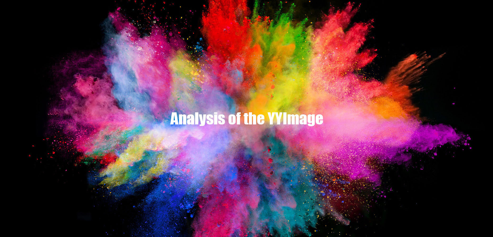
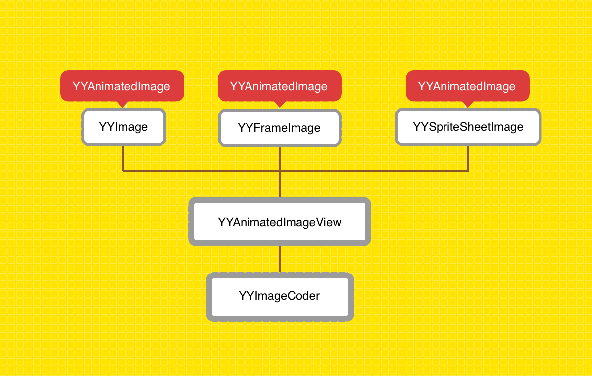
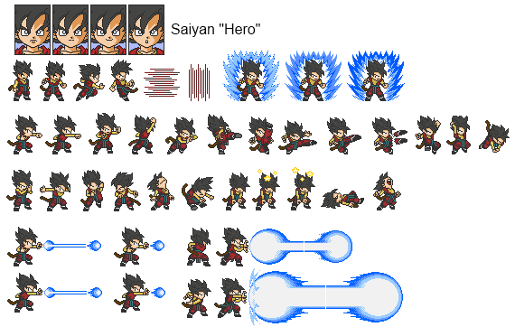

# YYImage 设计思路，实现细节剖析



## 前言

图片的历史早于文字，是最原始的信息传递方式。[六书](https://zh.wikipedia.org/wiki/%E5%85%AD%E6%9B%B8)中的象形文构造思想就是用文字的线条或笔画，把要表达物体的外形特征，具体地勾画出来。

> [许慎](https://zh.wikipedia.org/wiki/%E8%A8%B1%E6%85%8E)《[说文解字](https://zh.wikipedia.org/wiki/%E8%AF%B4%E6%96%87%E8%A7%A3%E5%AD%97)》云：“象形者，画成其物，随体诘诎，日、月是也。”

现代社会的信息传递中，图片仍然是不可或缺的一环，不论是报纸、杂志、漫画等实体刊物还是生活中超市地铁广告活动，都会有专门的配图抓人眼球。

在移动端 App 中，图片通常占据着重要的视觉空间，作为 iOS 开发来讲，所有的 App 都有精心设计的 AppIcon 陈列在 SpringBoard 中，打开任意一款主流 App 都少不了琳琅满目的图片搭配。

[YYImage](https://github.com/ibireme/YYImage) 是一款功能强大的 iOS 图像框架（该项目是 [YYKit](https://github.com/ibireme/YYKit) 组件之一），支持目前市场上所有主流的图片格式的显示与编/解码，并且提供高效的动态内存缓存管理，以保证高性能低内存的动画播放。

YYKit 的作者 [@ibireme](https://weibo.com/239801242) 对于 iOS 图片处理写有两篇非常不错的文章，推荐各位读者在阅读本文之前查阅。

- [移动端图片格式调研](https://blog.ibireme.com/2015/11/02/mobile_image_benchmark/)
- [iOS 处理图片的一些小 Tip](https://blog.ibireme.com/2015/11/02/ios_image_tips/)

本文引用代码均为 YYImage v1.0.4 版本源码，文章旨在剖析 YYImage 的架构思想以及设计思路并对笔者在阅读源码过程中发现的有趣实现细节探究分享，不会逐行翻译源码，建议对源码实现感兴趣的同学结合 YYImage v1.0.4 版本源码食用本文~


## 索引

- YYImage 简介
- YYImage, YYFrameImage, YYSpriteSheetImage
- YYAnimatedImageView
- YYImageCoder
- 总结
- 扩展阅读

## YYImage 简介


YYImage 是一款功能强大的 iOS 图像框架，支持当前市场主流的静/动态图像编/解码与动态图像的动画播放显示，其具有以下特性：

- 支持以下类型动画图像的播放/编码/解码: WebP, APNG, GIF。
- 支持以下类型静态图像的显示/编码/解码: WebP, PNG, GIF, JPEG, JP2, TIFF, BMP, ICO, ICNS。
- 支持以下类型图片的渐进式/逐行扫描/隔行扫描解码: PNG, GIF, JPEG, BMP。
- 支持多张图片构成的帧动画播放，支持单张图片的 sprite sheet 动画。
- 高效的动态内存缓存管理，以保证高性能低内存的动画播放。
- 完全兼容 UIImage 和 UIImageView，使用方便。
- 保留可扩展的接口，以支持自定义动画。
- 每个类和方法都有完善的文档注释。

### YYImage 架构分析

通过 YYImage 源码可以按照其与 UIKit 的对应关系划分为三个层级：

| 层级 | UIKit | YYImage |
| :---: | :---: | :---: |
| 图像层 | UIImage | YYImage, YYFrameImage, YYSpriteSheetImage |
| 视图层 | UIImageView | YYAnimatedImageView |
| 编/解码层 | ImageIO.framework | YYImageCoder |

- 图像层，把不同类型的图像信息封装成类并提供初始化和其他便捷接口。
- 视图层，负责图像层内容的显示（包含动态图像的动画播放）工作。
- 编/解码层，提供图像底层支持，使整个框架得以支持市场主流的图片格式。

> Note: [ImageIO.framework](https://developer.apple.com/documentation/imageio) 是 iOS 底层实现的图片编/解码库，负责管理颜色和访问图像元数据。其内部的实现使用了第三方编/解码库（如 libpng 等）并对第三方库进行调整优化。除此之外，iOS 还专门针对 JPEG 的编/解码开发了 AppleJPEG.framework，实现了性能更高的硬编码和硬解码。



## YYImage, YYFrameImage, YYSpriteSheetImage

先来介绍 YYImage 库中图像层的三个类，它们分别是：

- YYImage
- YYFrameImage
- YYSpriteSheetImage

### YYImage

YYImage 是一个显示动态图片数据的高级别类，其继承自 UIImage 并对 UIImage 做了扩展以支持 WebP，APNG 和 GIF 格式的图片解码。它还支持 NSCoding 协议可以对多帧图像数据进行 archive 和 unarchive 操作。

``` obj-c
@interface YYImage : UIImage <YYAnimatedImage>

+ (nullable YYImage *)imageNamed:(NSString *)name; // 不同于 UIImage，此方法无缓存
+ (nullable YYImage *)imageWithContentsOfFile:(NSString *)path;
+ (nullable YYImage *)imageWithData:(NSData *)data;
+ (nullable YYImage *)imageWithData:(NSData *)data scale:(CGFloat)scale;

@property (nonatomic, readonly) YYImageType animatedImageType; // 图像数据类型
@property (nullable, nonatomic, readonly) NSData *animatedImageData; // 动态图像的元数据
@property (nonatomic, readonly) NSUInteger animatedImageMemorySize; // 多帧图像内存占用量
@property (nonatomic) BOOL preloadAllAnimatedImageFrames; // 预加载所有帧（到内存）

@end
```

YYImage 提供了类似 UIImage 的初始化方法，公开了一些属性便于我们检测和控制其内存使用。

值得一提的是 YYImage 的 `imageNamed:` 初始化方法并不支持缓存。因为其 `imageNamed:` 内部实现并不同于 UIImage 的 `imageNamed:` 方法，YYImage 中的实现流程如下：

- 推测出给定图像资源路径
- 拿到路径中的图像数据（NSData）
- 调用 YYImage 的 `initWithData:scale:` 方法初始化

YYImage 的私有变量部分也比较简单，相信大家可以根据上面暴露出的属性和接口猜得到哈。

``` obj-c
@implementation YYImage {
    YYImageDecoder *_decoder; // 解码器
    NSArray *_preloadedFrames; // 预加载的图像帧
    dispatch_semaphore_t _preloadedLock; // 预加载锁
    NSUInteger _bytesPerFrame; // 内存占用量
}
```

其内部有一把锁 `dispatch_semaphore_t`，我们知道 `dispatch_semaphore_t` 当信号量为 1 时可以当做锁来使用，在不阻塞时其作为锁的效率非常高。这里使用 `_preloadedLock` 的主要目的是保证 `_preloadedFrames` 的读写，由于 `_preloadedFrames` 的读写过程是在内存中完成的，操作耗时不会太多，所以不会长时间阻塞，这种情况使用 `dispatch_semaphore_t` 非常合适。

嘛~ `_preloadedFrames` 对应 `preloadAllAnimatedImageFrames` 属性，开启预加载所有帧到内存的话，`_preloadedFrames` 作为一个数组会保存所有帧的图像。`_bytesPerFrame` 则对应 `animatedImageMemorySize` 属性，在初始化 YYImage 时，如果帧总数超过 1 则会计算 `_bytesPerFrame` 的大小。

``` obj-c
if (decoder.frameCount > 1) {
    _decoder = decoder;
    _bytesPerFrame = CGImageGetBytesPerRow(image.CGImage) * CGImageGetHeight(image.CGImage);
    _animatedImageMemorySize = _bytesPerFrame * decoder.frameCount;
}
```

其实 YYImage 中还有一些实现也比较有趣，比如 `animatedImageDurationAtIndex:` 的实现中如果取到 <= 10 ms 的时长会替换为 100 ms，并在 [注释](https://github.com/ibireme/YYImage/blob/master/YYImage/YYImage.m#L246) 中解释了为什么（一定要点进去看啊，笑~）。

### YYFrameImage

YYFrameImage 是专门用来显示基于帧的动画图像类，其也是 UIImage 的子类。YYFrameImage 仅支持系统图片格式例如 png 和 jpeg。

> Note: 使用 YYFrameImage 显示动画图像同样要基于 YYAnimatedImageView 播放。

``` obj-c
@interface YYFrameImage : UIImage <YYAnimatedImage>

- (nullable instancetype)initWithImagePaths:(NSArray<NSString *> *)paths
                           oneFrameDuration:(NSTimeInterval)oneFrameDuration
                                  loopCount:(NSUInteger)loopCount;
- (nullable instancetype)initWithImagePaths:(NSArray<NSString *> *)paths
                             frameDurations:(NSArray<NSNumber *> *)frameDurations
                                  loopCount:(NSUInteger)loopCount;
- (nullable instancetype)initWithImageDataArray:(NSArray<NSData *> *)dataArray
                               oneFrameDuration:(NSTimeInterval)oneFrameDuration
                                      loopCount:(NSUInteger)loopCount;
- (nullable instancetype)initWithImageDataArray:(NSArray<NSData *> *)dataArray
                                 frameDurations:(NSArray *)frameDurations
                                      loopCount:(NSUInteger)loopCount;

@end
```

YYFrameImage 可以把静态图片类型如 png 和 jpeg 格式的静态图像用帧切换的方式以动态图片的形式显示，并且提供了 4 个常用的初始化方法方便我们使用。

YYFrameImage 内部有一些基本的变量分别对应于其暴露的 4 个常用初始化接口：

``` obj-c
@implementation YYFrameImage {
    NSUInteger _loopCount;
    NSUInteger _oneFrameBytes;
    NSArray *_imagePaths;
    NSArray *_imageDatas;
    NSArray *_frameDurations;
}
```

YYFrameImage 的实现代码非常简单，初始化方法大致可以分为以下步骤：

- 入参校验
- 根据入参取到首张图片
- 用首图初始化 `_oneFrameBytes` ，如入参初始化 `_imageDatas` ，`_frameDurations` 和 `_loopCount`
- 用 `UIImage` 的 `initWithCGImage:scale:orientation:` 初始化并返回初始化结果

### YYSpriteSheetImage



YYSpriteSheetImage 是用来做 Spritesheet 动画显示的图像类，它也是 UIImage 的子类。

关于 Spritesheet 可能做过游戏开发或者以前鼓捣过简单网页游戏 Demo 的同学会很熟悉，其动画原理是把一个动画过程分解为多个动画帧，按照顺序将这些动画帧排布在一张大的画布中，播放动画时只需要按照每一帧图像的尺寸大小以及对应索引去画布中提取对应的帧替换显示以达到人眼判定动画的效果，点击 [
An Introduction to Spritesheet Animation](https://gamedevelopment.tutsplus.com/tutorials/an-introduction-to-spritesheet-animation--gamedev-13099) 或者 [What is a sprite sheet?](https://www.codeandweb.com/what-is-a-sprite-sheet) 了解更多关于 Spritesheet 动画的信息。

> Note: 关于 SpriteSheet 素材的制作有一款工具 [SpriteSheetMaker](https://www.codeandweb.com/sprite-sheet-maker) 推荐使用。

``` obj-c
@interface YYSpriteSheetImage : UIImage <YYAnimatedImage>

// 初始化方法，这个第一次接触 Spritesheet 的同学可能会觉得比较繁琐
- (nullable instancetype)initWithSpriteSheetImage:(UIImage *)image
                                     contentRects:(NSArray<NSValue *> *)contentRects
                                   frameDurations:(NSArray<NSNumber *> *)frameDurations
                                        loopCount:(NSUInteger)loopCount;

@property (nonatomic, readonly) NSArray<NSValue *> *contentRects; // 帧位置信息
@property (nonatomic, readonly) NSArray<NSValue *> *frameDurations; // 帧持续时长
@property (nonatomic, readonly) NSUInteger loopCount; // 循环数

// 根据索引找到对应帧 CALayer 的位置
- (CGRect)contentsRectForCALayerAtIndex:(NSUInteger)index;

@end
```

其中初始化方法的入参为 SpriteSheet 画布（包含所有动画帧的大图）image，每一帧的位置 contentRects，每一帧对应的持续显示时间 frameDurations，循环次数 loopCount，初始化示例在 YYImage 源文件 [YYSpriteSheetImage.h](https://github.com/ibireme/YYImage/blob/master/YYImage/YYSpriteSheetImage.h#L32) 注释中有写。

> Note: 下文中要讲的 YYAnimatedImageView 中定义了 YYAnimatedImage 协议，这个协议中有一个可选方法 `animatedImageContentsRectAtIndex:` 就是为 YYSpriteSheetImage 量身打造的。

这里需要提一下 `contentsRectForCALayerAtIndex:` 接口会根据索引找到对应帧的 CALayer 位置，该接口返回一个由 0.0~1.0 之间的数值组成的图层定位 LayerRect，如果在查找位置过程中发现异常则返回 CGRectMake(0, 0, 1, 1)，其内部实现大体步骤：

- 校验入参索引是否超过 SpriteSheet 分割帧总数，超过返回 CGRectMake(0, 0, 1, 1)
- 没超过则通过 YYAnimatedImage 协议的 `animatedImageContentsRectAtIndex:` 方法找到对应索引的真实位置 RealRect
- 通过真实位置 RealRect 与 SpriteSheet 画布的比算错 0.0~1.0 之间的值，得到指定索引帧的逻辑定位 LogicRect
- 通过 `CGRectIntersection` 方法计算逻辑定位 LogicRect 与 CGRectMake(0, 0, 1, 1) 的交集，确保逻辑定位没有超出画布的部分
- 将处理后的逻辑定位 LogicRect 作为图层定位 LayerRect 返回

返回的 LayerRect 作为对应索引帧的画布内相对位置存在，结合画布就可以定位到对应帧图像的具体尺寸和位置。

## YYAnimatedImageView


人眼中呈现的动画是由一幅幅内容连贯的图像以较短时间按顺序替换形成的，所以要显示动画只需要知道动画顺序中每一帧图像以及对应的显示时间等信息即可。YYImage 中对应于 UIImage 层级的内容（YYImage, YYFrameImage, YYSpriteSheetImage）在上文已经介绍过了，虽然它们之间存在内容和形式上的差异，但是对于人眼动画呈现的原理却是不变的。

YYAnimatedImageView 是 YYImage 的重要组成，它是 UIImageView 的子类，负责 YYImage 图像层中不同的图像类的视图显示（包含动态图像的动画播放），其内部包含 YYAnimatedImage 协议以及 YYAnimatedImageView 自身两部分。

### YYAnimatedImage 协议

上文提到不论是 YYImage, YYFrameImage, YYSpriteSheetImage 还是以后可能会扩展的图像类，虽然它们之间存在内容和形式上的差异，但是对于人眼动画呈现的原理却是不变的。

YYAnimatedImage 协议就是在不影响原来图像类的情况下把不同图像类之间的共性找出来（求同存异？笑），以统一化的接口将人眼动画呈现所需的基本信息输出给 YYAnimatedImageView 使用的协议。

> Note: 作为图像类须遵循 YYAnimatedImage 协议以便可以使用 YYAnimatedImageView 播放动画。

``` obj-c
@protocol YYAnimatedImage <NSObject>

@required
// 动画帧总数
- (NSUInteger)animatedImageFrameCount;
// 动画循环次数，0 表示无限循环
- (NSUInteger)animatedImageLoopCount;
// 每帧字节数（在内存中），可能用于优化内存缓冲区大小
- (NSUInteger)animatedImageBytesPerFrame;
// 返回给定特殊索引对应的帧图像，这个方法可能在异步线程中调用
- (nullable UIImage *)animatedImageFrameAtIndex:(NSUInteger)index;
// 返回给定特殊索引对应的帧图像对应的显示持续时长
- (NSTimeInterval)animatedImageDurationAtIndex:(NSUInteger)index;

@optional
// 针对 Spritesheet 动画的方法，用于显示某一帧图像在 Spritesheet 画布中的位置
- (CGRect)animatedImageContentsRectAtIndex:(NSUInteger)index;

@end
```

> 上文提到过可选实现接口 `animatedImageContentsRectAtIndex:` 是专为 Spritesheet 动画设计的。

像这样规定一个协议，使不相关的类遵循此协议拥有统一的功能接口方便另一个类调用的设计思想我们在自己日常项目的开发过程中很多场景都可以用到，例如可以封装一个 TableView，设计一个 TableViewCell 协议，让所有 TableViewCell 都实现这个协议以拥有统一的功能接口，然后我们封装的 TableView 类就可以统一的使用这些 TableViewCell 显示数据啦，省去了反复写相同功能 UITableView 的劳动力（实际应用场景很多，这里只是简单举例，抛砖引玉）。

### YYAnimatedImageView

上文提到过 YYAnimatedImageView 作为 YYImage 框架中的图片视图层，上接图像层，下启编/解码底层，是枢纽一般的存在（承上启下啊有木有？），我们需要重点研究其内部实现：

``` obj-c
@interface YYAnimatedImageView : UIImageView

// 如果 image 为多帧组成时，自动赋值为 YES，可以在显示和隐藏时自动播放和停止动画
@property (nonatomic) BOOL autoPlayAnimatedImage;
// 当前显示的帧（从 0 起始），设置新值后会立即显示对应帧，如果新值无效则此方法无效
@property (nonatomic) NSUInteger currentAnimatedImageIndex;
// 当前是否在播放动画
@property (nonatomic, readonly) BOOL currentIsPlayingAnimation;
// 动画定时器所在的 runloop mode，默认为 NSRunLoopCommonModes，关乎动画定时器的触发
@property (nonatomic, copy) NSString *runloopMode;
// 内部缓存区的最大值（in bytes），默认为 0（动态），如果有值将会把缓存区限制为值大小，当收到内存警告或者 App 进入后台时，缓存区将会立即释放并且在适时的时候回复原状
@property (nonatomic) NSUInteger maxBufferSize;

@end
```

额...出乎意料的简单呢~ 只有一些属性暴露出来以便我们在使用过程中实时查看动画的播放状态以及内存使用情况。笔者看源码总结出一条经验，即**如果某个组件在库中占据重要地位，其 .h 文件中暴露的内容越是简单，其 .m 内部实现就越是复杂**。

通过 `runloopMode` 属性大家用猜的也应该可以猜出 YYAnimatedImageView 内部实现动画的原理离不开 RunLoop，而且极有可能是用定时器 NSTimer 或者 CADisplayLink 实现的。下面我们来对 YYAnimatedImageView 的实现剖析，验证一下我们刚才的猜想。

#### YYAnimatedImageView 的实现剖析

YYAnimatedImageView 内部实现源码很有趣，有很多值得分享的地方。不过为了不把文章写成 MarkDown 编辑器文（笑~）笔者不会逐行翻译源码。读者如果想要知道实现的细节建议结合文章去翻阅源码。相信有了文章梳理的思路源码看起来应该不会有太大的困难，文章还是重在传播实现思想和一些值得分享的技巧。

我们先简单看一下 YYAnimatedImageView 的内部结构，方便后面分析实现思路时大家脑中对 YYAnimatedImageView 的结构提前有一个大概的认识。

``` obj-c
@interface YYAnimatedImageView() {
    @package
    UIImage <YYAnimatedImage> *_curAnimatedImage; ///< 当前图像
    
    dispatch_once_t _onceToken; ///< 用于确保初始化代码只执行一次
    dispatch_semaphore_t _lock; ///< 信号量锁（用于 _buffer）
    NSOperationQueue *_requestQueue; ///< 图片请求队列，串行
    
    CADisplayLink *_link; ///< 帧转换
    NSTimeInterval _time; ///< 上一帧之后的时间
    
    UIImage *_curFrame; ///< 当前帧
    NSUInteger _curIndex; ///< 当前帧索引
    NSUInteger _totalFrameCount; ///< 帧总数
    
    BOOL _loopEnd; ///< 是否在循环末尾
    NSUInteger _curLoop; ///< 当前循环次数
    NSUInteger _totalLoop; ///< 总循环次数, 0 表示无穷
    
    NSMutableDictionary *_buffer; ///< 帧缓冲区
    BOOL _bufferMiss; ///< 是否丢帧，在上面 _link 定时执行的 step 函数中从帧缓冲区读取下一帧图片时如果没读到，则视为丢帧
    NSUInteger _maxBufferCount; ///< 最大缓冲计数
    NSInteger _incrBufferCount; ///< 当前允许的缓存区计数（将逐步增加）
    
    CGRect _curContentsRect; ///< 针对 YYSpriteSheetImage
    BOOL _curImageHasContentsRect; ///< 图像类是否实现了 animatedImageContentsRectAtIndex: 接口
}
@property (nonatomic, readwrite) BOOL currentIsPlayingAnimation;
- (void)calcMaxBufferCount; // 动态调节缓冲区最大限制 _maxBufferCount
@end
```

可以看到 YYAnimatedImageView 内部结构比 .h 中暴露的属性要复杂的多，而 `CADisplayLink *_link` 属性也证实了我们之前关于 .h 中 `runloopMode` 属性的猜想。

YYAnimatedImageView 内部的初始化没什么特别之处，初始化函数中会设置图片，当判定图片有更改时会依照下面 4 步去处理：

- 改变图片
- 重置动画
- 初始化动画参数
- 重绘

> Note: 这样可以保证 YYAnimatedImageView 的图片更改时都会执行上面的步骤为新的图片初始化配套的新动画参数并且重绘，而重置动画实现中会使用到上面的 `dispatch_once_t _onceToken;` 以确保某些内部变量的创建以及对 App 内存警告和进入后台的通知观察代码只执行一次。

YYAnimatedImageView 使图片动起来是依靠 `CADisplayLink *_link;` 变量切换帧图像，其内部的实现逻辑可以简单理解为：

- 根据当前帧索引推出下一帧索引
- 使用下一帧索引去帧缓冲区尝试获取对应帧图像
- 如果找到对应帧图像则使用其重绘
- 如果没找到则根据条件向图片请求队列加入请求操作（向图片缓冲区录入之后的帧图像数据）

嘛~ 这里面有一些值得一提的实现细节哈！

> - YYAnimatedImageView 实现中当 `_curIndex` 即当前帧索引修改时在修改代码前后加入了 `willChangeValueForKey:` 与 `didChangeValueForKey:` 方法以支持 KVO
> - 对帧缓冲区 `_buffer` 的操作都使用 `_lock` 上锁
> - 通过将图片请求队列 `_requestQueue` 的 `maxConcurrentOperationCount` 设置为 1 使图片请求队列成为串行队列（最大并发数为 1）
> - 图片请求队列中加入的操作均为 `_YYAnimatedImageViewFetchOperation`
> - 为了避免使用 `CADisplayLink` 可能造成的循环引用设计了 `_YYImageWeakProxy`

先看一下 `_YYAnimatedImageViewFetchOperation` 的源码：

``` obj-c
@interface _YYAnimatedImageViewFetchOperation : NSOperation
@property (nonatomic, weak) YYAnimatedImageView *view;
@property (nonatomic, assign) NSUInteger nextIndex;
@property (nonatomic, strong) UIImage <YYAnimatedImage> *curImage;
@end

@implementation _YYAnimatedImageViewFetchOperation
- (void)main {//...}
@end
```

`_YYAnimatedImageViewFetchOperation` 继承自 NSOperation 类，是自定义操作类，作者将其操作内容实现写在了 `main` 中，代码太长而且我觉得贴出来不仅不会帮助读者理解反而会因为片面的源码实现影响读者对 YYAnimatedImageView 的整体实现思路理解（因为大量贴源码会使文章生涩很多，而且会把读者注意力转移到某一个实现），这里简单描述一下 `main` 函数内部实现逻辑：

- 判断帧缓冲区大小
- 扫描下一帧以及当前允许缓冲范围内之后的帧图片
- 如果发现丢失的帧则尝试重新获取帧图像并加入到帧缓冲

嘛~ 不贴源码归不贴源码，该注意的细节还是需要列出来的（笑）。
 
> - 操作中对于 `view` 缓冲区的操作也都上了锁
> - 操作由于是放入图片请求队列中进行的，内部有对 `isCancelled` 做判断，如果操作已经被取消（发生在更改图片、停止动画、手动更改当前帧、收到内存警告或 App 进入后台等）则需要及时跳出
> - 对于新的线程优先级只在 `main` 方法范围内有效，所以推荐把操作的实现放在 `main` 中而非 `start`（如需覆盖 start 方法时，需要关注 `isExecuting` 和 `isFinished` 两个 key paths）

YYAnimatedImageView 内部设计了 `_YYImageWeakProxy` 来避免使用 NSTimer 或者 CADisplayLink 可能造成的循环引用问题，`_YYImageWeakProxy` 内部实现也比较简单，继承自 NSProxy，关于 NSProxy 可以查看[官方文档](https://developer.apple.com/documentation/foundation/nsproxy)以了解更多。

``` obj-c
@interface _YYImageWeakProxy : NSProxy
@property (nonatomic, weak, readonly) id target;
- (instancetype)initWithTarget:(id)target;
+ (instancetype)proxyWithTarget:(id)target;
@end

@implementation _YYImageWeakProxy
// ...
- (id)forwardingTargetForSelector:(SEL)selector {
    return _target;
}
- (void)forwardInvocation:(NSInvocation *)invocation {
    void *null = NULL;
    [invocation setReturnValue:&null];
}
- (NSMethodSignature *)methodSignatureForSelector:(SEL)selector {
    return [NSObject instanceMethodSignatureForSelector:@selector(init)];
}
// ...
@end
```

上面贴出的源码省略了比较基础的实现部分，`_YYImageWeakProxy` 内部弱引用一个对象 target，对于 `_YYImageWeakProxy` 的一些基本操作包含 `hash` 和 `isEqual` 这些统统都转到 target 上，并且使用 `forwardingTargetForSelector:` 消息重定向将不能响应的运行时消息也重定向给 target 来响应。

Emmmmm..那么问题来了，既然都消息重定向给 target 了还要消息转发干嘛？因为要避免循环引用问题所以对 target 使用弱引用，期间无法保证 target 一定存在，所以 `forwardingTargetForSelector:` 方法可能返回 nil，接着在 Runtime 消息转发中借用 init 消息返回空以“吞掉”异常。

> Note: 消息转发产生的开销要比动态方法解析和消息重定向大。

## YYImageCoder


YYImageCoder 作为 YYImage 的编/解码器，对应于 iOS 中的 ImageIO.framework 图片编/解码库，正是因为有了 YYImageCoder 的存在，YYImage 才得以支持如此多的图片格式，所以说 YYImageCoder 是 YYImage 的底层核心。

YYImageCoder 内部定义了许多 YYImage 中用到的核心数据结构：

- YYImageType，所有的支持的图片格式做了枚举定义
- YYImageDisposeMethod，指定在画布上渲染下一个帧之前如何处理当前帧所使用的区域方法
- YYImageBlendOperation，指定当前帧的透明像素如何与前一个画布的透明像素混合操作
- YYImageFrame，一帧图像数据
- YYImageEncoder，图像编码器
- YYImageDecoder，图像解码器
- UIImage+YYImageCoder，UIImage 的分类，里面提供了一些方便使用的方法

其中 YYImageFrame 是对一帧图像数据的封装，便于在 YYImageCoder 编/解码过程中使用。

YYImageCoder 内部图像编码器 YYImageEncoder 和图像解码器 YYImageDecoder 其实是分开来的，我们下面分别对它们做分析。

### YYImageEncoder

先来讲一下 YYImageEncoder，其在 YYImageCoder 中担任编码器的角色。

``` obj-c
@interface YYImageEncoder : NSObject

@property (nonatomic, readonly) YYImageType type; ///< 图像类型
@property (nonatomic) NSUInteger loopCount;       ///< 循环次数，0 无限循环，仅适用于 GIF/APNG/WebP 格式
@property (nonatomic) BOOL lossless;              ///< 无损标记，仅适用于 WebP.
@property (nonatomic) CGFloat quality;            ///< 压缩质量，0.0~1.0，仅适用于 JPG/JP2/WebP.

// 禁止适用 init、new 初始化编码器（我没忘记我说过这些编码技巧会在之后统一写一篇文章汇总）
- (instancetype)init UNAVAILABLE_ATTRIBUTE;
+ (instancetype)new UNAVAILABLE_ATTRIBUTE;

// 根据给定图片类型创建编码器
- (nullable instancetype)initWithType:(YYImageType)type NS_DESIGNATED_INITIALIZER;
// 添加图像
- (void)addImage:(UIImage *)image duration:(NSTimeInterval)duration;
// 添加图像数据
- (void)addImageWithData:(NSData *)data duration:(NSTimeInterval)duration;
// 添加文件路径
- (void)addImageWithFile:(NSString *)path duration:(NSTimeInterval)duration;
// 开始图像编码并尝试返回编码后的数据
- (nullable NSData *)encode;
// 编码并将得到的数据保存到给定路径文件中
- (BOOL)encodeToFile:(NSString *)path;
// 便捷方法，对一个单帧图像编码
+ (nullable NSData *)encodeImage:(UIImage *)image type:(YYImageType)type quality:(CGFloat)quality;
// 便捷方法，从解码器中编码图像数据
+ (nullable NSData *)encodeImageWithDecoder:(YYImageDecoder *)decoder type:(YYImageType)type quality:(CGFloat)quality;

@end
```

可以看到 YYImageEncoder 内部的一些属性和接口都比较基本，关于其内部实现我们需要先看一下私有变量：

``` obj-c
@implementation YYImageEncoder {
    NSMutableArray *_images; // 已添加到编码器的图片（数组）
    NSMutableArray *_durations; // 对应的图片帧显示持续时长（数组）
}
```

#### YYImageEncoder 的实现思路

YYImageEncoder 的初始化部分没有多复杂，根据图片的类型按照编码最优的参数做初始化而已。关于 YYImageEncoder 对于图片的编码工作，其实作者根据要支持的图片类型和对应图片类型的编码方式做了底层封装，再根据当前图片的类型选择对应的底层编码方法执行。

关于不同图片类型的图片编码格式可以查阅本文文末的扩展阅读章节，结合扩展阅读的内容查阅 YYImage 这部分源码可以理解作者对于底层图片格式信息的结构封装以及编/解码操作具体实现。

关于 YYImageEncoder 的一些简单使用示例可以查看 [YYImageCoder.h](https://github.com/ibireme/YYImage/blob/master/YYImage/YYImageCoder.h#L216) 了解。

### YYImageDecoder

YYImageDecoder 在 YYImageCoder 中担任解码器的角色，其与上述 YYImageEncoder 对应，一个负责图像编码一个负责图像解码，不过 YYImageDecoder 的实现比 YYImageEncoder 更为复杂。

``` obj-c
@interface YYImageDecoder : NSObject

@property (nullable, nonatomic, readonly) NSData *data;    ///< 图像数据
@property (nonatomic, readonly) YYImageType type;          ///< 图像数据类型
@property (nonatomic, readonly) CGFloat scale;             ///< 图像大小
@property (nonatomic, readonly) NSUInteger frameCount;     ///< 图像帧数量
@property (nonatomic, readonly) NSUInteger loopCount;      ///< 图像循环次数，0 无限循环
@property (nonatomic, readonly) NSUInteger width;          ///< 图像画布宽度
@property (nonatomic, readonly) NSUInteger height;         ///< 图像画布高度
@property (nonatomic, readonly, getter=isFinalized) BOOL finalized;

// 创建一个图像解码器
- (instancetype)initWithScale:(CGFloat)scale NS_DESIGNATED_INITIALIZER;
// 用新数据增量更新图像
- (BOOL)updateData:(nullable NSData *)data final:(BOOL)final;
// 方便用一个特殊的数据创建对应的解码器
+ (nullable instancetype)decoderWithData:(NSData *)data scale:(CGFloat)scale;
// 解码并返回给定索引对应的帧数据
- (nullable YYImageFrame *)frameAtIndex:(NSUInteger)index decodeForDisplay:(BOOL)decodeForDisplay;
// 返回给定索引对应的帧持续显示时长
- (NSTimeInterval)frameDurationAtIndex:(NSUInteger)index;
// 返回给定索引对应帧的属性信息，去 ImageIO.framework 的 "CGImageProperties.h" 文件中了解更多
- (nullable NSDictionary *)framePropertiesAtIndex:(NSUInteger)index;
// 返回图片的属性信息，去 ImageIO.framework 的 "CGImageProperties.h" 文件中了解更多
- (nullable NSDictionary *)imageProperties;

@end
```

可以看到 YYImageDecoder 暴露了一些关于解码图像的属性并提供了初始化解码器方法、图像解码方法以及访问图像帧信息的方法。不过上文也说过 YYImageDecoder 的实现比较复杂，我们接着看一下其内部变量结构：

``` obj-c
@implementation YYImageDecoder {
    pthread_mutex_t _lock; // 递归锁
    
    BOOL _sourceTypeDetected; // 是否推测图像源类型
    CGImageSourceRef _source; // 图像源
    yy_png_info *_apngSource; // 如果判定图像为 YYImageTypePNG 则会以 APNG 更新图像源
#if YYIMAGE_WEBP_ENABLED
    WebPDemuxer *_webpSource; // 如果判定图像为 YYImageTypeWebP 则会议 WebP 更新图像源
#endif
    
    UIImageOrientation _orientation; // 绘制方向
    dispatch_semaphore_t _framesLock; // 针对于图像帧的锁
    NSArray *_frames; ///< Array<_YYImageDecoderFrame *>, without image
    BOOL _needBlend; // 是否需要混合
    NSUInteger _blendFrameIndex; // 从帧索引混合到当前帧
    CGContextRef _blendCanvas; // 混合画布
}
```

`_YYImageDecoderFrame` 继承自 YYImageFrame 类作为 YYImageCoder 图像解码器 YYImageDecoder 使用的内部框架类存在，是对于一帧图像的数据封装提供了便于编/解码时需要访问的数据。

#### YYImageDecoder 内锁的选择

可以看到作者在 YYImageDecoder 内部使用了两种锁：

- `pthread_mutex_t _lock;`
- `dispatch_semaphore_t _framesLock;`

`pthread_mutex_t` 在解码器初始化过程中被以 `PTHREAD_MUTEX_RECURSIVE` 类型设置为了递归锁。

``` obj-c
pthread_mutexattr_t attr;
pthread_mutexattr_init (&attr);
pthread_mutexattr_settype (&attr, PTHREAD_MUTEX_RECURSIVE);
pthread_mutex_init (&_lock, &attr);
pthread_mutexattr_destroy (&attr);
```

> Note: 一般情况下一个线程只能申请一次锁，也只能在获得锁的情况下才能释放锁，多次申请锁或释放未获得的锁都会导致崩溃。假设在已经获得锁的情况下再次申请锁，线程会因为等待锁的释放而进入睡眠状态，因此就不可能再释放锁，从而导致死锁。
> 
> 然而这种情况经常会发生，比如某个函数申请了锁，在临界区内又递归调用了自己。辛运的是 `pthread_mutex` 支持递归锁，也就是允许一个线程递归的申请锁，只要把 attr 的类型改成 `PTHREAD_MUTEX_RECURSIVE` 即可。

作者使用 `dispatch_semaphore_t` 作为图像帧数组的锁是因为 `dispatch_semaphore_t` 更加轻量且对于图像帧数组的临界操作比较快，不会造成长时间的阻塞，这种情况下 `dispatch_semaphore_t` 具有性能优势（Emmmmmm..老生常谈了，熟悉的同学不要抱怨，照顾一下后面的同学）。

#### YYImageDecoder 内的实现思路

YYImageDecoder 内在初始化时会初始化锁并更新图像源数据，在更新图像源时调用 `_updateSource` 方法根据当前图像类型以作者对该类型封装好的底层数据结构和对应图像类型解码规则做解码，解码之后设置对应属性。

关于作者对不同格式的图像数据的底层封装源码感兴趣的读者可以参考本文文末的扩展阅读章节内容自行查阅。

关于 YYImageDecoder 的一些简单使用示例可以查看 [YYImageCoder.h](https://github.com/ibireme/YYImage/blob/master/YYImage/YYImageCoder.h#L106) 了解。

## 总结

- 文章系统的分析了 YYImage 源码，希望各位读者在阅读本文之后可以对 YYImage 整体架构和设计思路有清晰的认识。
- 文章对 YYImage 的 Image 层级的三类图像（YYImage, YYFrameImage, YYSpriteSheetImage）分别解读，希望可以对各位读者关于这三类图像的组成原理和呈现动画的方式的理解有所帮助。
- 文章深入剖析了 YYAnimatedImageView 的内部实现，提炼出其设计思路以供读者探究。
- 笔者把自己在阅读源码中发现的值得分享的实现细节结合源码单独拎出来分析，希望各位读者可以在自己平时工作中遇到相似情况时能够多一些思路，封装项目组件时可以用到这些技巧。

文章写得比较用心（是我个人的原创文章，转载请注明出处 [https://lision.me/](https://lision.me/)），如果发现错误会优先在我的 [个人博客](https://lision.me/) 中更新。能力不足，水平有限，如果有任何问题欢迎在我的微博 [@Lision](https://weibo.com/lisioncode) 联系我，另外我的 [GitHub 主页](https://github.com/Lision) 里有很多有趣的小玩意哦~

最后，希望我的文章可以为你带来价值~

## 扩展阅读

- [libpng 官网关于 PNG 结构的官方说明](http://www.libpng.org/pub/png/spec/1.2/PNG-Structure.html)
- [APNG 的维基百科](https://wiki.mozilla.org/APNG_Specification)
- [WebP 开发者文档](https://developers.google.com/speed/webp/docs/api)