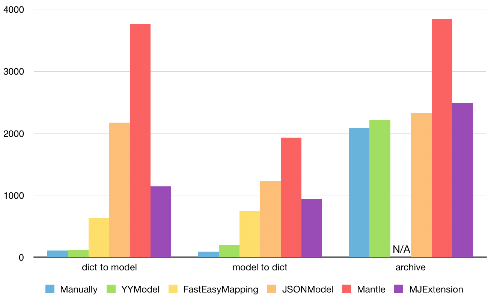

# 揭秘 YYModel 的魔法（上）


## 前言

iOS 开发中少不了各种各样的模型，不论是采用 MVC、MVP 还是 MVVM 设计模式都逃不过 Model。

那么大家在使用 Model 的时候肯定遇到过一个问题，即接口传递过来的数据（一般是 JSON 格式）需要转换为 iOS 内我们能直接使用的模型（类）。iOS 开发早期第三方框架没有那么多，大家可能会手写相关代码，但是随着业务的扩展，模型的增多，这些没什么技术含量的代码只是在重复的浪费我们的劳动力而已。

这时候就需要一种工具来帮助我们把劳动力从这些无意义的繁琐代码中解放出来，于是 GitHub 上出现了很多解决此类问题的第三方库，诸如 Mantle、JSONModel、MJExtension 以及 YYModel 等等。

这些库的神奇之处在于它们提供了模型与 JSON 数据的自动转换功能，仿佛具有魔法一般！本文将通过剖析 YYModel 源码一步一步破解这“神奇”的魔法。

[YYModel](https://github.com/ibireme/YYModel) 是一个高性能 iOS/OSX 模型转换框架（该项目是 [YYKit](https://github.com/ibireme/YYKit) 组件之一）。YYKit 在我之前的文章【[从 YYCache 源码 Get 到如何设计一个优秀的缓存](https://lision.me/yycache/)】中已经很详细的介绍过了，感兴趣的同学可以点进去了解一下。

YYModel 是一个非常轻量级的 JSON 模型自动转换库，代码风格良好且思路清晰，可以从源码中看到作者对 Runtime 深厚的理解。难能可贵的是 YYModel 在其轻量级的代码下还保留着自动类型转换，类型安全，无侵入等特性，并且具有接近手写解析代码的超高性能。

> 处理 GithubUser 数据 10000 次耗时统计 (iPhone 6):



## 索引

- YYModel 简介
- YYClassInfo 剖析
- NSObject+YYModel 探究
- JSON 与 Model 相互转换
- 总结

## YYModel 简介


撸了一遍 YYModel 的源码，果然是非常轻量级的 JSON 模型自动转换库，加上 YYModel.h 一共也只有 5 个文件。

抛开 YYModel.h 来看，其实只有 YYClassInfo 和 NSObject+YYModel 两个模块。

- YYClassInfo 主要将 Runtime 层级的一些结构体封装到 NSObject 层级以便调用。
- NSObject+YYModel 负责提供方便调用的接口以及实现具体的模型转换逻辑（借助 YYClassInfo 中的封装）。

## YYClassInfo 剖析


前面说到 YYClassInfo 主要将 Runtime 层级的一些结构体封装到 NSObject 层级以便调用，我觉得如果需要与 Runtime 层级的结构体做对比的话，没什么比表格来的更简单直观了：

| YYClassInfo | Runtime |
| :---: | :---: |
| YYClassIvarInfo | `objc_ivar` |
| YYClassMethodInfo | `objc_method` |
| YYClassPropertyInfo | `property_t` |
| YYClassInfo | `objc_class` |

> Note: 本次比较基于 [Runtime 源码](https://opensource.apple.com/tarballs/objc4/) 723 版本。

安~ 既然是剖析肯定不会列个表格这样子哈。

### YYClassIvarInfo && objc_ivar

我把 YYClassIvarInfo 看做是作者对 Runtime 层 `objc_ivar` 结构体的封装，`objc_ivar` 是 Runtime 中表示变量的结构体。

- YYClassIvarInfo

``` obj-c
@interface YYClassIvarInfo : NSObject
@property (nonatomic, assign, readonly) Ivar ivar; ///< 变量，对应 objc_ivar
@property (nonatomic, strong, readonly) NSString *name; ///< 变量名称，对应 ivar_name
@property (nonatomic, assign, readonly) ptrdiff_t offset; ///< 变量偏移量，对应 ivar_offset
@property (nonatomic, strong, readonly) NSString *typeEncoding; ///< 变量类型编码，通过 ivar_getTypeEncoding 函数得到
@property (nonatomic, assign, readonly) YYEncodingType type; ///< 变量类型，通过 YYEncodingGetType 方法从类型编码中得到

- (instancetype)initWithIvar:(Ivar)ivar;
@end
```
- `objc_ivar`

``` obj-c
struct objc_ivar {
    char * _Nullable ivar_name OBJC2_UNAVAILABLE; // 变量名称
    char * _Nullable ivar_type OBJC2_UNAVAILABLE; // 变量类型
    int ivar_offset OBJC2_UNAVAILABLE; // 变量偏移量
#ifdef __LP64__ // 如果已定义 __LP64__ 则表示正在构建 64 位目标
    int space OBJC2_UNAVAILABLE; // 变量空间
#endif
}
```

> Note: 日常开发中 NSString 类型的属性我们都会用 copy 来修饰，而 YYClassIvarInfo 中的 `name` 和 `typeEncoding` 属性都用 strong 修饰。因为其内部是先通过 Runtime 方法拿到 `const char *` 之后通过 `stringWithUTF8String` 方法转为 NSString 的。所以即便是 NSString 这类属性在确定其不会在初始化之后被修改的情况下，使用 strong 做一次单纯的强引用在性能上讲比 copy 要高一些。

囧~ 不知道讲的这么细会不会反而引起反感，如果对文章有什么建议可以联系我 [@薛定谔的猹](https://weibo.com/5071795354/profile) 。

> Note: 类型编码，关于 YYClassIvarInfo 中的 YYEncodingType 类型属性 type 的解析代码篇幅很长，而且没有搬出来的必要，可以参考官方文档 [Type Encodings](https://developer.apple.com/library/content/documentation/Cocoa/Conceptual/ObjCRuntimeGuide/Articles/ocrtTypeEncodings.html) 和 [Declared Properties](https://developer.apple.com/library/content/documentation/Cocoa/Conceptual/ObjCRuntimeGuide/Articles/ocrtPropertyIntrospection.html) 阅读这部分源码。

### YYClassMethodInfo && objc_method

相应的，YYClassMethodInfo 则是作者对 Runtime 中 `objc_method` 的封装，`objc_method` 在 Runtime 是用来定义方法的结构体。

- YYClassMethodInfo

``` obj-c
@interface YYClassMethodInfo : NSObject
@property (nonatomic, assign, readonly) Method method; ///< 方法
@property (nonatomic, strong, readonly) NSString *name; ///< 方法名称
@property (nonatomic, assign, readonly) SEL sel; ///< 方法选择器
@property (nonatomic, assign, readonly) IMP imp; ///< 方法实现，指向实现方法函数的函数指针
@property (nonatomic, strong, readonly) NSString *typeEncoding; ///< 方法参数和返回类型编码
@property (nonatomic, strong, readonly) NSString *returnTypeEncoding; ///< 返回值类型编码
@property (nullable, nonatomic, strong, readonly) NSArray<NSString *> *argumentTypeEncodings; ///< 参数类型编码数组

- (instancetype)initWithMethod:(Method)method;
@end
```

- `objc_method`

``` obj-c
struct objc_method {
    SEL _Nonnull method_name OBJC2_UNAVAILABLE; // 方法名称
    char * _Nullable method_types OBJC2_UNAVAILABLE; // 方法类型
    IMP _Nonnull method_imp OBJC2_UNAVAILABLE; // 方法实现（函数指针）
}
```

可以看到基本也是一一对应的关系，除了类型编码的问题作者为了方便使用在封装时进行了扩展。

为了照顾对 Runtime 还没有一定了解的读者，我这里简单的解释一下 `objc_method` 结构体（都是我自己的认知，欢迎讨论）：

- SEL，selector 在 Runtime 中的表现形式，可以理解为方法选择器

``` obj-c
typedef struct objc_selector *SEL;
```

- IMP，函数指针，指向具体实现逻辑的函数

``` obj-c
#if !OBJC_OLD_DISPATCH_PROTOTYPES
typedef void (*IMP)(void /* id, SEL, ... */ ); 
#else
typedef id _Nullable (*IMP)(id _Nonnull, SEL _Nonnull, ...); 
#endif
```

关于更多 Runtime 相关的知识由于篇幅原因（真的写不完）就不在这篇文章介绍了，我推荐大家去鱼神的文章 [Objective-C Runtime](http://yulingtianxia.com/blog/2014/11/05/objective-c-runtime/) 学习（因为我最早接触 Runtime 就是通过这篇文章，笑~）。

有趣的是，鱼神的文章中对 SEL 的描述有一句“其实它就是个映射到方法的 C 字符串”，但是他在文章中没有介绍出处。本着对自己文章质量负责的原则，对于一切没有出处的表述都应该持有怀疑的态度，所以我下面讲一下自己的对于 SEL 的理解。

撸了几遍 Runtime 源码，发现不论是 objc-runtime-new 还是 objc-runtime-old 中都用 SEL 类型作为方法结构体的 name 属性类型，而且通过以下源码：

``` obj-c
OBJC_EXPORT SEL _Nonnull sel_registerName(const char * _Nonnull str)
    OBJC_AVAILABLE(10.0, 2.0, 9.0, 1.0, 2.0);

OBJC_EXPORT const char * _Nonnull sel_getName(SEL _Nonnull sel)
    OBJC_AVAILABLE(10.0, 2.0, 9.0, 1.0, 2.0);
```

可以看到通过一个 `const char *` 类型的字符串即可在 Runtime 系统中注册并返回一个 SEL，方法的名称则会映射到这个 SEL。

> 官方注释：
> Registers a method with the Objective-C runtime system, maps the method name to a selector, and returns the selector value.

所以我觉得 SEL 和 `char *` 的的确确是有某种一一对应的映射关系，不过 SEL 的本质是否是 `char *` 就要打一个问号了。因为我在调试 SEL 阶段发现 SEL 内还有一个当前 SEL 的指针，与 `char *` 不同的是当 `char *` 赋值之后当前 `char *` 变量指针指向字符串首字符，而 SEL 则是 <no value available>，即我们无法直接看到它。

所以我做了一个无聊的测试，用相同的字符串初始化一个 `char *` 实例与一个 SEL 实例，之后尝试打印它们，有趣的是不论我使用 `%s` 还是 `%c` 都可以从两个实例中得到相同的打印输出，不知道鱼神是否做过相同的测试（笑~）

嘛~ 经过验证我们可以肯定 SEL 和 `char *` 存在某种映射关系，可以相互转换。同时猜测 SEL 本质上就是 `char *`，如果有哪位知道 SEL 与 `char *` 确切关系的可以留言讨论哟。

### YYClassPropertyInfo && property_t

YYClassPropertyInfo 是作者对 `property_t` 的封装，`property_t` 在 Runtime 中是用来表示属性的结构体。

- YYClassPropertyInfo

``` obj-c
@interface YYClassPropertyInfo : NSObject
@property (nonatomic, assign, readonly) objc_property_t property; ///< 属性
@property (nonatomic, strong, readonly) NSString *name; ///< 属性名称
@property (nonatomic, assign, readonly) YYEncodingType type; ///< 属性类型
@property (nonatomic, strong, readonly) NSString *typeEncoding; ///< 属性类型编码
@property (nonatomic, strong, readonly) NSString *ivarName; ///< 变量名称
@property (nullable, nonatomic, assign, readonly) Class cls; ///< 类型
@property (nullable, nonatomic, strong, readonly) NSArray<NSString *> *protocols; ///< 属性相关协议
@property (nonatomic, assign, readonly) SEL getter; ///< getter 方法选择器
@property (nonatomic, assign, readonly) SEL setter; ///< setter 方法选择器

- (instancetype)initWithProperty:(objc_property_t)property;
@end
```

- `property_t`

``` obj-c
struct property_t {
    const char *name; // 名称
    const char *attributes; // 修饰
};
```

为什么说 YYClassPropertyInfo 是作者对 `property_t` 的封装呢？

``` obj-c
// runtime.h
typedef struct objc_property *objc_property_t;

// objc-private.h
#if __OBJC2__
typedef struct property_t *objc_property_t;
#else
typedef struct old_property *objc_property_t;
#endif

// objc-runtime-new.h
struct property_t {
    const char *name;
    const char *attributes;
};
```

这里唯一值得注意的就是 getter 与 setter 方法了。

``` obj-c
// 先尝试获取属性的 getter 与 setter
    case 'G': {
        type |= YYEncodingTypePropertyCustomGetter;
        if (attrs[i].value) {
            _getter = NSSelectorFromString([NSString stringWithUTF8String:attrs[i].value]);
        }
    } break;
    case 'S': {
        type |= YYEncodingTypePropertyCustomSetter;
        if (attrs[i].value) {
            _setter = NSSelectorFromString([NSString stringWithUTF8String:attrs[i].value]);
        }
    } break;
    
// 如果没有则按照标准规则自己造
if (!_getter) {
    _getter = NSSelectorFromString(_name);
}
if (!_setter) {
    _setter = NSSelectorFromString([NSString stringWithFormat:@"set%@%@:", [_name substringToIndex:1].uppercaseString, [_name substringFromIndex:1]]);
}
```

### YYClassInfo && objc_class

最后作者用 YYClassInfo 封装了 `objc_class`，`objc_class` 在 Runtime 中表示一个 Objective-C 类。

- YYClassInfo

``` obj-c
@interface YYClassInfo : NSObject
@property (nonatomic, assign, readonly) Class cls; ///< 类
@property (nullable, nonatomic, assign, readonly) Class superCls; ///< 超类
@property (nullable, nonatomic, assign, readonly) Class metaCls;  ///< 元类
@property (nonatomic, readonly) BOOL isMeta; ///< 元类标识，自身是否为元类
@property (nonatomic, strong, readonly) NSString *name; ///< 类名称
@property (nullable, nonatomic, strong, readonly) YYClassInfo *superClassInfo; ///< 父类（超类）信息
@property (nullable, nonatomic, strong, readonly) NSDictionary<NSString *, YYClassIvarInfo *> *ivarInfos; ///< 变量信息
@property (nullable, nonatomic, strong, readonly) NSDictionary<NSString *, YYClassMethodInfo *> *methodInfos; ///< 方法信息
@property (nullable, nonatomic, strong, readonly) NSDictionary<NSString *, YYClassPropertyInfo *> *propertyInfos; ///< 属性信息

- (void)setNeedUpdate;
- (BOOL)needUpdate;

+ (nullable instancetype)classInfoWithClass:(Class)cls;
+ (nullable instancetype)classInfoWithClassName:(NSString *)className;

@end
```

- `objc_class`

``` obj-c
// objc.h
typedef struct objc_class *Class;

// runtime.h
struct objc_class {
    Class _Nonnull isa OBJC_ISA_AVAILABILITY; // isa 指针

#if !__OBJC2__
    Class _Nullable super_class OBJC2_UNAVAILABLE; // 父类（超类）指针
    const char * _Nonnull name OBJC2_UNAVAILABLE; // 类名
    long version OBJC2_UNAVAILABLE; // 版本
    long info OBJC2_UNAVAILABLE; // 信息
    long instance_size OBJC2_UNAVAILABLE; // 初始尺寸
    struct objc_ivar_list * _Nullable ivars OBJC2_UNAVAILABLE; // 变量列表
    struct objc_method_list * _Nullable * _Nullable methodLists OBJC2_UNAVAILABLE; // 方法列表
    struct objc_cache * _Nonnull cache OBJC2_UNAVAILABLE; // 缓存
    struct objc_protocol_list * _Nullable protocols OBJC2_UNAVAILABLE; // 协议列表
#endif

} OBJC2_UNAVAILABLE;
```

额... 看来想完全避开 Runtime 的知识来讲 YYModel 源码是不现实的。这里简单介绍一下 Runtime 中关于 Class 的知识以便阅读，已经熟悉这方面知识的同学就当温习一下好了。


- isa 指针，用于找到所属类，类对象的 isa 一般指向对应元类。
- 元类，由于 objc_class 继承于 objc_object，即类本身同时也是一个对象，所以 Runtime 库设计出元类用以表述类对象自身所具备的元数据。
- cache，实际上当一个对象收到消息时并不会直接在 isa 指向的类的方法列表中遍历查找能够响应消息的方法，因为这样效率太低了。为了优化方法调用的效率，加入了 cache，也就是说在收到消息时，会先去 cache 中查找，找不到才会去像上图所示遍历查找，相信苹果为了提升缓存命中率，应该也花了一些心思（笑~）。
- version，我们可以使用这个字段来提供类的版本信息。这对于对象的序列化非常有用，它可是让我们识别出不同类定义版本中实例变量布局的改变。

> 关于 Version 的官方描述：
> Classes derived from the Foundation framework NSObject class can set the class-definition version number using the setVersion: class method, which is implemented using the class_setVersion function.

#### YYClassInfo 的初始化细节

关于 YYClassInfo 的初始化细节我觉得还是有必要分享出来的。

``` obj-c
+ (instancetype)classInfoWithClass:(Class)cls {
    // 判空入参
    if (!cls) return nil;
    
    // 单例缓存 classCache 与 metaCache，对应缓存类和元类
    static CFMutableDictionaryRef classCache;
    static CFMutableDictionaryRef metaCache;
    static dispatch_once_t onceToken;
    static dispatch_semaphore_t lock;
    dispatch_once(&onceToken, ^{
        classCache = CFDictionaryCreateMutable(CFAllocatorGetDefault(), 0, &kCFTypeDictionaryKeyCallBacks, &kCFTypeDictionaryValueCallBacks);
        metaCache = CFDictionaryCreateMutable(CFAllocatorGetDefault(), 0, &kCFTypeDictionaryKeyCallBacks, &kCFTypeDictionaryValueCallBacks);
        // 这里把 dispatch_semaphore 当做锁来使用（当信号量只有 1 时）
        lock = dispatch_semaphore_create(1);
    });
    
    // 初始化之前，首先会根据当前 YYClassInfo 是否为元类去对应的单例缓存中查找
    // 这里使用了上面的 dispatch_semaphore 加锁，保证单例缓存的线程安全 
    dispatch_semaphore_wait(lock, DISPATCH_TIME_FOREVER);
    YYClassInfo *info = CFDictionaryGetValue(class_isMetaClass(cls) ? metaCache : classCache, (__bridge const void *)(cls));
    // 如果找到了，且找到的信息需要更新的话则执行更新操作
    if (info && info->_needUpdate) {
        [info _update];
    }
    dispatch_semaphore_signal(lock);
    
    // 如果没找到，才会去老实初始化
    if (!info) {
        info = [[YYClassInfo alloc] initWithClass:cls];
        if (info) { // 初始化成功
            // 线程安全
            dispatch_semaphore_wait(lock, DISPATCH_TIME_FOREVER);
            // 根据初始化信息选择向对应的类/元类缓存注入信息，key = cls，value = info
            CFDictionarySetValue(info.isMeta ? metaCache : classCache, (__bridge const void *)(cls), (__bridge const void *)(info));
            dispatch_semaphore_signal(lock);
        }
    }
    
    return info;
}
```

总结一下初始化的主要步骤：

- 创建单例缓存，类缓存和元类缓存
- 使用 `dispatch_semaphore` 作为锁保证缓存线程安全
- 初始化前先去缓存中查找是否已经向缓存中注册过当前要初始化的 YYClassInfo
- 如果查找到缓存对象，则判断缓存对象是否需要更新并执行相关操作
- 如果缓存中未找到缓存对象则初始化
- 初始化成功后向缓存中注册该 YYClassInfo 实例

其中，使用缓存可以有效减少我们在 JSON 模型转换时反复初始化 YYClassInfo 带来的开销，而 `dispatch_semaphore` 在信号量为 1 时是可以当做锁来使用的，虽然它在阻塞时效率超低，但是对于代码中的缓存阻塞这里属于低频事件，使用 `dispatch_semaphore` 在非阻塞状态下性能很高，这里锁的选择非常合适。

#### 关于 YYClassInfo 的更新

首先 YYClassInfo 是作者对应 `objc_class` 封装出来的类，所以理应在其对应的 `objc_class` 实例发生变化时更新。那么 `objc_class` 什么时候会发生变化呢？

嘛~ 比如你使用了 `class_addMethod` 方法为你的模型类加入了一个方法等等。

YYClassInfo 有一个私有 BOOL 类型参数 `_needUpdate` 用以表示当前的 YYClassInfo 实例是否需要更新，并且提供了 `- (void)setNeedUpdate;` 接口方便我们在更改了自己的模型类时调用其将 `_needUpdate` 设置为 YES，当 `_needUpdate` 为 YES 时后面就不用我说了，相关的代码在上一节初始化中有哦。

``` obj-c
if (info && info->_needUpdate) {
    [info _update];
}
```

简单介绍一下 `_update`，它是 YYClassInfo 的私有方法，它的实现逻辑简单介绍就是清空当前 YYClassInfo 实例变量，方法以及属性，之后再重新初始化它们。由于 `_update` 实现源码并没有什么特别之处，我这里就不贴源码了。

嘛~ 对 YYClassInfo 的剖析到这里就差不多了。

## NSObject+YYModel 探究


如果说 YYClassInfo 主要是作者对 Runtime 层在 JSON 模型转换中需要用到的结构体的封装，那么 NSObject+YYModel 在 YYModel 中担当的责任则是利用 YYClassInfo 层级封装好的类切实的执行 JSON 模型之间的转换逻辑，并且提供了无侵入性的接口。

第一次阅读 NSObject+YYModel.m 的源码可能会有些不适应，这很正常。因为其大量使用了 Runtime 函数与 CoreFoundation 库，加上各种类型编码和递归解析，代码量也有 1800 多行了。

我简单把 NSObject+YYModel.m 的源码做了一下划分，这样划分之后代码看起来一样很简单清晰：

- 类型编码解析
- 数据结构定义
- 递归模型转换
- 接口相关代码

### 类型编码解析

类型编码解析代码主要集中在 NSObject+YYModel.m 的上面部分，涉及到 YYEncodingNSType 枚举的定义，配套 `YYClassGetNSType` 函数将 NS 类型转为 YYEncodingNSType 还有 `YYEncodingTypeIsCNumber` 函数判断类型是否可以直接转为 C 语言数值类型的函数。

此外还有将 id 指针转为对应 NSNumber 的函数 `YYNSNumberCreateFromID`，将 NSString 转为 NSDate 的 `YYNSDateFromString` 函数，这类函数主要是方便在模型转换时使用。

``` obj-c
static force_inline NSDate *YYNSDateFromString(__unsafe_unretained NSString *string) {
    typedef NSDate* (^YYNSDateParseBlock)(NSString *string);
    // YYNSDateFromString 支持解析的最长时间字符串
    #define kParserNum 34
    // 这里创建了一个单例时间解析代码块数组
    // 为了避免重复创建这些 NSDateFormatter，它的初始化开销不小
    static YYNSDateParseBlock blocks[kParserNum + 1] = {0};
    static dispatch_once_t onceToken;
    dispatch_once(&onceToken, ^{
        // 这里拿 `yyyy-MM-dd` 举例分析
        {
            /*
             2014-01-20  // Google
             */
            NSDateFormatter *formatter = [[NSDateFormatter alloc] init];
            formatter.locale = [[NSLocale alloc] initWithLocaleIdentifier:@"en_US_POSIX"];
            formatter.timeZone = [NSTimeZone timeZoneForSecondsFromGMT:0];
            formatter.dateFormat = @"yyyy-MM-dd";
            // 这里使用 blocks[10] 是因为 `yyyy-MM-dd` 的长度就是 10
            blocks[10] = ^(NSString *string) { return [formatter dateFromString:string]; };
        }
        
        // 其他的格式都是一样类型的代码，省略
        ...
    });
    
    if (!string) return nil;
    if (string.length > kParserNum) return nil;
    // 根据入参的长度去刚才存满各种格式时间解析代码块的单例数组取出对应的代码块执行
    YYNSDateParseBlock parser = blocks[string.length];
    if (!parser) return nil;
    return parser(string);
    #undef kParserNum
}
```

> Note: 在 iOS 7 之前 NSDateFormatter 是**非线程安全**的。

除此之外还用 YYNSBlockClass 指向了 NSBlock 类，实现过程也比较巧妙。

``` obj-c
static force_inline Class YYNSBlockClass() {
    static Class cls;
    static dispatch_once_t onceToken;
    dispatch_once(&onceToken, ^{
        void (^block)(void) = ^{};
        cls = ((NSObject *)block).class;
        // 轮询父类直到父类指向 NSObject 停止
        while (class_getSuperclass(cls) != [NSObject class]) {
            cls = class_getSuperclass(cls);
        }
    });
    return cls; // 拿到的就是 "NSBlock"
}
```

关于 `force_inline` 这种代码技巧，我说过我在写完 YYModel 或者攒到足够多的时候会主动拿出来与大家分享这些代码技巧，不过这里大家通过字面也不难理解，就是强制内联。

嘛~ 关于内联函数应该不需要我多说（笑）。

### 数据结构定义

NSObject+YYModel 中重新定义了两个类，通过它们来使用 YYClassInfo 中的封装。

| NSObject+YYModel | YYClassInfo |
| :---: | :---: |
| `_YYModelPropertyMeta` | YYClassPropertyInfo |
| `_YYModelMeta` | YYClassInfo |

#### _YYModelPropertyMeta

`_YYModelPropertyMeta` 表示模型对象中的属性信息，它包含 YYClassPropertyInfo。

``` obj-c
@interface _YYModelPropertyMeta : NSObject {
    @package
    NSString *_name;             ///< 属性名称
    YYEncodingType _type;        ///< 属性类型
    YYEncodingNSType _nsType;    ///< 属性在 Foundation 框架中的类型
    BOOL _isCNumber;             ///< 是否为 CNumber
    Class _cls;                  ///< 属性类
    Class _genericCls;           ///< 属性包含的泛型类型，没有则为 nil
    SEL _getter;                 ///< getter
    SEL _setter;                 ///< setter
    BOOL _isKVCCompatible;       ///< 如果可以使用 KVC 则返回 YES
    BOOL _isStructAvailableForKeyedArchiver; ///< 如果可以使用 archiver/unarchiver 归/解档则返回 YES
    BOOL _hasCustomClassFromDictionary; ///< 类/泛型自定义类型，例如需要在数组中实现不同类型的转换需要用到
    
    /*
     property->key:       _mappedToKey:key     _mappedToKeyPath:nil            _mappedToKeyArray:nil
     property->keyPath:   _mappedToKey:keyPath _mappedToKeyPath:keyPath(array) _mappedToKeyArray:nil
     property->keys:      _mappedToKey:keys[0] _mappedToKeyPath:nil/keyPath    _mappedToKeyArray:keys(array)
     */
    NSString *_mappedToKey;      ///< 映射 key
    NSArray *_mappedToKeyPath;   ///< 映射 keyPath，如果没有映射到 keyPath 则返回 nil
    NSArray *_mappedToKeyArray;  ///< key 或者 keyPath 的数组，如果没有映射多个键的话则返回 nil
    YYClassPropertyInfo *_info;  ///< 属性信息，详见上文 YYClassPropertyInfo && property_t 章节
    _YYModelPropertyMeta *_next; ///< 如果有多个属性映射到同一个 key 则指向下一个模型属性元
}
@end
```

#### _YYModelMeta

`_YYModelMeta` 表示模型的类信息，它包含 YYClassInfo。

``` obj-c
@interface _YYModelMeta : NSObject {
    @package
    YYClassInfo *_classInfo;
    /// Key:被映射的 key 与 keyPath, Value:_YYModelPropertyMeta.
    NSDictionary *_mapper;
    /// Array<_YYModelPropertyMeta>, 当前模型的所有 _YYModelPropertyMeta 数组
    NSArray *_allPropertyMetas;
    /// Array<_YYModelPropertyMeta>, 被映射到 keyPath 的 _YYModelPropertyMeta 数组
    NSArray *_keyPathPropertyMetas;
    /// Array<_YYModelPropertyMeta>, 被映射到多个 key 的 _YYModelPropertyMeta 数组
    NSArray *_multiKeysPropertyMetas;
    /// 映射 key 与 keyPath 的数量，等同于 _mapper.count
    NSUInteger _keyMappedCount;
    /// 模型 class 类型
    YYEncodingNSType _nsType;
    
    // 忽略
    ...
}
@end
```

### 递归模型转换

NSObject+YYModel.m 内写了一些（间接）递归模型转换相关的函数，如 `ModelToJSONObjectRecursive` 之类的，由于涉及繁杂的模型编码解析以及代码量比较大等原因我不准备放在这里详细讲解。

我认为这种逻辑并不复杂但是牵扯较多的函数代码与结构/类型定义代码不同，后者更适合列出源码让读者对数据有全面清醒的认识，而前者结合功能实例讲更容易使读者对整条功能的流程有一个更透彻的理解。

所以我准备放到后面 JSON 与 Model 相互转换时一起讲。

### 接口相关代码

嘛~ 理由同上。

## 半章总结

- 文章对 YYModel 源码进行了系统解读，有条理的介绍了 YYModel 的结构，相信会让各位对 YYModel 的代码结构有一个清晰的认识。
- 深入剖析了 YYClassInfo 的 4 个类，并详细讲解了它们与 Runtime 层级结构体的对应。
- 在剖析 YYClassInfo 章节中分享了一些我在阅读源码的过程中发现的并且觉得值得分享的处理细节，比如为什么作者选择用 `strong` 来修饰 NSString 等。顺便还对 SEL 与 `char *` 的关系做了实验得出了我的推论。
- 把 YYClassInfo 的初始化以及更新细节单独拎出来做了分析。
- 探究 NSObject+YYModel 源码（分享了一些实现细节）并对其实现代码做了划分，希望能够对读者阅读 YYModel 源码时提供一些小小的帮助。

嘛~ 上篇差不多就这样了。我写的上一篇 YYKit 源码系列文章[【从 YYCache 源码 Get 到如何设计一个优秀的缓存】](https://lision.me/yycache/)收到了不少的好评和支持（掘金里一位读者 [@ios123456](https://juejin.im/user/5912c8b2da2f600053723275) 的评论更是暖化了我），这些美好的东西让我更加坚定了继续用心创作文章的决心。

文章写得比较用心（是我个人的原创文章，转载请注明 [https://lision.me/](https://lision.me/)），如果发现错误会优先在我的 [个人博客](https://lision.me/) 中更新。如果有任何问题欢迎在我的微博 [@Lision](https://weibo.com/lisioncode) 联系我~

希望我的文章可以为你带来价值~