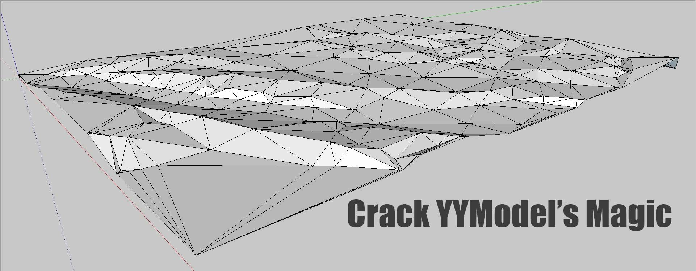
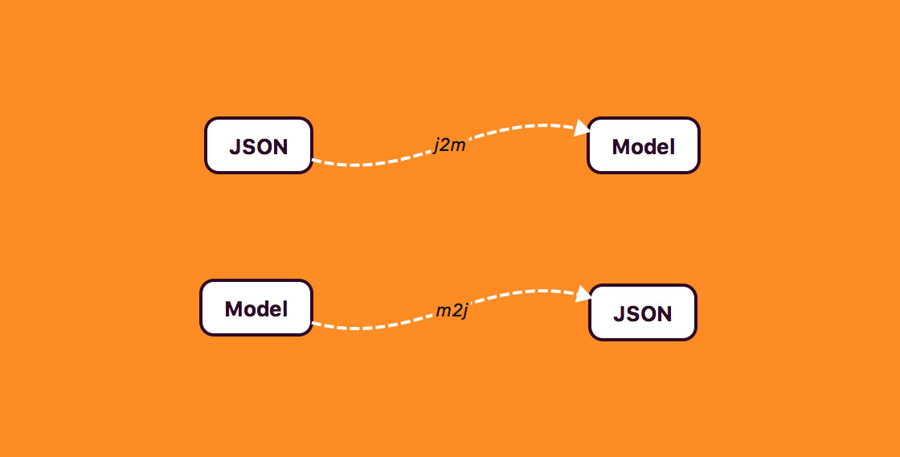
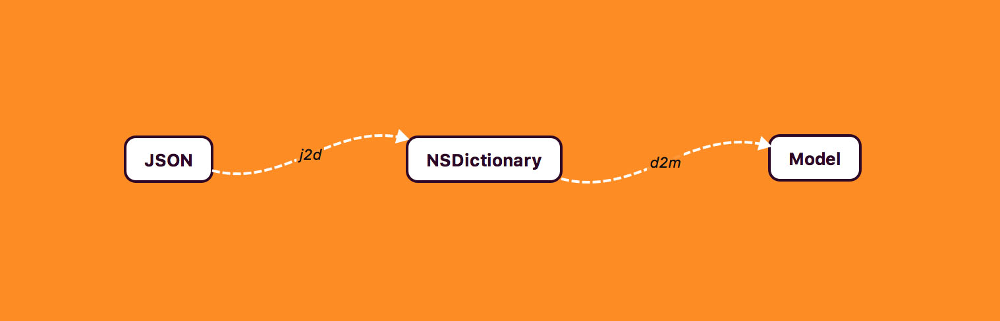
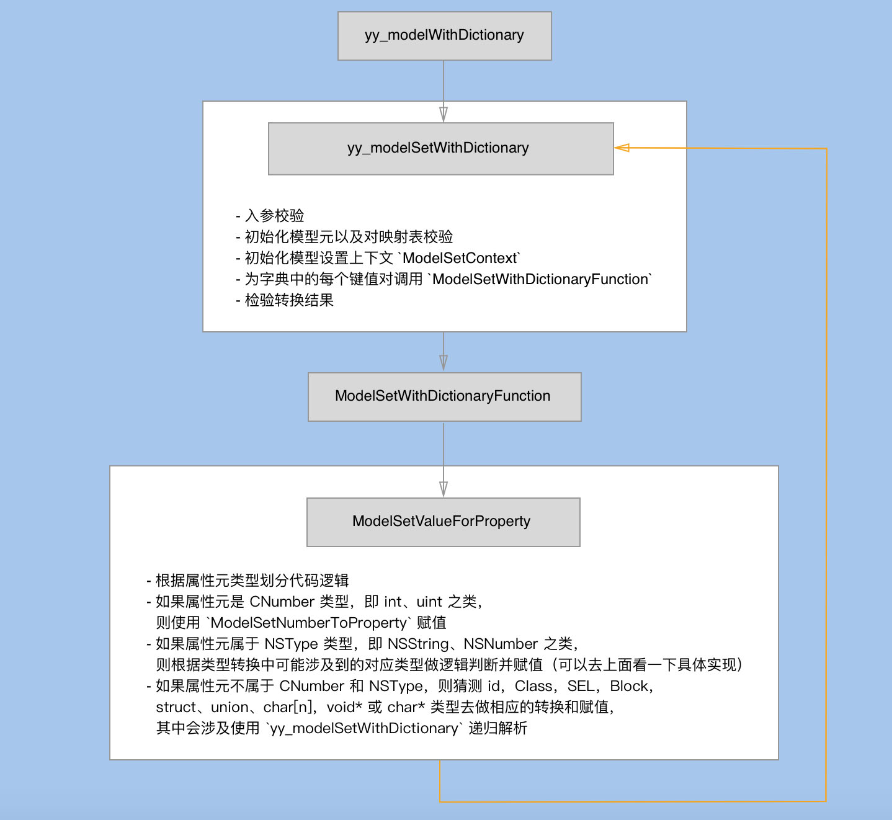
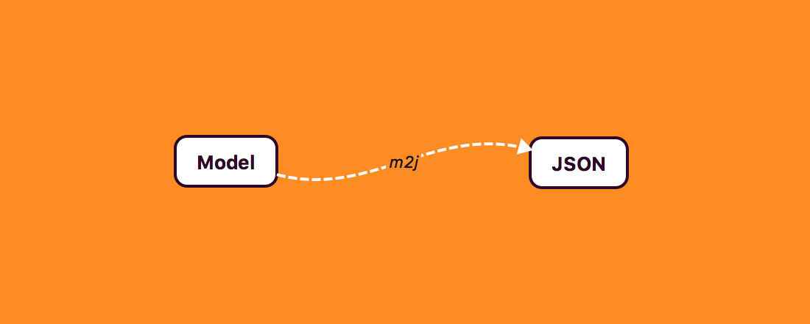

# 揭秘 YYModel 的魔法（下）



## 前言

在上文[《揭秘 YYModel 的魔法（上）》](https://lision.me/yymodel_x01/) 中主要剖析了 [YYModel](https://github.com/ibireme/YYModel) 的源码结构，并且分享了 YYClassInfo 与 NSObject+YYModel 内部有趣的实现细节。

紧接上篇，本文将解读 YYModel 关于 JSON 模型转换的源码，旨在揭秘 JSON 模型自动转换魔法。

## 索引

- JSON 与 Model 相互转换
- 总结

## JSON 与 Model 相互转换

JSON(JavaScript Object Notation) 是一种轻量级的数据交换格式，它易于人们阅读和编写，同时也易于机器解析和生成。它是基于 [JavaScript Programming Language](http://www.crockford.com/javascript/), [Standard ECMA-262 3rd Edition - December 1999](http://www.ecma-international.org/publications/files/ECMA-ST/Ecma-262.pdf) 的一个子集。JSON 采用完全独立于语言的文本格式，但是也使用了类似于 C 语言家族的习惯（包括C, C++, C#, Java, JavaScript, Perl, Python等）。这些特性使 JSON 成为理想的数据交换语言，点击 [这里](https://www.json.org/json-zh.html) 了解更多关于 JSON 的信息。

Model 是 [面向对象编程](https://zh.wikipedia.org/zh-hans/%E9%9D%A2%E5%90%91%E5%AF%B9%E8%B1%A1%E7%A8%8B%E5%BA%8F%E8%AE%BE%E8%AE%A1)（Object Oriented Programming，简称 OOP）程序设计思想中的对象，OOP 把对象作为程序的基本单元，一个对象包含了数据和操作数据的函数。一般我们会根据业务需求来创建对象，在一些设计模式中（如 MVC 等）对象一般作为模型（Model），即对象建模。

JSON 与 Model 相互转换按转换方向分为两种：

- JSON to Model
- Model to JSON



### JSON to Model

我们从 YYModel 的接口开始解读。

``` obj-c
+ (instancetype)yy_modelWithJSON:(id)json {
    // 将 json 转为字典 dic
    NSDictionary *dic = [self _yy_dictionaryWithJSON:json];
    // 再通过 dic 得到 model 并返回
    return [self yy_modelWithDictionary:dic];
}
```

上面接口把 JSON 转 Model 很简单的分为了两个子任务：

- JSON to NSDictionary
- NSDictionary to Model



#### JSON to NSDictionary

我们先看一下 `_yy_dictionaryWithJSON` 是怎么将 json 转为 NSDictionary 的。

``` obj-c
+ (NSDictionary *)_yy_dictionaryWithJSON:(id)json {
    // 入参判空
    if (!json || json == (id)kCFNull) return nil;
    
    NSDictionary *dic = nil;
    NSData *jsonData = nil;
    // 根据 json 的类型对应操作
    if ([json isKindOfClass:[NSDictionary class]]) {
        // 如果是 NSDictionary 类则直接赋值
        dic = json;
    } else if ([json isKindOfClass:[NSString class]]) {
        // 如果是 NSString 类则用 UTF-8 编码转 NSData
        jsonData = [(NSString *)json dataUsingEncoding : NSUTF8StringEncoding];
    } else if ([json isKindOfClass:[NSData class]]) {
        // 如果是 NSData 则直接赋值给 jsonData
        jsonData = json;
    }
    
    // jsonData 不为 nil，则表示上面的 2、3 情况中的一种
    if (jsonData) {
        // 利用 NSJSONSerialization 方法将 jsonData 转为 dic
        dic = [NSJSONSerialization JSONObjectWithData:jsonData options:kNilOptions error:NULL];
        // 判断转换结果 
        if (![dic isKindOfClass:[NSDictionary class]]) dic = nil;
    }
    
    return dic;
}
```

这个函数主要是根据入参的类型判断如何将其转为 NSDictionary 类型并返回。

其中 `kCFNull` 是 CoreFoundation 中 CFNull 的单例对象。如同 Foundation 框架中的 NSNull 一样，CFNull 是用来表示集合对象中的空值（不允许为 NULL）。CFNull 对象既不允许被创建也不允许被销毁，而是通过定义一个 CFNull 常量，即 `kCFNull`，在需要空值时使用。

> 官方文档：
> The CFNull opaque type defines a unique object used to represent null values in collection objects (which don’t allow NULL values). CFNull objects are neither created nor destroyed. Instead, a single CFNull constant object—[kCFNull](https://developer.apple.com/documentation/corefoundation/kcfnull)—is defined and is used wherever a null value is needed.

NSJSONSerialization 是用于将 JSON 和等效的 Foundation 对象之间相互转换的对象。它在 iOS 7 以及 macOS 10.9（包含 iOS 7 和 macOS 10.9）之后是线程安全的。

代码中将 NSString 转为 NSData 用到了 NSUTF8StringEncoding，其中编码类型必须属于 JSON 规范中列出的 5 种支持的编码类型：

- UTF-8
- UTF-16LE
- UTF-16BE
- UTF-32LE
- UTF-32BE

而用于解析的最高效的编码是 UTF-8 编码，所以作者这里使用 NSUTF8StringEncoding。

> 官方注释：
> The data must be in one of the 5 supported encodings listed in the JSON specification: UTF-8, UTF-16LE, UTF-16BE, UTF-32LE, UTF-32BE. The data may or may not have a BOM. The most efficient encoding to use for parsing is UTF-8, so if you have a choice in encoding the data passed to this method, use UTF-8.

#### NSDictionary to Model

现在我们要从 `yy_modelWithJSON` 接口中探究 `yy_modelWithDictionary` 是如何将 NSDictionary 转为 Model 的。

敲黑板！做好准备，这一小节介绍的代码是 YYModel 的精华哦~。

``` obj-c
+ (instancetype)yy_modelWithDictionary:(NSDictionary *)dictionary {
    // 入参校验
    if (!dictionary || dictionary == (id)kCFNull) return nil;
    if (![dictionary isKindOfClass:[NSDictionary class]]) return nil;
    
    // 使用当前类生成一个 _YYModelMeta 模型元类
    Class cls = [self class];
    _YYModelMeta *modelMeta = [_YYModelMeta metaWithClass:cls];
    // 这里 _hasCustomClassFromDictionary 用于标识是否需要自定义返回类
    // 属于模型转换附加功能，可以不用投入太多关注
    if (modelMeta->_hasCustomClassFromDictionary) {
        cls = [cls modelCustomClassForDictionary:dictionary] ?: cls;
    }
    
    // 调用 yy_modelSetWithDictionary 为新建的类实例 one 赋值，赋值成功则返回 one
    NSObject *one = [cls new];
    // 所以这个函数中我们应该把注意力集中在 yy_modelSetWithDictionary
    if ([one yy_modelSetWithDictionary:dictionary]) return one;
    
    return nil;
}
```

代码中根据 `_hasCustomClassFromDictionary` 标识判断是否需要自定义返回模型的类型。这段代码属于 YYModel 的附加功能，为了不使大家分心，这里仅做简单介绍。

如果我们要在 JSON 转 Model 的过程中根据情况创建不同类型的实例，则可以在 Model 中实现接口：

``` obj-c
+ (nullable Class)modelCustomClassForDictionary:(NSDictionary *)dictionary;
```

来满足需求。当模型元初始化时会检测当前模型类是否可以响应上面的接口，如果可以响应则会把 `_hasCustomClassFromDictionary` 标识为 YES，所以上面才会出现这些代码：

``` obj-c
if (modelMeta->_hasCustomClassFromDictionary) {
    cls = [cls modelCustomClassForDictionary:dictionary] ?: cls;
}
```

嘛~ 我觉得这些附加的东西在阅读源码时很大程度上会分散我们的注意力，这次先详细的讲解一下，以后遇到类似的代码我们会略过，内部的实现大都与上述案例原理相同，感兴趣的同学可以自己研究哈。

我们应该把注意力集中在 `yy_modelSetWithDictionary` 上，这个函数（其实也是 NSObject+YYModel 暴露的接口）是根据字典初始化模型的实现方法。它的代码比较长，如果不想看可以跳过，在后面有解释。

``` obj-c
- (BOOL)yy_modelSetWithDictionary:(NSDictionary *)dic {
    // 入参校验
    if (!dic || dic == (id)kCFNull) return NO;
    if (![dic isKindOfClass:[NSDictionary class]]) return NO;
    
    // 根据自身类生成 _YYModelMeta 模型元类
    _YYModelMeta *modelMeta = [_YYModelMeta metaWithClass:object_getClass(self)];
    // 如果模型元类键值映射数量为 0 则 return NO，表示构建失败
    if (modelMeta->_keyMappedCount == 0) return NO;
    
    // 忽略，该标识对应 modelCustomWillTransformFromDictionary 接口
    if (modelMeta->_hasCustomWillTransformFromDictionary) {
        // 该接口类似 modelCustomTransformFromDictionary 接口，不过是在模型转换之前调用的
        dic = [((id<YYModel>)self) modelCustomWillTransformFromDictionary:dic];
        if (![dic isKindOfClass:[NSDictionary class]]) return NO;
    }
    
    // 初始化模型设置上下文 ModelSetContext
    ModelSetContext context = {0};
    context.modelMeta = (__bridge void *)(modelMeta);
    context.model = (__bridge void *)(self);
    context.dictionary = (__bridge void *)(dic);
    
    // 判断模型元键值映射数量与 JSON 所得字典的数量关系
    if (modelMeta->_keyMappedCount >= CFDictionaryGetCount((CFDictionaryRef)dic)) {
        // 一般情况下他们的数量相等
        // 特殊情况比如有的属性元会映射字典中的多个 key
        
        // 为字典中的每个键值对调用 ModelSetWithDictionaryFunction
        // 这句话是核心代码，一般情况下就是靠 ModelSetWithDictionaryFunction 通过字典设置模型
        CFDictionaryApplyFunction((CFDictionaryRef)dic, ModelSetWithDictionaryFunction, &context);
        // 判断模型中是否存在映射 keyPath 的属性元
        if (modelMeta->_keyPathPropertyMetas) {
            // 为每个映射 keyPath 的属性元执行 ModelSetWithPropertyMetaArrayFunction
            CFArrayApplyFunction((CFArrayRef)modelMeta->_keyPathPropertyMetas,
                                 CFRangeMake(0, CFArrayGetCount((CFArrayRef)modelMeta->_keyPathPropertyMetas)),
                                 ModelSetWithPropertyMetaArrayFunction,
                                 &context);
        }
        // 判断模型中是否存在映射多个 key 的属性元
        if (modelMeta->_multiKeysPropertyMetas) {
            // 为每个映射多个 key 的属性元执行 ModelSetWithPropertyMetaArrayFunction
            CFArrayApplyFunction((CFArrayRef)modelMeta->_multiKeysPropertyMetas,
                                 CFRangeMake(0, CFArrayGetCount((CFArrayRef)modelMeta->_multiKeysPropertyMetas)),
                                 ModelSetWithPropertyMetaArrayFunction,
                                 &context);
        }
    } else { // 模型元键值映射数量少，则认为不存在映射多个 key 的属性元
        // 直接为每个 modelMeta 属性元执行 ModelSetWithPropertyMetaArrayFunction
        CFArrayApplyFunction((CFArrayRef)modelMeta->_allPropertyMetas,
                             CFRangeMake(0, modelMeta->_keyMappedCount),
                             ModelSetWithPropertyMetaArrayFunction,
                             &context);
    }
    
    // 忽略，该标识对应接口 modelCustomTransformFromDictionary
    if (modelMeta->_hasCustomTransformFromDictionary) {
        // 该接口用于当默认 JSON 转 Model 不适合模型对象时做额外的逻辑处理
        // 我们也可以用这个接口来验证模型转换的结果
        return [((id<YYModel>)self) modelCustomTransformFromDictionary:dic];
    }
    
    return YES;
}
```

代码已经注明必要中文注释，关于两处自定义扩展接口我们不再多说，由于代码比较长我们先来梳理一下 `yy_modelSetWithDictionary` 主要做了哪些事？

- 入参校验
- 初始化模型元以及映射表校验
- 初始化模型设置上下文 `ModelSetContext`
- 为字典中的每个键值对调用 `ModelSetWithDictionaryFunction`
- 检验转换结果

模型设置上下文 `ModelSetContext` 其实就是一个包含模型元，模型实例以及待转换字典的结构体。

``` obj-c
typedef struct {
    void *modelMeta;  ///< 模型元
    void *model;      ///< 模型实例，指向输出的模型
    void *dictionary; ///< 待转换字典
} ModelSetContext;
```

大家肯定都注意到了 `ModelSetWithDictionaryFunction` 函数，不论走哪条逻辑分支，最后都是调用这个函数把字典的 key（keypath）对应的 value 取出并赋值给 Model 的，那么我们就来看看这个函数的实现。

``` obj-c
// 字典键值对建模
static void ModelSetWithDictionaryFunction(const void *_key, const void *_value, void *_context) {
    // 拿到入参上下文
    ModelSetContext *context = _context;
    // 取出上下文中模型元
    __unsafe_unretained _YYModelMeta *meta = (__bridge _YYModelMeta *)(context->modelMeta);
    // 根据入参 _key 从模型元中取出映射表对应的属性元
    __unsafe_unretained _YYModelPropertyMeta *propertyMeta = [meta->_mapper objectForKey:(__bridge id)(_key)];
    // 拿到待赋值模型
    __unsafe_unretained id model = (__bridge id)(context->model);
    // 遍历 propertyMeta，直到 propertyMeta->_next == nil
    while (propertyMeta) {
        // 当前遍历的 propertyMeta 有 setter 方法，则调用 ModelSetValueForProperty 赋值
        if (propertyMeta->_setter) {
            // 核心方法，拎出来讲
            ModelSetValueForProperty(model, (__bridge __unsafe_unretained id)_value, propertyMeta);
        }
        propertyMeta = propertyMeta->_next;
    };
}
```

`ModelSetWithDictionaryFunction` 函数的实现逻辑就是先通过模型设置上下文拿到带赋值模型，之后遍历当前的属性元（直到 propertyMeta->_next == nil），找到 `setter` 不为空的属性元通过 `ModelSetValueForProperty` 方法赋值。

`ModelSetValueForProperty` 函数是为模型中的属性赋值的实现方法，也是整个 YYModel 的核心代码。别紧张，这个函数写得很友好的，也就 300 多行而已 😜（无关紧要的内容我会尽量忽略掉），不过忽略的太多会影响代码阅读的连续性，如果嫌长可以不看，文章后面会总结一下这个函数的实现逻辑。

``` obj-c
static void ModelSetValueForProperty(__unsafe_unretained id model,
                                     __unsafe_unretained id value,
                                     __unsafe_unretained _YYModelPropertyMeta *meta) {
    // 如果属性是一个 CNumber，即输入 int、uint……
    if (meta->_isCNumber) {
        // 转为 NSNumber 之后赋值
        NSNumber *num = YYNSNumberCreateFromID(value);
        // 这里 ModelSetNumberToProperty 封装了给属性元赋值 NSNumber 的操作
        ModelSetNumberToProperty(model, num, meta);
        if (num) [num class]; // hold the number
    } else if (meta->_nsType) {
        // 如果属性属于 nsType，即 NSString、NSNumber……
        if (value == (id)kCFNull) { // 为空，则赋值 nil（通过属性元 _setter 方法使用 objc_msgSend 将 nil 赋值）
            ((void (*)(id, SEL, id))(void *) objc_msgSend)((id)model, meta->_setter, (id)nil);
        } else { // 不为空
            switch (meta->_nsType) {
                // NSString 或 NSMutableString
                case YYEncodingTypeNSString:
                case YYEncodingTypeNSMutableString: {
                    // 处理可能的 value 类型：NSString，NSNumber，NSData，NSURL，NSAttributedString
                    // 对应的分支就是把 value 转为 NSString 或者 NSMutableString，之后调用 setter 赋值
                    ...
                } break;
                
                // NSValue，NSNumber 或 NSDecimalNumber
                case YYEncodingTypeNSValue:
                case YYEncodingTypeNSNumber:
                case YYEncodingTypeNSDecimalNumber: {
                    // 对属性元的类型分情况赋值（中间可能会涉及到类型之间的转换）
                    ...
                } break;
                    
                // NSData 或 NSMutableData
                case YYEncodingTypeNSData:
                case YYEncodingTypeNSMutableData: {
                    // 对属性元的类型分情况赋值（中间可能会涉及到类型之间的转换）
                    ...
                } break;
                    
                // NSDate
                case YYEncodingTypeNSDate: {
                    // 考虑可能的 value 类型：NSDate 或 NSString
                    // 转换为 NSDate 之后赋值
                    ...
                } break;
                    
                // NSURL
                case YYEncodingTypeNSURL: {
                    // 考虑可能的 value 类型：NSURL 或 NSString
                    // 转换为 NSDate 之后赋值（这里对 NSString 的长度判断是否赋值 nil）
                    ...
                } break;
                    
                // NSArray 或 NSMutableArray
                case YYEncodingTypeNSArray:
                case YYEncodingTypeNSMutableArray: {
                    // 对属性元的泛型判断
                    if (meta->_genericCls) { // 如果存在泛型
                        NSArray *valueArr = nil;
                        // value 所属 NSArray 则直接赋值，如果所属 NSSet 类则转为 NSArray
                        if ([value isKindOfClass:[NSArray class]]) valueArr = value;
                        else if ([value isKindOfClass:[NSSet class]]) valueArr = ((NSSet *)value).allObjects;
                        
                        // 遍历刚才通过 value 转换来的 valueArr
                        if (valueArr) {
                            NSMutableArray *objectArr = [NSMutableArray new];
                            for (id one in valueArr) {
                                // 遇到 valueArr 中的元素属于泛型类，直接加入 objectArr
                                if ([one isKindOfClass:meta->_genericCls]) {
                                    [objectArr addObject:one];
                                } else if ([one isKindOfClass:[NSDictionary class]]) {
                                    // 遇到 valueArr 中的元素是字典类，
                                    Class cls = meta->_genericCls;
                                    // 忽略
                                    if (meta->_hasCustomClassFromDictionary) {
                                        cls = [cls modelCustomClassForDictionary:one];
                                        if (!cls) cls = meta->_genericCls; // for xcode code coverage
                                    }
                                    // 还记得我们直接的起点 yy_modelSetWithDictionary，将字典转模型
                                    // 我觉得这应该算是一个间接递归调用
                                    // 如果设计出的模型是无限递归（从前有座山，山上有座庙的故事），那么肯定会慢
                                    NSObject *newOne = [cls new];
                                    [newOne yy_modelSetWithDictionary:one];
                                    // 转化成功机也加入 objectArr
                                    if (newOne) [objectArr addObject:newOne];
                                }
                            }
                            // 最后将得到的 objectArr 赋值给属性
                            ((void (*)(id, SEL, id))(void *) objc_msgSend)((id)model, meta->_setter, objectArr);
                        }
                    } else {
                        // 没有泛型，嘛~ 判断一下 value 的可能所属类型 NSArray 或 NSSet
                        // 转换赋值（涉及 mutable）
                        ...
                    }
                } break;
                
                // NSDictionary 或 NSMutableDictionary
                case YYEncodingTypeNSDictionary:
                case YYEncodingTypeNSMutableDictionary: {
                    // 跟上面数组的处理超相似，泛型的间接递归以及无泛型的类型转换（mutable 的处理）
                    ...
                } break;
                    
                // NSSet 或 NSMutableSet
                case YYEncodingTypeNSSet:
                case YYEncodingTypeNSMutableSet: {
                    // 跟上面数组的处理超相似，泛型的间接递归以及无泛型的类型转换（mutable 的处理）
                    ...
                }
                
                default: break;
            }
        }
    } else { // 属性元不属于 CNumber 和 nsType 
        BOOL isNull = (value == (id)kCFNull);
        switch (meta->_type & YYEncodingTypeMask) {
            // id
            case YYEncodingTypeObject: {
                if (isNull) { // 空，赋值 nil
                    ((void (*)(id, SEL, id))(void *) objc_msgSend)((id)model, meta->_setter, (id)nil);
                } else if ([value isKindOfClass:meta->_cls] || !meta->_cls) {
                    // 属性元与 value 从属于同一个类，则直接赋值
                    ((void (*)(id, SEL, id))(void *) objc_msgSend)((id)model, meta->_setter, (id)value);
                } else if ([value isKindOfClass:[NSDictionary class]]) {
                    // 嘛~ value 从属于 
                    NSObject *one = nil;
                    // 如果属性元有 getter 方法，则通过 getter 获取到实例
                    if (meta->_getter) {
                        one = ((id (*)(id, SEL))(void *) objc_msgSend)((id)model, meta->_getter);
                    }
                    if (one) {
                        // 用 yy_modelSetWithDictionary 输出化属性实例对象
                        [one yy_modelSetWithDictionary:value];
                    } else {
                        Class cls = meta->_cls;
                        // 略过
                        if (meta->_hasCustomClassFromDictionary) {
                            cls = [cls modelCustomClassForDictionary:value];
                            if (!cls) cls = meta->_genericCls; // for xcode code coverage
                        }
                        // 用 yy_modelSetWithDictionary 输出化属性实例对象，赋值
                        one = [cls new];
                        [one yy_modelSetWithDictionary:value];
                        ((void (*)(id, SEL, id))(void *) objc_msgSend)((id)model, meta->_setter, (id)one);
                    }
                }
            } break;
            
            // Class
            case YYEncodingTypeClass: {
                if (isNull) { // 空，赋值(Class)NULL，由于 Class 其实是 C 语言定义的结构体，所以使用 NULL
                    // 关于 nil，Nil，NULL，NSNull，kCFNull 的横向比较，我会单独拎出来在下面介绍
                    ((void (*)(id, SEL, Class))(void *) objc_msgSend)((id)model, meta->_setter, (Class)NULL);
                } else {
                    // 判断 value 可能的类型 NSString 或判断 class_isMetaClass(object_getClass(value))
                    // 如果满足条件则赋值
                    ...
                }
            } break;
            
            // SEL
            case  YYEncodingTypeSEL: {
                // 判空，赋值(SEL)NULL
                // 否则转换类型 SEL sel = NSSelectorFromString(value); 然后赋值
                ...
            } break;
                
            // block
            case YYEncodingTypeBlock: {
                // 判空，赋值(void (^)())NULL
                // 否则判断类型 [value isKindOfClass:YYNSBlockClass()] 之后赋值
                ...
            } break;
            
            // struct、union、char[n]，关于 union 共同体感兴趣的同学可以自己 google，这里简单介绍一下
            // union 共同体，类似 struct 的存在，但是 union 每个成员会用同一个存储空间，只能存储最后一个成员的信息
            case YYEncodingTypeStruct:
            case YYEncodingTypeUnion:
            case YYEncodingTypeCArray: {
                if ([value isKindOfClass:[NSValue class]]) { 
                    // 涉及 Type Encodings
                    const char *valueType = ((NSValue *)value).objCType;
                    const char *metaType = meta->_info.typeEncoding.UTF8String;
                    // 比较 valueType 与 metaType 是否相同，相同（strcmp(a, b) 返回 0）则赋值
                    if (valueType && metaType && strcmp(valueType, metaType) == 0) {
                        [model setValue:value forKey:meta->_name];
                    }
                }
            } break;
            
            // void* 或 char*
            case YYEncodingTypePointer:
            case YYEncodingTypeCString: {
                if (isNull) { // 判空，赋值(void *)NULL
                    ((void (*)(id, SEL, void *))(void *) objc_msgSend)((id)model, meta->_setter, (void *)NULL);
                } else if ([value isKindOfClass:[NSValue class]]) {
                    // 涉及 Type Encodings
                    NSValue *nsValue = value;
                    if (nsValue.objCType && strcmp(nsValue.objCType, "^v") == 0) {
                        ((void (*)(id, SEL, void *))(void *) objc_msgSend)((id)model, meta->_setter, nsValue.pointerValue);
                    }
                }
            }
                
            default: break;
        }
    }
}
```

额 😓 我是真的已经忽略掉很多代码了，没办法还是有点长。其实代码逻辑还是很简单的，只是模型赋值涉及的编码类型等琐碎逻辑比较多导致代码量比较大，我们一起来总结一下核心代码的实现逻辑。

- 根据属性元类型划分代码逻辑
- 如果属性元是 CNumber 类型，即 int、uint 之类，则使用 `ModelSetNumberToProperty` 赋值
- 如果属性元属于 NSType 类型，即 NSString、NSNumber 之类，则根据类型转换中可能涉及到的对应类型做逻辑判断并赋值（可以去上面代码中查看具体实现逻辑）
- 如果属性元不属于 CNumber 和 NSType，则猜测为 id，Class，SEL，Block，struct、union、char[n]，void* 或 char* 类型并且做出相应的转换和赋值

嘛~ 其实上面的代码除了长以外逻辑还是很简单的，总结起来就是根据可能出现的类型去做出对应的逻辑操作，建议各位有时间还是去读下源码，尤其是自己项目中用到 YYModel 的同学。相信看完之后会对 YYModel 属性赋值一清二楚，这样在使用 YYModel 的日常中出现任何问题都可以心中有数，改起代码自然如有神助哈。

额...考虑到 NSDictionary to Model 的整个过程代码量不小，我花了一些时间将其逻辑总结归纳为一张图：



希望可以尽自己的努力让文章的表述变得更直白。

### Model to JSON



相比于 JSON to Model 来说，Model to JSON 更简单一些。其中因为 NSJSONSerialization 在对 JSON 的转换时做了一些规定：

- 顶级对象是 NSArray 或者 NSDictionary 类型
- 所有的对象都是 NSString, NSNumber, NSArray, NSDictionary, 或 NSNull 的实例
- 所有字典中的 key 都是一个 NSString 实例
- Numbers 是除去无穷大和 NaN 的其他表示

> Note: 上文出自 [NSJSONSerialization 官方文档](https://developer.apple.com/documentation/foundation/nsjsonserialization)。

知道了这一点后，我们就可以从 YYModel 的 Model to JSON 接口 `yy_modelToJSONObject` 处开始解读源码了。

``` obj-c
- (id)yy_modelToJSONObject {
    // 递归转换模型到 JSON
    id jsonObject = ModelToJSONObjectRecursive(self);
    if ([jsonObject isKindOfClass:[NSArray class]]) return jsonObject;
    if ([jsonObject isKindOfClass:[NSDictionary class]]) return jsonObject;
    
    return nil;
}
```

嘛~ 一共 4 行代码，只需要关注一下第一行代码中的 `ModelToJSONObjectRecursive` 方法，`Objective-C` 的语言特性决定了从函数名称即可无需注释看懂代码，这个方法从名字上就可以 get 到它是通过递归方法使 Model 转换为 JSON 的。

``` obj-c
// 递归转换模型到 JSON，如果转换异常则返回 nil
static id ModelToJSONObjectRecursive(NSObject *model) {
    // 判空或者可以直接返回的对象，则直接返回
    if (!model || model == (id)kCFNull) return model;
    if ([model isKindOfClass:[NSString class]]) return model;
    if ([model isKindOfClass:[NSNumber class]]) return model;
    // 如果 model 从属于 NSDictionary
    if ([model isKindOfClass:[NSDictionary class]]) {
        // 如果可以直接转换为 JSON 数据，则返回
        if ([NSJSONSerialization isValidJSONObject:model]) return model;
        NSMutableDictionary *newDic = [NSMutableDictionary new];
        // 遍历 model 的 key 和 value
        [((NSDictionary *)model) enumerateKeysAndObjectsUsingBlock:^(NSString *key, id obj, BOOL *stop) {
            NSString *stringKey = [key isKindOfClass:[NSString class]] ? key : key.description;
            if (!stringKey) return;
            // 递归解析 value 
            id jsonObj = ModelToJSONObjectRecursive(obj);
            if (!jsonObj) jsonObj = (id)kCFNull;
            newDic[stringKey] = jsonObj;
        }];
        return newDic;
    }
    // 如果 model 从属于 NSSet
    if ([model isKindOfClass:[NSSet class]]) {
        // 如果能够直接转换 JSON 对象，则直接返回
        // 否则遍历，按需要递归解析
        ...
    }
    if ([model isKindOfClass:[NSArray class]]) {
        // 如果能够直接转换 JSON 对象，则直接返回
        // 否则遍历，按需要递归解析
        ...
    }
    // 对 NSURL, NSAttributedString, NSDate, NSData 做相应处理
    if ([model isKindOfClass:[NSURL class]]) return ((NSURL *)model).absoluteString;
    if ([model isKindOfClass:[NSAttributedString class]]) return ((NSAttributedString *)model).string;
    if ([model isKindOfClass:[NSDate class]]) return [YYISODateFormatter() stringFromDate:(id)model];
    if ([model isKindOfClass:[NSData class]]) return nil;
    
    // 用 [model class] 初始化一个模型元
    _YYModelMeta *modelMeta = [_YYModelMeta metaWithClass:[model class]];
    // 如果映射表为空，则不做解析直接返回 nil
    if (!modelMeta || modelMeta->_keyMappedCount == 0) return nil;
    // 性能优化细节，使用 __unsafe_unretained 来避免在下面遍历 block 中直接使用 result 指针造成的不必要 retain 与 release 开销
    NSMutableDictionary *result = [[NSMutableDictionary alloc] initWithCapacity:64];
    __unsafe_unretained NSMutableDictionary *dic = result;
    // 遍历模型元属性映射字典
    [modelMeta->_mapper enumerateKeysAndObjectsUsingBlock:^(NSString *propertyMappedKey, _YYModelPropertyMeta *propertyMeta, BOOL *stop) {
        // 如果遍历当前属性元没有 getter 方法，跳过
        if (!propertyMeta->_getter) return;
        
        id value = nil;
        // 如果属性元属于 CNumber，即其 type 是 int、float、double 之类的
        if (propertyMeta->_isCNumber) {
            // 从属性中利用 getter 方法得到对应的值
            value = ModelCreateNumberFromProperty(model, propertyMeta);
        } else if (propertyMeta->_nsType) { // 属性元属于 nsType，即 NSString 之类
            // 利用 getter 方法拿到 value
            id v = ((id (*)(id, SEL))(void *) objc_msgSend)((id)model, propertyMeta->_getter);
            // 对拿到的 value 递归解析
            value = ModelToJSONObjectRecursive(v);
        } else {
            // 根据属性元的 type 做相应处理
            switch (propertyMeta->_type & YYEncodingTypeMask) {
                // id，需要递归解析，如果解析失败则返回 nil
                case YYEncodingTypeObject: {
                    id v = ((id (*)(id, SEL))(void *) objc_msgSend)((id)model, propertyMeta->_getter);
                    value = ModelToJSONObjectRecursive(v);
                    if (value == (id)kCFNull) value = nil;
                } break;
                // Class，转 NSString，返回 Class 名称
                case YYEncodingTypeClass: {
                    Class v = ((Class (*)(id, SEL))(void *) objc_msgSend)((id)model, propertyMeta->_getter);
                    value = v ? NSStringFromClass(v) : nil;
                } break;
                // SEL，转 NSString，返回给定 SEL 的字符串表现形式
                case YYEncodingTypeSEL: {
                    SEL v = ((SEL (*)(id, SEL))(void *) objc_msgSend)((id)model, propertyMeta->_getter);
                    value = v ? NSStringFromSelector(v) : nil;
                } break;
                default: break;
            }
        }
        // 如果 value 还是没能解析，则跳过
        if (!value) return;
        
        // 当前属性元是 KeyPath 映射，即 a.b.c 之类
        if (propertyMeta->_mappedToKeyPath) {
            NSMutableDictionary *superDic = dic;
            NSMutableDictionary *subDic = nil;
            // _mappedToKeyPath 是 a.b.c 根据 '.' 拆分成的字符串数组，遍历 _mappedToKeyPath
            for (NSUInteger i = 0, max = propertyMeta->_mappedToKeyPath.count; i < max; i++) {
                NSString *key = propertyMeta->_mappedToKeyPath[i];
                // 遍历到结尾
                if (i + 1 == max) {
                    // 如果结尾的 key 为 nil，则使用 value 赋值
                    if (!superDic[key]) superDic[key] = value;
                    break;
                }
                
                // 用 subDic 拿到当前 key 对应的值
                subDic = superDic[key];
                // 如果 subDic 存在
                if (subDic) {
                    // 如果 subDic 从属于 NSDictionary
                    if ([subDic isKindOfClass:[NSDictionary class]]) {
                        // 将 subDic 的 mutable 版本赋值给 superDic[key]
                        subDic = subDic.mutableCopy;
                        superDic[key] = subDic;
                    } else {
                        break;
                    }
                } else {
                    // 将 NSMutableDictionary 赋值给 superDic[key]
                    // 注意这里使用 subDic 间接赋值是有原因的，原因就在下面
                    subDic = [NSMutableDictionary new];
                    superDic[key] = subDic;
                }
                // superDic 指向 subDic，这样在遍历 _mappedToKeyPath 时即可逐层解析
                // 这就是上面先把 subDic 转为 NSMutableDictionary 的原因
                superDic = subDic;
                subDic = nil;
            }
        } else {
            // 如果不是 KeyPath 则检测 dic[propertyMeta->_mappedToKey]，如果为 nil 则赋值 value
            if (!dic[propertyMeta->_mappedToKey]) {
                dic[propertyMeta->_mappedToKey] = value;
            }
        }
    }];
    
    // 忽略，对应 modelCustomTransformToDictionary 接口
    if (modelMeta->_hasCustomTransformToDictionary) {
        // 用于在默认的 Model 转 JSON 过程不适合当前 Model 类型时提供自定义额外过程
        // 也可以用这个方法来验证转换结果
        BOOL suc = [((id<YYModel>)model) modelCustomTransformToDictionary:dic];
        if (!suc) return nil;
    }
    
    return result;
}
```

额...代码还是有些长，不过相比于之前 JSON to Model 方向上由 `yy_modelSetWithDictionary`，`ModelSetWithDictionaryFunction` 和 `ModelSetValueForProperty` 三个方法构成的间接递归来说算是非常简单了，那么总结一下上面的代码逻辑。

- 判断入参，如果满足条件可以直接返回
- 如果 Model 从属于 NSType，则根据不同的类型做逻辑处理
- 如果上面条件不被满足，则用 Model 的 Class 初始化一个模型元 _YYModelMeta
- 判断模型元的映射关系，遍历映射表拿到对应键值对并存入字典中并返回

> Note: 这里有一个性能优化的细节，用 `__unsafe_unretained` 修饰的 dic 指向我们最后要 return 的 NSMutableDictionary *result，看作者的注释：`// avoid retain and release in block` 是为了避免直接使用 `result` 在后面遍历映射表的代码块中不必要的 retain 和 release 操作以节省开销。

## 总结

- 文章紧接上文[《揭秘 YYModel 的魔法（上）》](https://lision.me/yymodel_x01/)中对 YYModel 代码结构的讲解后将重点放到了对 JSON 模型相互转换的实现逻辑上。
- 从 JSON 模型的转换方向上划分，将 YYModel 的 JSON 模型转换过程正反方向剖析揭秘，希望可以解开大家对 JSON 模型自动转换的疑惑。

文章写得比较用心（是我个人的原创文章，转载请注明 [https://lision.me/](https://lision.me/)），如果发现错误会优先在我的 [个人博客](https://lision.me/) 中更新。如果有任何问题欢迎在我的微博 [@Lision](https://weibo.com/lisioncode) 联系我~

希望我的文章可以为你带来价值~
